# java

## 1.基础

### 1.1、string

```java
@Test
public void test1(){
    String s3 = "abcd";
    String s5 = "ab";
    String s6 = "cd";
    String s7 = s5+s6;
    final String s1 = "ab";
    final String s2 = "cd";
    String s4 = s1+s2;
    System.out.println(s3 == s7);//结果为false
    System.out.println(s3 == s4);//结果为true
}
```

s5+s6：

- 两个或者两个以上的字符串常量相加，在预编译的时候“+”会被优化，相当于把字符串常量自动合成一个字符串常量
- 字符串的+操作其本质是new了StringBuilder对象进行append操作，拼接后调用toString()返回String对象

使用final修饰String，相当于将s1与s2设置为常量。当final变量是基本数据类型以及String类型时，如果在编译期间能知道它的确切值，则编译器会把它当做编译期常量使用。也就是说在用到该final变量的地方，相当于直接访问的这个常量，不需要在运行时确定。

**intern()方法问题：**

```java
String s1 = new StringBuilder("go").append("od").toString();
System.out.println(s1.intern() == s1);//true
String s2 = new StringBuilder("ja").append("va").toString();
System.out.println(s2.intern() == s2);//false
```

解释：

intern方法是一个native方法，它会去字符串常量池去找这个常量，如果有则返回这个字符串常量池的地址。如果没有则把这个值放在字符串常量池中并返回新字符串的引用。

因为"Java"这个字符串在System类中已经存在了，所以不是第一次创建。

### 1.2、int

如果整型字面量的值在-128到127之间，那么不会new新的Integer对象，而是直接引用常量池中的Integer对象。

```java
Integer i1 = 130;
Integer i2 = 130;
i1 == i2;//false
Integer i3 = 80;
Integer i4 = 80;
i3 == i4;//true
```

### 1.3、&与&&，|与||

&&与||是短路与/或。

### 1.4、关于hashCode()


### 1.6、容器

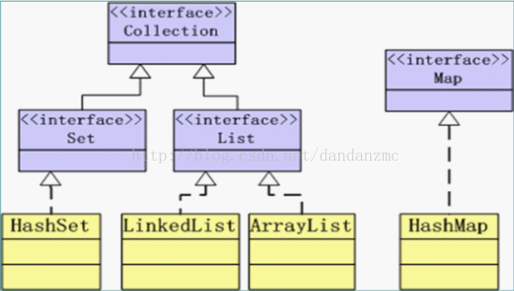

#### 1.6.1、Collections常用方法

```java
Collections.sort(list);//排序
Collections.shuffle(list);//随机排序
int max = Collections.max(list);
int min = Collections.min(list);
Collections.binarySearch(list2, "Thursday");//查找集合指定元素，返回元素所在索引
Collections.indexOfSubList(list2, subList);//查找子串在集合中首次出现的位置
Collections.lastIndexOfSubList(list2, subList);//查找子串在集合中最后一次出现的位置
Collections.replaceAll(list2, "Sunday", "tttttt");//替换集合中指定的元素，若元素存在返回true，否则返回false
Collections.reverse(list2);//反转集合中的元素的顺序
Collections.rotate(list2, 3);//集合中的元素向后移动k位置，后面的元素出现在集合开始的位置
Collections.copy(list2, list3);//将集合list3中的元素复制到list2中，并覆盖相应索引位置的元素
Collections.swap(list2, 0, 3);//交换集合中指定元素的位置
Collections.fill(list2, "替换");//替换集合中的所有元素，用对象object
Collections.nCopies(5, "哈哈");//生成一个指定大小与内容的集合
```


#### 1.6.2、底层数据结构

**List：**

- `Arraylist`： `Object[]`数组
- `Vector`：`Object[]`数组
- `LinkedList`： 双向链表(JDK1.6 之前为循环链表，JDK1.7 取消了循环)

**Set：**

- `HashSet`（无序，唯一）: 基于 `HashMap` 实现的，底层采用 `HashMap` 来保存元素
- `LinkedHashSet`：`LinkedHashSet` 是 `HashSet` 的子类，并且其内部是通过 `LinkedHashMap` 来实现的。有点类似于我们之前说的 `LinkedHashMap` 其内部是基于 `HashMap` 实现一样，不过还是有一点点区别的
- `TreeSet`（有序，唯一）： 红黑树(自平衡的排序二叉树)

**Map：**

- `HashMap`： JDK1.8 之前 `HashMap` 由数组+链表组成的，数组是 `HashMap` 的主体，链表则是主要为了解决哈希冲突而存在的（“拉链法”解决冲突）。JDK1.8 以后在解决哈希冲突时有了较大的变化，当链表长度大于阈值（默认为 8）（将链表转换成红黑树前会判断，如果当前数组的长度小于 64，那么会选择先进行数组扩容，而不是转换为红黑树）时，将链表转化为红黑树，以减少搜索时间
- `LinkedHashMap`： `LinkedHashMap` 继承自 `HashMap`，所以它的底层仍然是基于拉链式散列结构即由数组和链表或红黑树组成。另外，`LinkedHashMap` 在上面结构的基础上，增加了一条双向链表，使得上面的结构可以保持键值对的插入顺序。同时通过对链表进行相应的操作，实现了访问顺序相关逻辑。详细可以查看：[《LinkedHashMap 源码详细分析（JDK1.8）》](https://www.imooc.com/article/22931)
- `Hashtable`： 数组+链表组成的，数组是 `HashMap` 的主体，链表则是主要为了解决哈希冲突而存在的
- `TreeMap`： 红黑树（自平衡的排序二叉树）

#### 1.6.3、comparable与comparator区别

- `comparable` 接口实际上是出自`java.lang`包 它有一个 `compareTo(Object obj)`方法用来排序

- `comparator`接口实际上是出自 java.util 包它有一个`compare(Object obj1, Object obj2)`方法用来排序

  ```java
  //comparator用法
  Arrays.sort(T[],Comparator<? super T> c);
  Collections.sort(List<T> list,Comparator<? super T> c);
  ```

#### 1.6.4、Map接口

##### 1.HashMap与HashTable的区别

1. **线程是否安全：** `HashMap` 是非线程安全的，`HashTable` 是线程安全的,因为 `HashTable` 内部的方法基本都经过`synchronized` 修饰。（如果你要保证线程安全的话就使用 `ConcurrentHashMap` 吧！）；
2. **效率：** 因为线程安全的问题，`HashMap` 要比 `HashTable` 效率高一点。另外，`HashTable` 基本被淘汰，不要在代码中使用它；
3. **对 Null key 和 Null value 的支持：** `HashMap` 可以存储 null 的 key 和 value，但 null 作为键只能有一个，null 作为值可以有多个；HashTable 不允许有 null 键和 null 值，否则会抛出 `NullPointerException`。
4. **初始容量大小和每次扩充容量大小的不同 ：** ① 创建时如果不指定容量初始值，`Hashtable` 默认的初始大小为 11，之后每次扩充，容量变为原来的 2n+1。`HashMap` 默认的初始化大小为 16。之后每次扩充，容量变为原来的 2 倍。② 创建时如果给定了容量初始值，那么 Hashtable 会直接使用你给定的大小，而 `HashMap` 会将其扩充为 2 的幂次方大小（`HashMap` 中的`tableSizeFor()`方法保证，下面给出了源代码）。也就是说 `HashMap` 总是使用 2 的幂作为哈希表的大小,后面会介绍到为什么是 2 的幂次方。
5. **底层数据结构：** JDK1.8 以后的 `HashMap` 在解决哈希冲突时有了较大的变化，当链表长度大于阈值（默认为 8）（将链表转换成红黑树前会判断，如果当前数组的长度小于 64，那么会选择先进行数组扩容，而不是转换为红黑树）时，将链表转化为红黑树，以减少搜索时间。Hashtable 没有这样的机制。

##### 2.HashMap与HashSet的区别

|               `HashMap`                |                          `HashSet`                           |
| :------------------------------------: | :----------------------------------------------------------: |
|           实现了 `Map` 接口            |                       实现 `Set` 接口                        |
|               存储键值对               |                          仅存储对象                          |
|     调用 `put()`向 map 中添加元素      |             调用 `add()`方法向 `Set` 中添加元素              |
| `HashMap` 使用键（Key）计算 `hashcode` | `HashSet` 使用成员对象来计算 `hashcode` 值，对于两个对象来说 `hashcode` 可能相同，所以` equals()`方法用来判断对象的相等性 |

##### 3.HsahMap与TreeMap的区别

`TreeMap` 和`HashMap` 都继承自`AbstractMap` ，但是需要注意的是`TreeMap`它还实现了`NavigableMap`接口和`SortedMap` 接口。

实现 `NavigableMap` 接口让 `TreeMap` 有了对集合内元素的搜索的能力。

实现`SortMap`接口让 `TreeMap` 有了对集合中的元素根据键排序的能力。默认是按 key 的升序排序，不过我们也可以指定排序的比较器。

**相比于`HashMap`来说 `TreeMap` 主要多了对集合中的元素根据键排序的能力以及对集合内元素的搜索的能力。**

##### 4.HashSet如何检查重复

当你把对象加入`HashSet`时，`HashSet` 会先计算对象的`hashcode`值来判断对象加入的位置，同时也会与其他加入的对象的 `hashcode` 值作比较，如果没有相符的 `hashcode`，`HashSet` 会假设对象没有重复出现。但是如果发现有相同 `hashcode` 值的对象，这时会调用`equals()`方法来检查 `hashcode` 相等的对象是否真的相同。如果两者相同，`HashSet` 就不会让加入操作成功。

**`hashCode()`与 `equals()` 的相关规定：**

1. 如果两个对象相等，则 `hashcode` 一定也是相同的
2. 两个对象相等,对两个 `equals()` 方法返回 true
3. 两个对象有相同的 `hashcode` 值，它们也不一定是相等的
4. 综上，`equals()` 方法被覆盖过，则 `hashCode()` 方法也必须被覆盖
5. `hashCode() `的默认行为是对堆上的对象产生独特值。如果没有重写 `hashCode()`，则该 class 的两个对象无论如何都不会相等（即使这两个对象指向相同的数据）。

##### 5.HashMap底层实现

当链表长度大于阈值（默认为 8）（将链表转换成红黑树前会判断，如果当前数组的长度小于 64，那么会选择先进行数组扩容，而不是转换为红黑树）时，将链表转化为红黑树，以减少搜索时间。


HashMap底层实现原理：数组+链表

put：

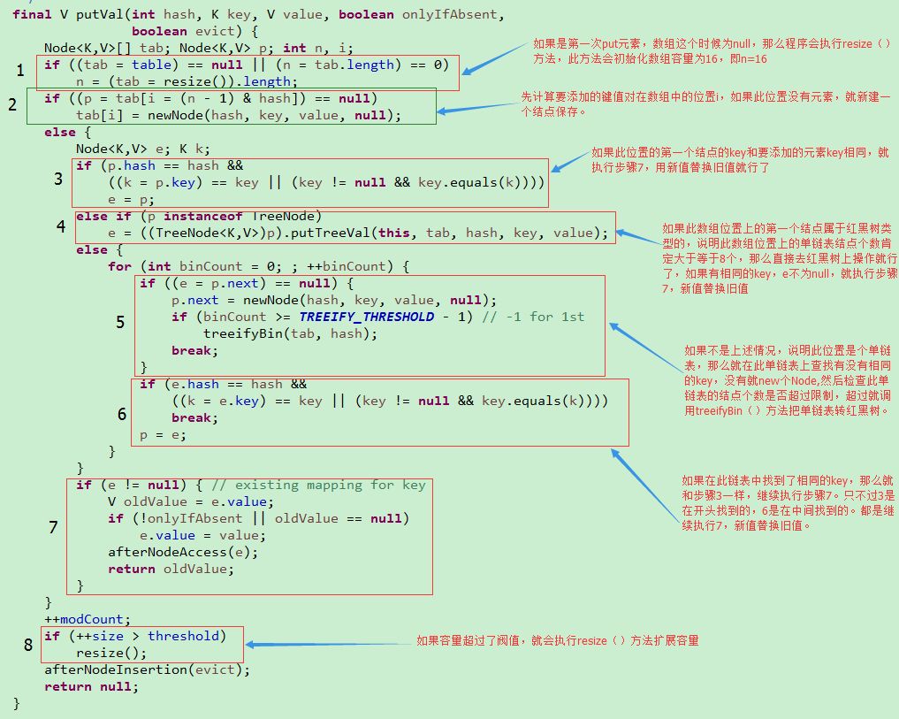

关于第4步：会先判断单链表节点书是否达到了8，如果达到了8还会判断当前数组的容量是否达到了64，如果没有则扩容，如果是则转为红黑树

get：

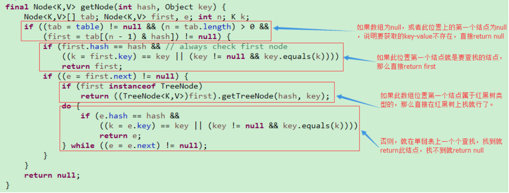

HashSet底层实现就是HashMap，将值作为HashMap的Key进行存储而实现不可重复性。HashMap的Value都为一个Object对象。

**HashMap的长度为什么是2的幂次方：**

为了能让 HashMap 存取高效，尽量较少碰撞，也就是要尽量把数据分配均匀。

1、2的幂次方满足**hash%length==hash&(length-1)**。使用&操作更加高效。

2、奇数不行的解释很能被接受，在计算hash的时候，确定落在数组的位置的时候，计算方法是(n - 1) & hash ，奇数n-1为偶数，偶数2进制的结尾都是0，经过&运算末尾都是0，会增加hash冲突。

##### 6.ConcurrentHashMap与Hashtable

`ConcurrentHashMap` 和 `Hashtable` 的区别主要体现在实现线程安全的方式上不同。

- **底层数据结构：** JDK1.7 的 `ConcurrentHashMap` 底层采用 **分段的数组+链表** 实现，JDK1.8 采用的数据结构跟 `HashMap1.8` 的结构一样，数组+链表/红黑二叉树。`Hashtable` 和 JDK1.8 之前的 `HashMap` 的底层数据结构类似都是采用 **数组+链表** 的形式，数组是 HashMap 的主体，链表则是主要为了解决哈希冲突而存在的；

- **实现线程安全的方式（重要）：**

   ① **在 JDK1.7 的时候，`ConcurrentHashMap`（分段锁）** 对整个桶数组进行了分割分段(`Segment`)，每一把锁只锁容器其中一部分数据，多线程访问容器里不同数据段的数据，就不会存在锁竞争，提高并发访问率。 **到了 JDK1.8 的时候已经摒弃了 `Segment` 的概念，而是直接用 `Node` 数组+链表+红黑树的数据结构来实现，并发控制使用 `synchronized` 和 CAS 来操作。（JDK1.6 以后 对 `synchronized` 锁做了很多优化）** 整个看起来就像是优化过且线程安全的 `HashMap`，虽然在 JDK1.8 中还能看到 `Segment` 的数据结构，但是已经简化了属性，只是为了兼容旧版本；`synchronized` 只锁定当前链表或红黑二叉树的首节点，这样只要 hash 不冲突，就不会产生并发，效率又提升 N 倍。

  ② **`Hashtable`(同一把锁)** :使用 `synchronized` 来保证线程安全，效率非常低下。当一个线程访问同步方法时，其他线程也访问同步方法，可能会进入阻塞或轮询状态，如使用 put 添加元素，另一个线程不能使用 put 添加元素，也不能使用 get，竞争会越来越激烈效率越低。

 

### 1.8、动态代理

#### 1.8.1、jdk动态代理

**在 Java 动态代理机制中 `InvocationHandler` 接口和 `Proxy` 类是核心。**

```java
public class MyProxy implements InvocationHandler {
    private Object targetClass;
    public MyProxy(Object targetClass){
        this.targetClass = targetClass;
    }
    @Override
    public Object invoke(Object proxy, Method method, Object[] args) throws Throwable {
        System.out.println("代理对象做的一些准备工作");
        Object invoke = method.invoke(targetClass, args);
        System.out.println("代理对象做的一些后续工作");
        return invoke;
    }
    public static Object getProxy(Object targetClass){
        return Proxy.newProxyInstance(
                targetClass.getClass().getClassLoader(),
                targetClass.getClass().getInterfaces(),
                new MyProxy(targetClass)
        );
    }
}

//使用
SmsSendService smsSendService = (SmsSendService)MyProxy.getProxy(new SmsSendServiceImpl());
smsSendService.senSms("啦啦啦");
```


#### 1.8.2、cglib代理

**JDK 动态代理有一个最致命的问题是其只能代理实现了接口的类。**

**为了解决这个问题，我们可以用 CGLIB 动态代理机制来避免。**

[CGLIB](https://github.com/cglib/cglib)(*Code Generation Library*)是一个基于[ASM](http://www.baeldung.com/java-asm)的字节码生成库，它允许我们在运行时对字节码进行修改和动态生成。CGLIB 通过继承方式实现代理。很多知名的开源框架都使用到了[CGLIB](https://github.com/cglib/cglib)， 例如 Spring 中的 AOP 模块中：如果目标对象实现了接口，则默认采用 JDK 动态代理，否则采用 CGLIB 动态代理。

**在 CGLIB 动态代理机制中 `MethodInterceptor` 接口和 `Enhancer` 类是核心。**

```java
public class MyProxyByCglib implements MethodInterceptor {
    @Override
    public Object intercept(Object o, Method method, Object[] objects, MethodProxy methodProxy) throws Throwable {
        System.out.println("代理对象做的一些准备工作");
        //注意，这里要使用methodProxy.invokeSuper
        Object invoke = methodProxy.invokeSuper(o, objects);
        System.out.println("代理对象做的一些后续工作");
        return invoke;
    }

    public static Object getProxy(Class<?> clazz) {
        // 创建动态代理增强类
        Enhancer enhancer = new Enhancer();
        // 设置类加载器
        enhancer.setClassLoader(clazz.getClassLoader());
        // 设置被代理类
        enhancer.setSuperclass(clazz);
        // 设置方法拦截器
        enhancer.setCallback(new MyProxyByCglib());
        // 创建代理类
        return enhancer.create();
    }
}
//使用
SendEmail sendEmail = (SendEmail)MyProxyByCglib.getProxy(SendEmail.class);
sendEmail.sendMessage("哈哈哈");
```

两种动态代理的对比：

1. **JDK 动态代理只能只能代理实现了接口的类或者直接代理接口，而 CGLIB 可以代理未实现任何接口的类。** 另外， CGLIB 动态代理是通过生成一个被代理类的子类来拦截被代理类的方法调用，因此不能代理声明为 final 类型的类和方法。
2. 就二者的效率来说，大部分情况都是 JDK 动态代理更优秀，随着 JDK 版本的升级，这个优势更加明显。

静态代理与动态代理的对比：

1. **灵活性** ：动态代理更加灵活，不需要必须实现接口，可以直接代理实现类，并且可以不需要针对每个目标类都创建一个代理类。另外，静态代理中，接口一旦新增加方法，目标对象和代理对象都要进行修改，这是非常麻烦的！
2. **JVM 层面** ：静态代理在编译时就将接口、实现类、代理类这些都变成了一个个实际的 class 文件。而动态代理是在运行时动态生成类字节码，并加载到 JVM 中的。

### 1.9、反射

获取Class对象的四种方式

```java
//方法1
Class c1 = Class1.class;
//方法2
Class c2 = Class.forName("com.xin.basic.Class1");
//方法3
Class c3 = class2.getClass();
//方法4
ClassLoader classLoader = Class2.class.getClassLoader();
Class<?> aClass = classLoader.loadClass("com.xin.basic.Class2");
```

获取属性与方法

```java
Class<?> targetClass = Class.forName("com.xin.basic.reflection.Class1");
Class1 class1 = (Class1) targetClass.newInstance();
//获取类中所有的方法
Method[] methods = targetClass.getDeclaredMethods();
for (Method method : methods) {
    System.out.println(method.getName());
}
//获取public方法
Method publicMethod = targetClass.getDeclaredMethod("publicMethod",String.class);
publicMethod.invoke(class1,"lalala");
//获取指定参数
Field field = targetClass.getDeclaredField("name");
field.setAccessible(true);//为了对类中的参数进行修改我们取消安全检查
field.set(class1,"aixin");
//获取私有方法
Method privateMethod = targetClass.getDeclaredMethod("privateMethod");
privateMethod.setAccessible(true);//为了调用private方法我们取消安全检查
privateMethod.invoke(class1);
```


## 2.多线程

### 2.1、多线程基础

堆与方法区（JDK1.8之后的元空间）为线程共享，程序计数器、虚拟机栈、本地方法栈是线程私有的。

程序计数器私有主要是为了线程切换后能恢复到正确的执行位置。

虚拟机栈与本地方法栈线程私有是为了保证线程中的局部变量不被别的线程访问到。

堆是进程中最大的一块内存，主要用于存放新创建的对象，方法区主要用于存放已被加载的类信息、常量、静态常量、即时编译器编译后的代码等数据。

**线程的生命周期：**

 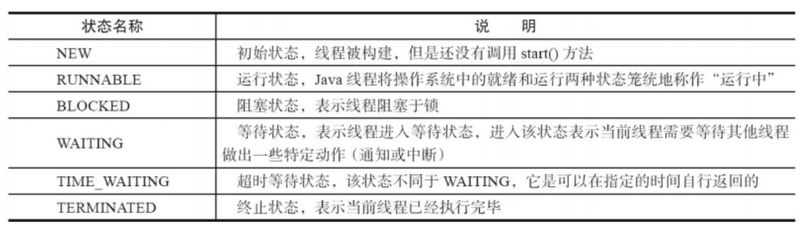

 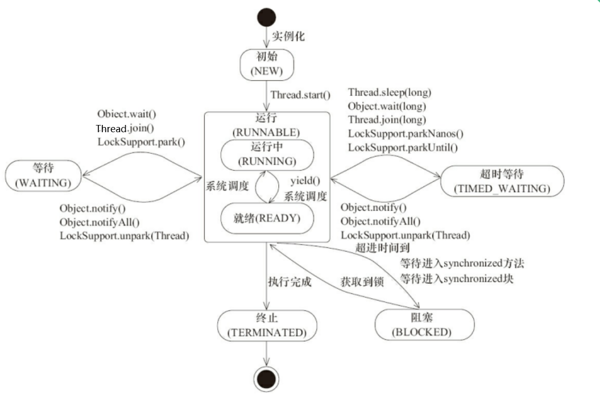


#### 2.1.1、**守护线程**:

Java中有两类线程：用户线程和守护线程。

只要当前jvm实例中有一个用户线程未结束，那么所有的守护线程就全部工作。只有当最后一个用户线程结束时，守护线程随着jvm一同结束工作。守护线程就是为其他线程的运行提供便利服务的。最经典的守护线程就是垃圾回收器（GC）。

```java
Thread t = new Thread();
t.setDaemon(true);
```

使用setDaemon为true将一个线程设置为守护线程。

注意：

1.setDaemon要在该线程start之前进行设置。

2.再守护线程中产生的线程也是守护线程。


```java
public class DemonThreadTest {
    public static void main(String[] args) {
        Thread t1 = new Thread(new CommonThread());
        Thread t2 = new DemonThread();
        t2.setDaemon(true);
        t1.start();
        t2.start();
     }
}

class CommonThread implements Runnable{

    public void run() {
        for (int i = 0; i < 10; i++) {
            System.out.println("正常线程第"+i+"次运行");
        }
        try {
            Thread.sleep(7);
        } catch (InterruptedException e) {
            e.printStackTrace();
        }
    }
}
class DemonThread extends Thread{
    public void run() {
        for (int i = 0; i < 9999; i++) {
            System.out.println("后台线程第"+i+"次运行");
        }
        try {
            Thread.sleep(7);
        } catch (InterruptedException e) {
            e.printStackTrace();
        }
    }
}
```

根据测试结果可以看出在用户线程全部结束后，程序就自动结束，不会管守护线程是否都已经执行完毕。


#### 2.1.2、Callable

```java
public class ThreadTest {

    @Test
    public void test(){

        FutureTask<String> task = new FutureTask<String>(new Thread1());
        Thread mThread=new Thread(task);
        Thread mThread2=new Thread(task);
        Thread mThread3=new Thread(task);
        mThread.start();
        mThread2.start();
        mThread3.start();
    }

}

class Thread1 implements Callable<String>{

    public String call() throws Exception {
        for (int i = 0; i < 10; i++) {
            System.out.println(Thread.currentThread().getName()+"线程执行"+i+"次");
        }
        return "啦啦啦";
    }
}
```

多个线程执行一个task的时候只会执行一次。

线程的操作方法：

#### 2.1.3、**join方法：**

理解为只有调用join方法的线程执行完毕之后再执行主线程。

下面例子只有当AA线程结束后才会执行main线程，如果去掉join方法那么主线程不会等待2秒钟。

```java
public class JoinTest implements Runnable{
    @Override
    public void run() {
        System.out.println(Thread.currentThread().getName()+"开始执行");
        try {
            Thread.sleep(2000);
        } catch (InterruptedException e) {
            e.printStackTrace();
        }
        System.out.println(Thread.currentThread().getName()+"执行完毕");
    }
    public static void main(String[] args) throws InterruptedException {
        JoinTest test = new JoinTest();
        Thread thread = new Thread(test,"AA");
        thread.start();
        thread.join();
        System.out.println("主线程运行");
    }
}
```

#### 2.1.4、**sleep方法：**

如果运行中的线程执行了sleep方法，那么回释放cpu资源sleep参数的毫秒数，因为此方法为线程的静态方法，所以该方法不会释放任何锁。**Sleep方法不会放弃 monitor 锁的所有权，会释放CPU资源。**

```java
Thread.sleep(2000);
//也可以使用TimeUnit方法进行休眠
TimeUnit.SECONDS.sleep(2);//HOURS,MINUTES,SECONDS,MILLISECONDS
```

例子证明sleep不释放锁：

```java
public class SleepTest implements Runnable{
    private static final Object locker = new Object();
    @Override
    public void run() {
        synchronized(locker){
            System.out.println(Thread.currentThread().getName()+"开始运行");
            try {
                TimeUnit.SECONDS.sleep(2);
            } catch (InterruptedException e) {
                e.printStackTrace();
            }
            System.out.println(Thread.currentThread().getName()+"运行结束");
        }
    }
    public static void main(String[] args) throws InterruptedException {
        SleepTest test = new SleepTest();
        Thread thread = new Thread(test);
        Thread thread2 = new Thread(test);
        thread.start();
        thread2.start();
        TimeUnit.SECONDS.sleep(1);
        System.out.println("main线程运行");
    }
}
```

运行结果：每次都是等到thread线程运行完毕才会运行thread2线程。但是main线程不会受影响该运行还是运行，因为main线程是一个jvm的线程，不需要持有SleepTest的locker锁才可以运行。

#### 2.1.5、**wait方法：**

当我们调用wait方法的时候，它就进入道与该对象相关的等待池，同时释放对象锁，使得其他线程可以访问。直到另一线程调用notify或notifyAll方法来唤醒。

例子说明wait方法释放锁：

```java
public class WaitTest{
    private static Object locker = new Object();
    public static void main(String[] args) throws InterruptedException {
        WaitTest test = new WaitTest();
        Thread thread = new Thread(()->{
            try {
                test.waitTest();
            } catch (InterruptedException e) {
                e.printStackTrace();
            }
        },"AA");
        Thread thread2 = new Thread(()->{
            test.notifyTest();
        },"BB");
        thread.start();
        TimeUnit.SECONDS.sleep(2);
        thread2.start();
    }
    private static void waitTest() throws InterruptedException {
        synchronized (locker){
            System.out.println(Thread.currentThread().getName()+"开始等待");
            locker.wait();
            System.out.println(Thread.currentThread().getName()+"等待结束");
        }
    }
    private static void notifyTest(){
        synchronized (locker){
            System.out.println(Thread.currentThread().getName()+"开始唤醒");
            locker.notify();
            System.out.println(Thread.currentThread().getName()+"唤醒结束");
        }
    }
}
```

说明：waitTest与notifyTest方法，要使用同一锁进行wait与notify。并且在同步代码块中也要持有同一锁。

#### 2.1.6、interrupt方法

intterrupt方法不能直接中断一个线程，而是通知线程应该中断了。具体是否要中断还是运行应该由被通知的线程自己处理。

- 如果一个线程处于阻塞状态（例如sleep，wait，join），那么线程会立即退出阻塞状态，并抛出一个interruptedException异常。
- 如果一个线程处于正常运行状态，那么线程的中断标志会被设置为true，仅此而已。

```java
public static void main(String[] args) throws InterruptedException {
    Thread t = new Thread(()->{
        System.out.println(Thread.currentThread().getName()+"开始运行");
        try {
            TimeUnit.SECONDS.sleep(4);
            System.out.println(Thread.currentThread().getName()+"完成休眠");
        } catch (InterruptedException e) {
            System.out.println(Thread.currentThread().getName()+"线程在sleep的时候被中断了");
        }
        System.out.println(Thread.currentThread().getName()+"正常结束");
    },"AA");
    t.start();
    Thread.sleep(2000);
    t.interrupt();
}
```

#### 2.1.7、yield方法

方法作用是让当前处于运行状态的线程退回到可运行状态，让出抢占资源的机会。


#### 2.1.8、死锁

死锁就是多个线程在争夺资源的情况下造成互相等待的情况，如果没有外力驱动就会一直等待下去。

代码：

```java
public class DeadLockTest {

    private static Object resources1 = new Object();
    private static Object resources2 = new Object();

    public static void main(String[] args) {
        new Thread(()->{
            synchronized (resources1){
                System.out.println(Thread.currentThread().getName()+"获取资源1");
                try {
                    Thread.sleep(2000);
                } catch (InterruptedException e) {
                    e.printStackTrace();
                }
                System.out.println(Thread.currentThread().getName()+"开始获取资源2");
                synchronized (resources2){
                    System.out.println(Thread.currentThread().getName()+"获取资源2");
                }
                System.out.println(Thread.currentThread().getName()+"线程结束");
            }
        },"AA").start();
        new Thread(()->{
            synchronized (resources2){
                System.out.println(Thread.currentThread().getName()+"获取资源2");
                try {
                    Thread.sleep(2000);
                } catch (InterruptedException e) {
                    e.printStackTrace();
                }
                System.out.println(Thread.currentThread().getName()+"开始获取资源1");
                synchronized (resources1){
                    System.out.println(Thread.currentThread().getName()+"获取资源1");
                }
                System.out.println(Thread.currentThread().getName()+"线程结束");
            }
        },"BB").start();
    }
}
```

死锁的四个必要条件：

- 互斥条件：同一时刻只能有一个线程获得该资源。
- 请求和保持条件：一个线程因请求资源而发生堵塞的情况对已获得的资源保持不放
- 不可剥夺条件：对于已获得的资源在没有用完之前不能被其他线程剥夺，只有用完之后才释放。
- 循环等待条件：若干线程之间产生首尾相接的循环等待资源关系。

防止死锁：只要破坏上述条件其中一条就不会产生死锁。

### 2.2、synchronized

synchronized有三种：

- 放在普通方法上

  ```java
  public synchronized void test1(){
      
  }
  ```

  持有的是对象锁

- 放在静态方法上

  ```java
  public synchronized static void test2(){
  
  }
  ```

  持有的是类锁

- 放在代码块上

  ```java
  private static Object o = new Object();
  public void test3(){
      synchronized (SynchronizedTest.class){
  
      }
      synchronized (o){
  
      }
  }
  ```

  上面持有的是类锁，下面持有的是对象锁。

**synchronized实现原理：**

synchronized实现是基于jvm实现的，synchronized修饰方法在字节码中添加了一个ACC_SYNCHRONIZED的flags，同步代码块则是在同步的代码块前插入monitorenter，在同步代码块之后插入monitorexit。当线程执行到某个方法时，jvm会去检查方法的ACC_SYNCHRONIZED访问标志是否被设置，如果设置了那该线程就获取了这个对象对应的monitor对象，获取成功后再执行方法体，执行结束后释放monitor对象。代码块也是一样，遇到了monitorenter就获取monitor，遇到了monitorexit就释放monitor。

monitor（对象监视器）：是有C++代码实现的。

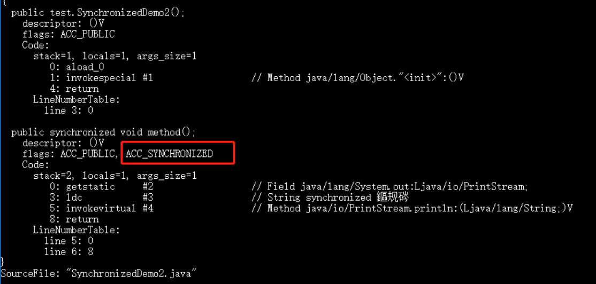

synchronized修饰代码块使用的是monitorenter和monitorexit指令。其中monitorenter指令指向同步代码块的开始位置，monitorexit指令则指明同步代码块的结束位置。当执行monitorenter指令时，线程试图获取锁也就是获取对象监视器monitor的持有权。如果锁的计数器为0则表示锁可以被获取，获取后将锁计数器+1.

当执行到monitorexit指令之后，将锁计数器设为0，标明锁被释放。如果获取对象锁失败，那当前线程就要阻塞等待，直到锁被另外一个线程释放为止。

 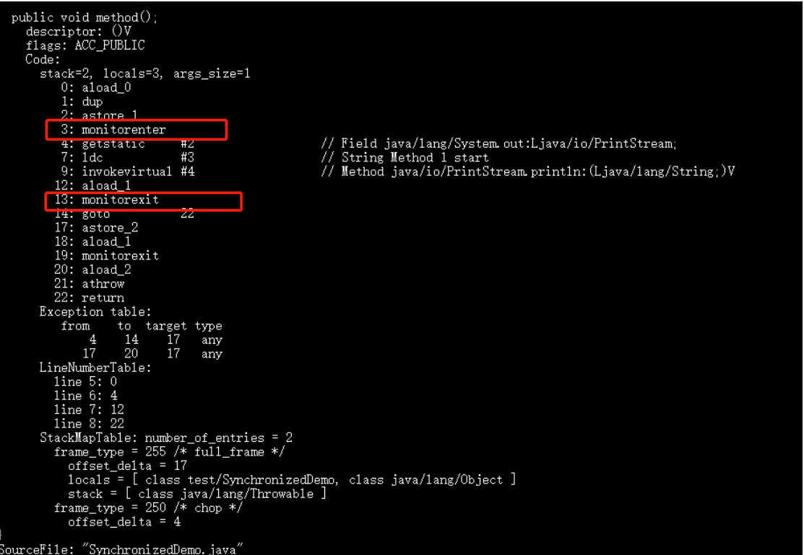


**两者的本质都是对monitor对象监视器的获取。**

**JDK1.6之后的synchronized关键字底层优化：**

锁主要的四种状态，依次是：无锁状态、偏向锁状态、轻量级锁状态、重量级锁状态，它们会随着竞争的激烈而逐渐升级。注意锁只能升级不能降级，这种策略是为了提高获得锁和释放锁的效率。

关于这几种优化的详细信息可以查看下面这篇文章：[Java6 及以上版本对 synchronized 的优化](https://www.cnblogs.com/wuqinglong/p/9945618.html)

在HotSpot虚拟机中，对象在内存中的布局分为三块区域：对象头，示例数据和对其填充。

对象头中包含两部分：MarkWord和类型指针，如果是数组对象的话还有一部分是存储数组的长度。

多线程下synchronized的加锁就是对同一个对象头中的MarkWord的变量进行CAS操作。

Mark Word用于存储对象自身的运行时数据, 如HashCode, GC分代年龄, 锁状态标志, 线程持有的锁, 偏向线程ID等等.占用内存大小与虚拟机位长一致(32位JVM -> MarkWord是32位, 64位JVM->MarkWord是64位).

类型指针指向对象的类元数据, 虚拟机通过这个指针确定该对象是哪个类的实例.

当只有一个线程访问同步代码块并获取锁的时候，会在锁对象的对象头和栈帧中的锁记录里存储锁偏向的线程ID。当出现两个线程来竞争锁的时候，那么偏向锁就失效了，此时锁就会膨胀升级为轻量级锁 有线程A和线程B来竞争对象c的锁(如: synchronized(c){} ), 这时线程A和线程B同时将对象c的MarkWord复制到自己的锁记录中, 两者竞争去获取锁, 假设线程A成功获取锁, 并将对象c的对象头中的线程ID(MarkWord中)修改为指向自己的锁记录的指针, 这时线程B仍旧通过CAS去获取对象c的锁, 因为对象c的MarkWord中的内容已经被线程A改了, 所以获取失败. 此时为了提高获取锁的效率, 线程B会循环去获取锁, 这个循环是有次数限制的, 如果在循环结束之前CAS操作成功, 那么线程B就获取到锁, 如果循环结束依然获取不到锁, 则获取锁失败, 对象c的MarkWord中的记录会被修改为重量级锁, 然后线程B就会被挂起, 之后有线程C来获取锁时, 看到对象c的MarkWord中的是重量级锁的指针, 说明竞争激烈, 直接挂起.

解锁时, 线程A尝试使用CAS将对象c的MarkWord改回自己栈中复制的那个MarkWord, 因为对象c中的MarkWord已经被指向为重量级锁了, 所以CAS失败. 线程A会释放锁并唤起等待的线程, 进行新一轮的竞争.

**synchronized与ReentrantLock的区别：**

两者都是可重入锁

- synchronized依赖于JVM而ReentrantLock依赖于API
- ReentrantLock比synchronized增加了一些高级功能
  - 等待可中断：ReentrantLock提供了一种能中断等待锁的线程的机制，通过lock.lockInterruptibly()来实现这个机制。也就说正在等待的线程可以选择放弃等待，改为处理其他事情。
  - 可实现公平锁，synchronized只能是非公平锁。可以通过ReentrantLock的构造方法传递boolean的值来定制是否为公平。
  - 可实现选择性通知（锁可以绑定多个条件）：`synchronized`关键字与`wait()`和`notify()`/`notifyAll()`方法相结合可以实现等待/通知机制。`ReentrantLock`类当然也可以实现，但是需要借助于`Condition`接口与`newCondition()`方法。


### 2.3、volatile

volitile：保证可见性，禁止指令重排，不保证原子性

可见性：多个线程访问同一共享变量的时候，共享变量放在主内存空间，每个线程需要操作的时候把共享变量拷贝一份放在线程自己的工作内存中，对工作内存的拷贝进行操作。如果变量的拷贝发生了变化，在此线程解锁前会把变化后的内容更新到主内存中，并且对于其他线程的工作内存中的拷贝也同时更新。也就是当前线程的修改对其他线程是可见的。

原子性：是指一个操作或多个操作要么全部执行，且执行的过程不会被任何因素打断，要么就都不执行。

有序性：即程序执行的顺序按照代码的先后顺序执行。

验证可见性代码：

```java
public class MyData {
    volatile int num = 0;
    public void addTo60(){
        num = 60;
    }
}
```

如果num不加volatile修饰，那么下面的main方法中会一直在while循环。

```java
public class MyTest {

    public static void main(String[] args) {
        MyData mydate = new MyData();
        new Thread(()->{
            System.out.println(Thread.currentThread().getName()+" comming in-------");
            try {
                TimeUnit.SECONDS.sleep(3);
            } catch (InterruptedException e) {
                e.printStackTrace();
            }
            mydate.addTo60();
            System.out.println(Thread.currentThread().getName()+" has beenupdate values="+mydate.num);
        },"aaa").start();
        while(mydate.num == 0){

        }
        System.out.println(Thread.currentThread().getName()+" mydate.num="+mydate.num);
    }

}
```

aaa线程修改了num之后，只有添加volatile修饰才会对其他线程立马可见。

不保证原子性验证：

```java
public class MyData {
    volatile int num = 0;
    public void add1(){
        num++;
    }
}
```

```java
public static void main(String[] args) {
        MyData mydate = new MyData();
        for (int i = 0; i < 20; i++) {
            new Thread(()->{
                for (int j = 0; j < 10000; j++) {
                    mydate.add1();
                }
            },String.valueOf(i)).start();
        }

        while(Thread.activeCount()>2){
            Thread.yield();
        }

        System.out.println(Thread.currentThread().getName()+" mydate.num="+mydate.num);

  }
```

结果每次都不一致

使用AtomicInteger来实现原子性的操作。

#### 2.3.1、单例模式现下的多线程问题

```java
public class SingleDemo {

    //懒汉式
    private static SingleDemo singleDemo;

    private SingleDemo(){
        System.out.println(Thread.currentThread().getName()+"进入了构造器");
    }

    public static SingleDemo getSingleDemo(){
        if(singleDemo == null){
            singleDemo = new SingleDemo();
        }
        return singleDemo;
    }

}
```

测试

```
public class SingleDemoTest {
    public static void main(String[] args) {
//        System.out.println(SingleDemo.getSingleDemo() == SingleDemo.getSingleDemo());
//        System.out.println(SingleDemo.getSingleDemo() == SingleDemo.getSingleDemo());
//        System.out.println(SingleDemo.getSingleDemo() == SingleDemo.getSingleDemo());

        for (int i = 0; i < 100; i++) {
            new Thread(()->{
                SingleDemo.getSingleDemo();
            }).start();
        }
    }
}
```

上面注释的全为true，并且只进入了一次构造器，这是在单线程的情况。

在下面多线程一起访问的情况下出现了多次进入构造器的情况，这种情况就需要解决了。

DCL（Double Check Lock）双端检锁机制方式解决：

```java
public static SingleDemo getSingleDemo(){
    if(singleDemo == null){
        synchronized (SingleDemo.class){
            if(singleDemo == null){
                singleDemo = new SingleDemo();
            }
        }
    }
    return singleDemo;
}
```

在private static SingleDemo singleDemo;上添加volatile防止指令重排。

### 2.4、ThreadLocal

#### 2.4.1、ThreadLocal简介

通常情况下，我们创建的变量是可以被任何一个线程访问并修改的。**如果想实现每一个线程都有自己的专属本地变量该如何解决呢？** JDK 中提供的`ThreadLocal`类正是为了解决这样的问题。 **`ThreadLocal`类主要解决的就是让每个线程绑定自己的值，可以将`ThreadLocal`类形象的比喻成存放数据的盒子，盒子中可以存储每个线程的私有数据。**

**如果你创建了一个`ThreadLocal`变量，那么访问这个变量的每个线程都会有这个变量的本地副本，这也是`ThreadLocal`变量名的由来。他们可以使用 `get（）` 和 `set（）` 方法来获取默认值或将其值更改为当前线程所存的副本的值，从而避免了线程安全问题。**

#### 2.4.2、ThreadLocal示例

```java
public class ThreadLocalExample implements Runnable{

    private static final ThreadLocal<String> threadLocal = ThreadLocal.withInitial(()->"defalutValue");

    @Override
    public void run() {
        System.out.println("ThreadName ="+Thread.currentThread().getName()+"defalutValue:"+threadLocal.get());
        try {
            Thread.sleep(new Random().nextInt(1000));
        } catch (InterruptedException e) {
            e.printStackTrace();
        }
        threadLocal.set(Thread.currentThread().getName());
        System.out.println("ThreadName ="+Thread.currentThread().getName()+"newValue:"+threadLocal.get());
    }

    public static void main(String[] args) throws InterruptedException {
        ThreadLocalExample example = new ThreadLocalExample();
        for (int i = 0; i < 10; i++) {
            Thread t = new Thread(example,""+i);
            Thread.sleep(new Random().nextInt(1000));
            t.start();
        }
    }
}
```

根据结果可以看到尽管各种线程已经修改了ThreadLocal的值但是下一个线程的值还是默认值。

#### 2.4.3、ThreadLocal原理

Threa源码：

```java
public class Thread implements Runnable {
 ......
//与此线程有关的ThreadLocal值。由ThreadLocal类维护
ThreadLocal.ThreadLocalMap threadLocals = null;

//与此线程有关的InheritableThreadLocal值。由InheritableThreadLocal类维护
ThreadLocal.ThreadLocalMap inheritableThreadLocals = null;
 ......
}
```

```java
static class ThreadLocalMap {
    static class Entry extends WeakReference<ThreadLocal<?>> {
        /** The value associated with this ThreadLocal. */
        Object value;

        Entry(ThreadLocal<?> k, Object v) {
            super(k);
            value = v;
        }
    }
     ...... ......
}
```

从上面可以看到Thread类中有一个threadLocals和一个inheritableThreadLocals变量，它们都是ThreadLocalMap类型的变量，我们可以把ThreadLocalMap理解为ThreadLocal类实现的定制化HashMap。默认情况下这两个变量都是null，只有当前线程调用ThreadLocal类的set或get方法时才创建它们，实际上调用这两个方法的时候我们调用的是ThreadLocalMap类对应的get和set方法。

ThreadLocal的set方法

```java
public void set(T value) {
    Thread t = Thread.currentThread();
    ThreadLocalMap map = getMap(t);
    if (map != null)
        map.set(this, value);
    else
        createMap(t, value);
}
```

#### 2.4.4、ThreadLocal内存泄漏问题

ThreadLocalMap中使用的Key为ThreadLocal的弱引用，而value为强引用。所以如果ThreadLocal没有被外部强引用的情况下，在垃圾回收的时候，key会被清理掉，而value不会被清理掉。这样一来，ThreadLocalMap中就会出现key为null的Entry，如果不采取任何措施的话，value永远不会被GC回收，这个时候就可能会产生内存泄漏。ThreadLocalMap实现中已经考虑了这种情况，在调用set，get，remove方法的时候会清理掉key为null的记录。使用完ThreadLocal最好手动调用remove方法。

### 2.5、线程池

#### 2.5.1、为什么使用线程池

池化技术减少每次获取资源的消耗，提高对资源的利用率。

线程池提供了一种限制和管理资源。每个线程池还维护一些基本的统计信息，比如已经完成的线程数量。

使用线程池的好处：

- 减少资源消耗。通过重复利用已创建的线程降低线程创建和销毁造成的消耗。
- 提高响应速度。当任务到达时，任务可以不需要的等到线程创建就能立即执行。
- 提高线程的可管理性。线程是稀缺资源，如果无限制的创建，不仅会消耗系统资源，还会降低系统的稳定性，使用线程池可以进行统一的分配，调优和监控。

#### 2.5.2、实现Runnable接口与Callable接口的区别

Runnable接口不会返回结果或抛出检查异常。但是Callable接口可以。如果任务不需要返回结果或抛出检查异常那么建议使用Runnable接口，这样代码更简洁。

工具类 `Executors` 可以实现 `Runnable` 对象和 `Callable` 对象之间的相互转换。（`Executors.callable（Runnable task`）或 `Executors.callable（Runnable task，Object resule）`）。

```java
@FunctionalInterface
public interface Runnable {
   /**
    * 被线程执行，没有返回值也无法抛出异常
    */
    public abstract void run();
}
```

```java
@FunctionalInterface
public interface Callable<V> {
    /**
     * 计算结果，或在无法这样做时抛出异常。
     * @return 计算得出的结果
     * @throws 如果无法计算结果，则抛出异常
     */
    V call() throws Exception;
}
```

#### 2.5.3、执行excute()与submit()的区别

excute方法提交不需要返回值的任务，所以无法判断任务是否被线程执行成功。

submit方法用于提交需要返回值的任务。线程池会返回一个Future类型的对象，通过这个对象可以判断任务是否被执行成功，并且可以通过Future的get方法获取返回值，get方法会阻塞当前线程知道任务执行完成。

#### 2.5.4、如何创建线程池

阿里巴巴Java开发手册中强制线程池不允许使用Executors去创建，而是通过ThreadPoolExecutor的方式，这样的处理方式可以更加明确线程池规则，规避资源耗尽的风险。

**方式1：通过构造方法实现**

 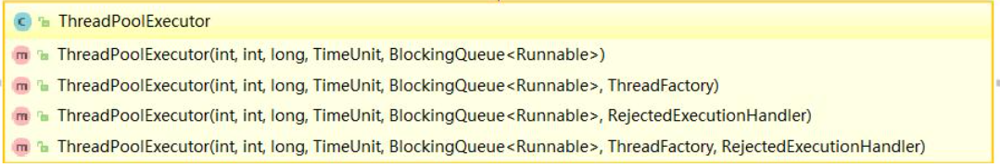

**方式2：通过Executors工具类来实现**

- FixedThreadPool:newFixedThreadPool(int nThreads)该方法返回一个固定线程数量的线程池。该线程池中的线程数量始终不变，当有一个新的任务提交时，线程池中若有空闲的线程则立即执行，若没有，则新的任务会被暂存在一个任务队列中，待有线程空闲时，便处理在任务队列中的任务。
- SingleThreadExecutor：newSingleThreadExecutor()该方法返回一个只有一个线程的线程池。若多余一个任务被提交到该线程池，任务会被保存在一个任务队列中，待线程空闲，按先入先出的顺序执行队列中的任务。
- CachedThreadPool：newCachedThreadPool()该方法返回一个可根据实际情况调整的线程数量的线程池。线程池的线程数量不确定，但若有空闲线程可以复用，则会优先使用可复用的线程。若所有线程均在工作，又有新的任务提交则会创建新的线程处理任务。所有线程在当前任务执行完毕后，将返回线程池进行复用。

#### 2.5.5、ThreadPoolExecutor类分析

ThreadPoolExecutor类中提供了四个构造方法。

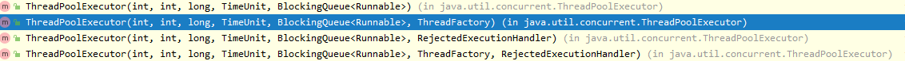

```java
public ThreadPoolExecutor(int corePoolSize,
                          int maximumPoolSize,
                          long keepAliveTime,
                          TimeUnit unit,
                          BlockingQueue<Runnable> workQueue,
                          ThreadFactory threadFactory,
                          RejectedExecutionHandler handler) {
    if (corePoolSize < 0 ||
        maximumPoolSize <= 0 ||
        maximumPoolSize < corePoolSize ||
        keepAliveTime < 0)
        throw new IllegalArgumentException();
    if (workQueue == null || threadFactory == null || handler == null)
        throw new NullPointerException();
    this.corePoolSize = corePoolSize;
    this.maximumPoolSize = maximumPoolSize;
    this.workQueue = workQueue;
    this.keepAliveTime = unit.toNanos(keepAliveTime);
    this.threadFactory = threadFactory;
    this.handler = handler;
}
```

- corePoolSize:核心线程数，定义了最小可以同时运行的线程数量。
- maximumPoolSize：当队列中存放的任务达到队列容量的时候，当前可以同时运行的线程数量变为最大线程数。
- workQueue：当新任务来的时候会先判断当前运行的线程数量是否达到了核心线程数，如果达到的话新任务就会被存放在队列中。
- keepAliveTime：当线程池中的线程数量大于核心线程数的时候，如果这时候没有新的任务提交，核心线程外的线程不会立即销毁，而是会等待，知道等待时间超过了keepAliveTime才会被销毁。
- unit：keepAliveTime参数的时间单位。
- threadFactory：表示生成线程池中工作线程的工厂，用于创建线程，一般使用默认即可。
- handler：拒绝策略（饱和策略）

**饱和策略：**

如果当时同时运行的线程数量达到了最大线程数量并且队列也已经被放满的时候，ThreadPoolTaskExecutor定义了一些策略：

- `ThreadPoolExecutor.AbortPolicy`：抛出RejectedExecutionException来拒绝新任务的处理。（默认未该策略）
- `ThreadPoolExecutor.CallerRunsPolicy`：”调用者运行“一种调节机制，该策略不会丢弃任务也不会抛出异常，而是将某些任务回退到调用者，从而降低新任务的流量。
- `ThreadPoolExecutor.DiscardPolicy`：不处理新任务，直接丢弃。

- `ThreadPoolExecutor.DiscardOldestPolicy`：将等待最久的未处理的任务丢弃。

```java
public static void main(String[] args) {
    ThreadPoolExecutor threadPoolExecutor = new ThreadPoolExecutor(
            2,
            5,
            1L,
            TimeUnit.SECONDS,
            new LinkedBlockingDeque<Runnable>(3),
            Executors.defaultThreadFactory(),
            new ThreadPoolExecutor.CallerRunsPolicy()
    );
    try{
        for (int i = 0; i < 9; i++) {
            threadPoolExecutor.execute(()->{
                System.out.println(Thread.currentThread().getName()+"\t 办理任务");
            });
        }
    }catch (Exception e){
        e.printStackTrace();
    }finally {
        threadPoolExecutor.shutdown();
    }
}

/**
pool-1-thread-1	 办理任务
pool-1-thread-2	 办理任务
pool-1-thread-1	 办理任务
pool-1-thread-4	 办理任务
main	 办理任务
pool-1-thread-3	 办理任务
pool-1-thread-1	 办理任务
pool-1-thread-2	 办理任务
pool-1-thread-5	 办理任务
*/
```

#### 2.5.6、原理分析

 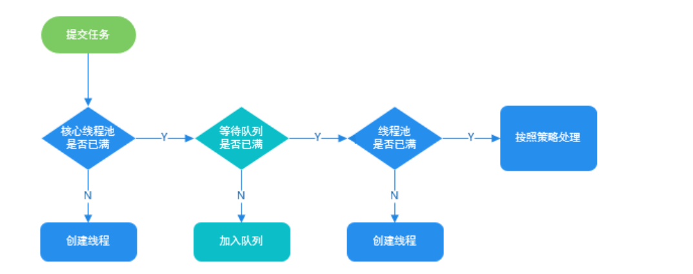

### 2.6、Atomic原子类

#### 2.6.1、原子类简介

具有原子操作特性的类。

 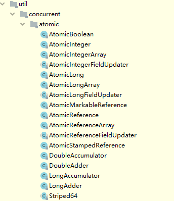

#### 2.6.2、原子类的四类

**基本类型**

- `AtomicInteger`
- `AtomicLong`
- `AtomicBoolean`

**数组类型**

- `AtomicIntegerArray`
- `AtomicLongArray`
- `AtomicReferenceArray`

**引用类型**

- `AtomicReference`
- `AtomicStampedReference`：原子更新带有版本号的引用类型。可以解决ABA问题。
- `AtomicMarkableReference`：原子更新带有标记位的引用类型

**对象的属性修改类型**

- `AtomicIntegerFieldUpdater`：原子更新整形字段的更新器
- `AtomicLongFieldUpdater`：原子更新长整形字段的更新器
- `AtomicReferenceFieldUpdater`：原子更新引用类型字段的更新器

AtomicInteger类的常用方法：

```java
public final int get() //获取当前的值
public final int getAndSet(int newValue)//获取当前的值，并设置新的值
public final int getAndIncrement()//获取当前的值，并自增
public final int getAndDecrement() //获取当前的值，并自减
public final int getAndAdd(int delta) //获取当前的值，并加上预期的值
boolean compareAndSet(int expect, int update) //如果输入的数值等于预期值，则以原子方式将该值设置为输入值（update）
public final void lazySet(int newValue)//最终设置为newValue,使用 lazySet 设置之后可能导致其他线程在之后的一小段时间内还是可以读到旧的值。
```

#### 2.6.3、AtomicInteger原理

```java
//部分源码
private static final Unsafe unsafe = Unsafe.getUnsafe();
private static final long valueOffset;

static {
    try {
        valueOffset = unsafe.objectFieldOffset
            (AtomicInteger.class.getDeclaredField("value"));
    } catch (Exception ex) { throw new Error(ex); }
}

private volatile int value;
```

AtomicInteger类主要利用CAS（Compare and Swap）+colatile和native方法来保证原子操作，从而避免synchronized的高开销。

CAS 的原理是拿期望的值和原本的一个值作比较，如果相同则更新成新的值。UnSafe 类的 objectFieldOffset() 方法是一个本地方法，这个方法是用来拿到“原来的值”的内存地址，返回值是 valueOffset。另外 value 是一个 volatile 变量，在内存中可见，因此 JVM 可以保证任何时刻任何线程总能拿到该变量的最新值。

### 2.7、AQS

#### 2.7.1、AQS介绍

AQS的全程为Abstract Queue Synchronizer。

AQS时一个用来构建锁和同步器的框架，使用AQS能简单且高效地构造出应用广泛的大量的同步器，比如ReentrantLock，Semaphore，其他的比如ReentrantReadWriterLock，SynchronousQueue，FutureTask都是基于AQS的。

#### 2.7.2、AQS原理分析

AQS核心思想是，如果被请求的共享资源空闲，则将当前请求资源的线程设置为有效的工作线程，并且将共享资源设置为锁定状态。如果被请求的共享资源被占用，那么就需要一套线程阻塞等待以及被唤醒时锁分配的机制，这个机制AQS是用CLH队列锁实现的，即将暂时获取不到锁的线程加入到队列中。

> CLH(Craig,Landin,and Hagersten)队列是一个虚拟的双向队列（虚拟的双向队列即不存在队列实例，仅存在结点之间的关联关系）。AQS 是将每条请求共享资源的线程封装成一个 CLH 锁队列的一个结点（Node）来实现锁的分配。

 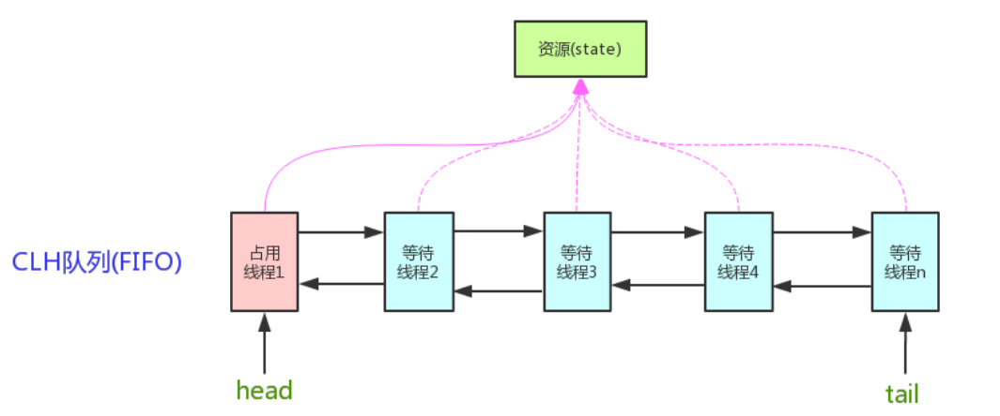

**AQS定义两种对资源共享方式：**

- Exclusive（独占）：只有一个线程能执行，如ReentrantLock。又可分为公平锁和非公平锁。
- share（共享）：多个线程可同时执行，如CountDownLatch，Semaphore，CyclicBarrier。ReadWriteLock。

不同的自定义同步器争用共享资源的方式也不同。自定义同步器在实现时只需要实现共享资源state的获取与释放方式即可，置于具体线程等待队列的维护，AQS已经在顶层实现好了。

**AQS 使用了模板方法模式，自定义同步器时需要重写下面几个 AQS 提供的模板方法：**

```java
isHeldExclusively()//该线程是否正在独占资源。只有用到condition才需要去实现它。
tryAcquire(int)//独占方式。尝试获取资源，成功则返回true，失败则返回false。
tryRelease(int)//独占方式。尝试释放资源，成功则返回true，失败则返回false。
tryAcquireShared(int)//共享方式。尝试获取资源。负数表示失败；0表示成功，但没有剩余可用资源；正数表示成功，且有剩余资源。
tryReleaseShared(int)//共享方式。尝试释放资源，成功则返回true，失败则返回false。
Copy to clipboardErrorCopied
```

默认情况下，每个方法都抛出 `UnsupportedOperationException`。 这些方法的实现必须是内部线程安全的，并且通常应该简短而不是阻塞。AQS 类中的其他方法都是 final ，所以无法被其他类使用，只有这几个方法可以被其他类使用。

以 ReentrantLock 为例，state 初始化为 0，表示未锁定状态。A 线程 lock()时，会调用 tryAcquire()独占该锁并将 state+1。此后，其他线程再 tryAcquire()时就会失败，直到 A 线程 unlock()到 state=0（即释放锁）为止，其它线程才有机会获取该锁。当然，释放锁之前，A 线程自己是可以重复获取此锁的（state 会累加），这就是可重入的概念。但要注意，获取多少次就要释放多么次，这样才能保证 state 是能回到零态的。

再以 `CountDownLatch` 以例，任务分为 N 个子线程去执行，state 也初始化为 N（注意 N 要与线程个数一致）。这 N 个子线程是并行执行的，每个子线程执行完后` countDown()` 一次，state 会 CAS(Compare and Swap)减 1。等到所有子线程都执行完后(即 state=0)，会 unpark()主调用线程，然后主调用线程就会从 `await()` 函数返回，继续后余动作。

一般来说，自定义同步器要么是独占方法，要么是共享方式，他们也只需实现`tryAcquire-tryRelease`、`tryAcquireShared-tryReleaseShared`中的一种即可。但 AQS 也支持自定义同步器同时实现独占和共享两种方式，如`ReentrantReadWriteLock`。

#### 2.7.3、AQS组件总结

- **`Semaphore`(信号量)-允许多个线程同时访问：** `synchronized` 和 `ReentrantLock` 都是一次只允许一个线程访问某个资源，`Semaphore`(信号量)可以指定多个线程同时访问某个资源。
- **`CountDownLatch `（倒计时器）：** `CountDownLatch` 是一个同步工具类，用来协调多个线程之间的同步。这个工具通常用来控制线程等待，它可以让某一个线程等待直到倒计时结束，再开始执行。
- **`CyclicBarrier`(循环栅栏)：** `CyclicBarrier` 和 `CountDownLatch` 非常类似，它也可以实现线程间的技术等待，但是它的功能比 `CountDownLatch` 更加复杂和强大。主要应用场景和 `CountDownLatch` 类似。`CyclicBarrier` 的字面意思是可循环使用（`Cyclic`）的屏障（`Barrier`）。它要做的事情是，让一组线程到达一个屏障（也可以叫同步点）时被阻塞，直到最后一个线程到达屏障时，屏障才会开门，所有被屏障拦截的线程才会继续干活。`CyclicBarrier` 默认的构造方法是 `CyclicBarrier(int parties)`，其参数表示屏障拦截的线程数量，每个线程调用 `await()` 方法告诉 `CyclicBarrier` 我已经到达了屏障，然后当前线程被阻塞。

### 2.8、并发容器

#### 2.8.1、 CopyOnWriteArrayList

CopyOnWriteArrayList 读取是完全不用加锁的，并且更厉害的是：写入也不会阻塞读取操作。只有写入和写入之间需要进行同步等待。这样一来，读操作的性能就会大幅度提升。

CopyOnWriteArrayList的所有可变操作都是通过底层创建数组副本来实现的。当想要修改List的时候，并不会修改原内容而是对原内容进行拷贝然后对拷贝副本进行修改，写完之后将副本内容替换到原内容进行更新。

```java
    /** The array, accessed only via getArray/setArray. */
    private transient volatile Object[] array;
    public E get(int index) {
        return get(getArray(), index);
    }
    @SuppressWarnings("unchecked")
    private E get(Object[] a, int index) {
        return (E) a[index];
    }
    final Object[] getArray() {
        return array;
    }
    
    public boolean add(E e) {
        final ReentrantLock lock = this.lock;
        lock.lock();//加锁
        try {
            Object[] elements = getArray();
            int len = elements.length;
            Object[] newElements = Arrays.copyOf(elements, len + 1);//拷贝新数组
            newElements[len] = e;
            setArray(newElements);
            return true;
        } finally {
            lock.unlock();//释放锁
        }
    }
```

#### 2.8.2、ConcurrentLinkedQueue

Java 提供的线程安全的 Queue 可以分为**阻塞队列**和**非阻塞队列**，其中阻塞队列的典型例子是 BlockingQueue，非阻塞队列的典型例子是 ConcurrentLinkedQueue，在实际应用中要根据实际需要选用阻塞队列或者非阻塞队列。 **阻塞队列可以通过加锁来实现，非阻塞队列可以通过 CAS 操作实现。**

#### 2.8.3、BlockingQueue

阻塞队列（BlockingQueue）被广泛使用在“生产者-消费者”，其原因是BlockingQueue提供了可阻塞的添加与移除方法。当队列为满的时候，生产者线程会被阻塞，直到队列未满，当队列为空的时候，消费者线程被阻塞知道队列插入。

BlockingQueue是一个接口，实现类如下：

 

- ArrayBlockingQueue：有界队列，底层采用数组实现。一旦创建容量不允许改变。并发控制采用可重入锁控制，插入和读取操作必须要获取到锁才能进行操作。对空队列获取和满队列插入都会被阻塞。默认是使用非公平锁，如果想要使用公平锁则在构造器里加入true。

  ```java
  ArrayBlockingQueue<Integer> blockingQueue = new ArrayBlockingQueue<Integer>(10,true);
  ```

- LinkedBlockingQueue：可以当作无界队列也可以当作有界队列，未指定大小容量为Integer.MAX_VALUE，底层采用单向链表实现。

- PriorityBlockingQueue：支持优先级的无界队列，默认情况下元素采用自然顺序进行排序，也可以通过自定义类实现 `compareTo()` 方法来指定元素排序规则，或者初始化时通过构造器参数 `Comparator` 来指定排序规则。并发控制采用的是 **ReentrantLock**不可以插入 null 值，同时，插入队列的对象必须是可比较大小的（comparable），否则报 ClassCastException 异常。它的插入操作 put 方法不会 阻塞，因为它是无界队列（take 方法在队列为空的时候会阻塞）。

### 

## 3.IO流

### 3.1、IO

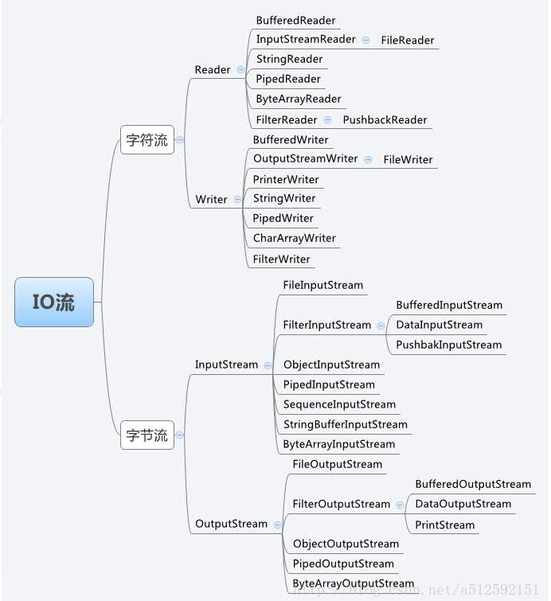


### 3.2、序列化

序列化：将对象写入到IO流当中

反序列化：从IO流中恢复对象

代码：

```java
public static void main(String[] args) throws IOException {
    User user = new User();
    user.setUserName("aixin");
    user.setAge(18);
    ObjectOutputStream objectOutputStream = new ObjectOutputStream (new FileOutputStream("user.txt"));
    objectOutputStream.writeObject(user);
}

@Test
public void test() throws IOException, ClassNotFoundException {
    ObjectInputStream ois = new ObjectInputStream(new FileInputStream("user.txt"));
    User user = (User)ois.readObject();
    System.out.println(user);
}
```

注意：

User类必须实现Serializable接口。如果User里有其他对象类型的属性那么也该对象也必须实现Serializable接口。序列化生成文件是乱码形式的，是看不懂的。

**transient**：用此关键字修饰的变量标明不会被持久化和修复。

多次序列化必须序列化的位置与反序列化的位置一样，否则可能会有错误。

```java
@Test
public void teacherTest() throws IOException{
    User user = new User("路飞",18);
    Teacher t1 = new Teacher("雷利",user);
    Teacher t2 = new Teacher("香克斯",user);
    ObjectOutputStream out = new ObjectOutputStream(new FileOutputStream("teacher.dat"));
    out.writeObject(user);
    out.writeObject(t1);
    out.writeObject(t2);
    out.writeObject(t1);
    out.flush();
    out.close();
}

@Test
public void teacherTest2() throws IOException, ClassNotFoundException {
    ObjectInputStream in = new ObjectInputStream(new FileInputStream("teacher.dat"));
    User user = (User)in.readObject();
    Teacher t1 = (Teacher)in.readObject();
    Teacher t2 = (Teacher)in.readObject();
    Teacher t3 = (Teacher)in.readObject();
    System.out.println(user);
    System.out.println(t1);
    System.out.println(t2);
    System.out.println(t3);
    System.out.println(t1 == t3);
}
```


## 4.JVM

### 4.1、Java运行时数据区域

 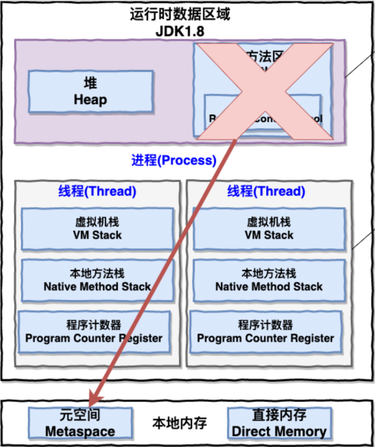

线程私有：程序计数器、虚拟机栈、本地方法栈

线程共享：堆、方法区、直接内存

### 4.2、程序计数器

程序计数器是记录当前线程执行的字节码行号指示器。字节码解释器工作时通过改变这个计数器的值来选取下一条需要执行的字节码指令，分支、循环、跳转、异常处理、线程恢复等功能都需要依赖这个计数器完成。

为了线程切换后可以恢复到正确的执行位置，所以每条线程都需要一个独立的程序计数器，各线程之间互不影响，独立存储。

程序计数器是唯一一个不会出现OutofMemoryError的内存区域，它的生命周期随着线程的创建而创建，随着线程的结束而结束。

### 4.3、虚拟机栈

虚拟机栈也是线程私有的，生命周期和线程相同，描述的是Java方法执行的内存模型，每次方法调用的数据都是通过栈传递的。

Java虚拟机栈是由一个个栈帧组成的，而每一个栈帧都拥有：局部变量表、操作数栈、动态链接、方法出口信息。

局部变量表主要存放了编译器可知的8大基本数据类型、对象引用（reference类型，可能是一个指向对象起止地址的指针，也可能是指向一个代表对象的句柄或其他与此对象相关的位置）。

Java虚拟机栈会出现两种错误：StackOverFlowError和OutOfMemoryError

- StackOverFlowError：若Java虚拟机栈的内存大小不允许动态扩展，那么当线程请求栈的深度超过当前Java虚拟机栈的最大深度时，就会抛出该异常。
- OutOfMemoryError：Java虚拟机栈的内存大小可以动态扩展，如果虚拟机在动态扩展栈时无法申请到足够的内存空间，就会抛出该异常。

Java方法有两种返回方式：return和抛出异常。无论哪一个方式都会导致栈帧被弹出。

### 4.4、本地方法栈

本地方法栈发挥的作用与虚拟机栈类似，只不过本地方法栈服务的时native方法。

### 4.5、堆

堆是Java虚拟机所管理的内存中最大的一块，Java堆是所有线程共享的一块内存区域，在虚拟机创建的时候创建，此内存区域的唯一目的就是存放对象实例，几乎所有的对象实例以及数组都是在这里分配内存。

Java堆是垃圾收集器管理的主要区域，因此也被称为GC堆，从垃圾回收的角度，由于现在收集器都是采用分代垃圾收集算法，所以Java还可以分为新生代和老年代。

 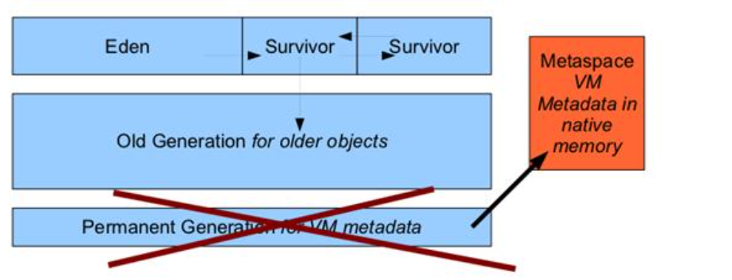

Eden，两个Survivor都属于新生代（为了区分两个Survivor区域按照顺序被命名为from和to）。

大部分情况，对象会首先在Eden上分配内存，在一次新生代垃圾回收之后，还存活的对象被放到S0或者S1，并且分代年龄+1.当年龄增加到一定程度（默认为15）就会被放到老年代中。对象今生老年代年龄的阈值可以通过参数-XX:MaxTenuringThreshold来设置。

> “Hotspot 遍历所有对象时，按照年龄从小到大对其所占用的大小进行累积，当累积的某个年龄大小超过了 survivor 区的一半时，取这个年龄和 MaxTenuringThreshold 中更小的一个值，作为新的晋升年龄阈值”

堆最容易出现的错误就是OutOfMemoryError，并且这种错误表现形式还会分为几种：

- `OutOfMemoryError: GC Overhead Limit Exceeded`：当JVM花太多时间执行垃圾回收并且只能回收很少的堆空间时就会发生此错误
- `java.lang.OutOfMemoryError: Java heap space`：在创建新对象的时候，如果堆内存中的空间不足以存放新创建的对象时就会出现这个错误。

### 4.6、方法区

方法区时线程共享的内存区域，它用于存储已被虚拟机加载的类信息、常量、静态变量、即时编译器编译后的代码等数据。虽然Java虚拟机规范把方法区描述为堆的一个逻辑部分，但是它却有另一个别名叫非堆(Non-Heap)。

#### 4.6.1、方法区与永久代的关系

> 《Java 虚拟机规范》只是规定了有方法区这么个概念和它的作用，并没有规定如何去实现它。那么，在不同的 JVM 上方法区的实现肯定是不同的了。 **方法区和永久代的关系很像 Java 中接口和类的关系，类实现了接口，而永久代就是 HotSpot 虚拟机对虚拟机规范中方法区的一种实现方式。** 也就是说，永久代是 HotSpot 的概念，方法区是 Java 虚拟机规范中的定义，是一种规范，而永久代是一种实现，一个是标准一个是实现，其他的虚拟机实现并没有永久代这一说法。

#### 4.6.2、常用设置参数

```java
//Java1.8之前
-XX:PermSize=N //方法区 (永久代) 初始大小
-XX:MaxPermSize=N //方法区 (永久代) 最大大小,超过这个值将会抛出 OutOfMemoryError 异常:java.lang.OutOfMemoryError: PermGen
//java 1.8之后
-XX:MetaspaceSize=N //设置 Metaspace 的初始（和最小大小）
-XX:MaxMetaspaceSize=N //设置 Metaspace 的最大大小
```

### 4.7、运行时常量池

运行时常量池时方法区的一部分。Class文件中除了类的版本、字段、方法、接口等描述信息外，还有常量池表（用于存放编译期生成的各种字面量和符号引用）

> 1. **JDK1.7 之前运行时常量池逻辑包含字符串常量池存放在方法区, 此时 hotspot 虚拟机对方法区的实现为永久代**
> 2. **JDK1.7 字符串常量池被从方法区拿到了堆中, 这里没有提到运行时常量池,也就是说字符串常量池被单独拿到堆,运行时常量池剩下的东西还在方法区, 也就是 hotspot 中的永久代** 。
> 3. **JDK1.8 hotspot 移除了永久代用元空间(Metaspace)取而代之, 这时候字符串常量池还在堆, 运行时常量池还在方法区, 只不过方法区的实现从永久代变成了元空间(Metaspace)**

### 4.8、对象的创建

 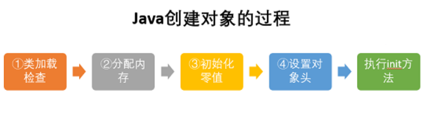

1. **类加载检查：**

   虚拟机遇到一条new指令时，首先去检查这个指令的参数是否能在常量池中定位到这个类的符号引用，并且检查这个符号引用代表的类是否已被加载过、解析和初始化过。如果没有，那必须先执行相应的类加载过程。

2. **分配内存：**

   在类加载检查通过后，接下来虚拟机将为新生对象分配内存。对象所需的内存大小在类加载完成后便可确定，为对象分配空间的任务等同于把一块确定大小的内存从Java堆中划分出来。分配方式有”指针碰撞“和”空闲列表“两种，选择哪种方式由Java堆是否规整决定，而Java堆是否规整又由采用的垃圾收集器是否带有压缩整理功能决定。

   **内存分配的两种方式：**

   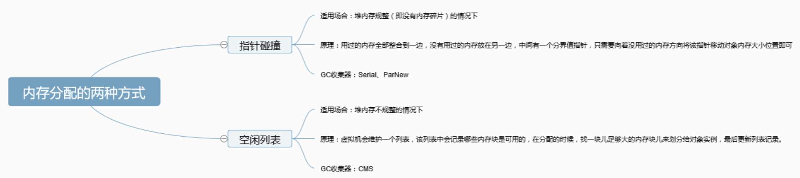

   **内存分配并发问题：**

   虚拟机采用两种方式来保证线程安全:

   - **CAS+失败重试**：虚拟机采用CAS配上失败重试的方式保证更新操作的原子性。
   - **TLAB**（Thread Local Allocation Buffer，即线程本地分配缓存区）：为每一个线程预先在Eden区分配一块内存，JVM在给线程中的对象分配内存时，首先在TLAB分配，当对象大于TLAB中的剩余内存或TLAB的内存已经用尽时，再采用上述的CAS进行内存分配。

3. **初始化零值：**

   内存分配完成后，虚拟机需要将分配到的内存空间都初始化为零值（不包括对象头），这一步操作保证了对象的实例字段在Java代码中可以不赋初始值就直接使用，程序能访问到这些字段的数据类型所对应的零值。

4. **设置对象头：**

   初始化零值完成之后，虚拟机要对对象进行必要的设置，例如这个对象是哪个类的实例、如何才能找到类的元数据信息、对象的哈希码、对象的GC分代年龄等。这些信息存放在对象头中。另外，根据虚拟机当前运行状态不同，如是否启用偏向锁等，对象头会有不同的设置方式。

   > 1，Mark Word
   >
   > 2，指向类的指针
   >
   > 3，数组长度（只有数组对象才有）

5. **执行init方法：**

   在上面工作都完成后，从虚拟机的视角来看，一个新的对象已经产生了，但从Java程序员的视角来看对象的创建才刚开始，<init>方法还没有执行，所有的字段都还为零。所以一般来说执行new指令之后会接着执行init方法，把对象按照程序员的意愿进行初始化，这样一个真正可用的对象才算产生出来。

### 4.9、对象的内存布局

对象在内存中的布局可以分为三块区域：对象头、实例数据和对齐填充。

**对象头包括**：一部分用于存储对象自身的运行时数据（哈希码、GC分代年龄、锁状态标志等等），另一部分是类型指针，即对象指向它的类元数据的指针，虚拟机通过这个指针来确定这个对象是哪个类的实例。

**实例数据部分**是对象真正存储的有效信息，也是在程序中所定义的各种类型的字段内容。

**对齐部分**仅仅起占位作用。因为Hotspot虚拟机的自动内存管理系统要求对象起始地址必须是8字节的整数倍。对象头部分正好是8字节的倍数，因此当对象实例部分没有对齐时，就需要通过对齐来补全。

### 4.10、对象的访问定位

Java程序通过栈上的reference数据来操作堆上的具体对象。对象的访问方式由虚拟机实现而定，目前主流的访问方式由**使用句柄**和**直接指针**两种：

1. 句柄：如果使用句柄的话，那么Java堆中就会划分出一块内存来作为句柄池，reference中存储的就是对象的句柄地址，而句柄中包含了对象实例数据与类型数据各自的具体地址信息。

    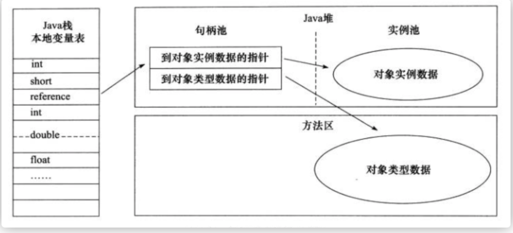

2. 直接指针：如果使用直接指针，那么Java堆对象的布局中就必须考虑如何放置访问类型数据的相关信息，而reference中存储的直接就是对象的地址。

    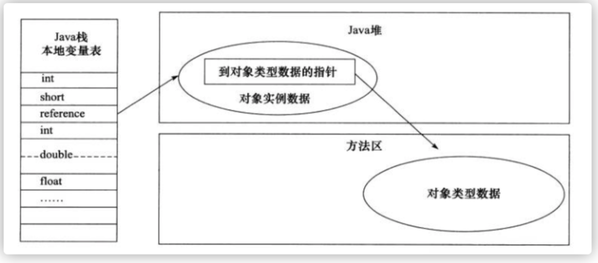

使用句柄来访问最大好处时在对象移动时只会改变句柄中的实例数据指针，而reference本身不需要修改。使用直接指针访问最大的好处就是速度快，它节省了一次指针定位的时间开销。Hotspot虚拟机采用第二种方式进行访问。

### 4.11、垃圾回收

#### 1.关于分配与回收

堆空间的基本结构：

 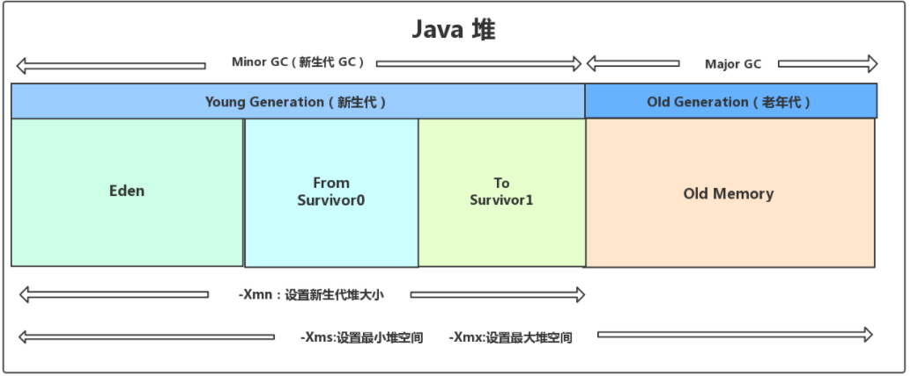

大部分情况，对象都会在Eden区域分配，在一次新生代垃圾回收之后还存活的对象移动到S0或者S1，并且对象的年龄+1，当它的年龄增加的一定程度时（默认15）就会被放到老年代。对象晋升老年代的年龄值可以通过参数：`-XX:MaxTenuringThreshold`来设置。

> Hotspot 遍历所有对象时，按照年龄从小到大对其所占用的大小进行累积，当累积的某个年龄大小超过了 survivor 区的一半时，取这个年龄和 MaxTenuringThreshold 中更小的一个值，作为新的晋升年龄阈值。

经过这次GC后，Eden区和From区被清空。将还存活的对象放在To区中，然后这个时候From和To会交换他们的角色。不管怎样，都会保证名为 To 的 Survivor 区域是空的。Minor GC 会一直重复这样的过程，直到“To”区被填满，"To"区被填满之后，会将所有对象移动到老年代中。

 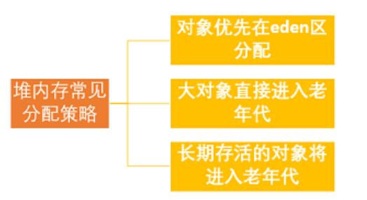

1. 对象优先在Eden区分配。

   **分配担保机制**

2. 大对象直接进入老年代：为了避免为大对象分配内存时由于分配担保机制带来的复制而降低效率。

   虚拟机提供了一个 `-XX:PretenureSizeThreshold` 参数，令大于这个设置值的对象直接在老年代分配。这样做的目的是避免在 Eden 区及两个 Survivor 区之间发生大量的内存复制。

3. 长期存活的对象进入老年代：动态年龄判断。

   对象晋升老年代的年龄阈值，可以通过参数`-XX:MaxTenuringThreshold`设置。

针对HotSpot虚拟机，GC分类准确的被分为两类：

部分收集 (Partial GC)：

- 新生代收集（Minor GC / Young GC）：只对新生代进行垃圾收集；
- 老年代收集（Major GC / Old GC）：只对老年代进行垃圾收集。需要注意的是 Major GC 在有的语境中也用于指代整堆收集；
- 混合收集（Mixed GC）：对整个新生代和部分老年代进行垃圾收集。

整堆收集（Full GC）：收集整个 Java 堆和方法区。

#### 2.关于对象是否可回收

 

##### 2.1、引用计数法

在对象中添加一个计数器，每当有一个地方引用它的时候计数器就+1，当引用失效计数器就-1，任何时候计数器为0就代表对象是不可能再被引用的。

这个方法简单，效率高但是目前主流的虚拟机都不使用它，因为它不能解决相互依赖的问题。

##### 2.2、可达性分析算法

基本思想就是通过一个“GC roots”的对象作为起点，从这些节点向下搜索，节点所走过的路径成为引用链，当一个对象到GC Roots没有任何引用链的相连的话，则证明对象不可用。

 

可作为GC Roots的对象：

- 虚拟机栈(栈帧中的本地变量表)中引用的对象
- 本地方法栈(Native 方法)中引用的对象
- 方法区中类静态属性引用的对象
- 方法区中常量引用的对象
- 所有被同步锁持有的对象

##### 2.3、再谈引用

无论上面哪一种方法都与引用有关。

JDK1.2之前，Java对引用的定义很传统，如果reference类型的数据存储的数值是另一块内存的起始地址，那么就称这块内存代表一个引用。

JDK1.2之后，对引用进行了分类：强引用，软引用，弱引用，虚引用（按照引用强度从大到小排序）

1. **强引用（StrongReference）**

   用的大部分的引用都是强引用，这个引用代表不可缺少。如果内存空间不够，垃圾回收不会回收他们。

2. **软引用（SoftReference）**

   如果一个对象只具有软引用，就代表它可有可无。如果内存空间足够，垃圾回收器不会回收它们，如果内存空间不够那么垃圾回收器就会回收它们。软引用可以用来实现内存敏感的高速缓存。

   软引用可以和一个引用队列（ReferenceQueue）联合使用，如果软引用所引用的对象被垃圾回收，JAVA 虚拟机就会把这个软引用加入到与之关联的引用队列中。

3. **弱引用（WeakReference）**

   如果一个对象只具有弱引用，就代表它可有可无。弱引用与软引用的区别：只具有弱引用的对象，如果垃圾回收器扫描到了这些对象，那么就会回收它们。不过由于垃圾回收是一个优先级很低的线程，所以不一定会很快的发现这些弱引用对象。

   弱引用可以和一个引用队列（ReferenceQueue）联合使用，如果弱引用所引用的对象被垃圾回收，JAVA 虚拟机就会把这个弱引用加入到与之关联的引用队列中。

4. **虚引用（PhantomReference）**

   虚引用，顾名思义就是形同虚设的引用。如果一个对象仅持有虚引用，那么它会在任何时候被垃圾回收。

   **虚引用主要用来跟踪对象被垃圾回收的活动。**

   虚引用必须跟引用队列联合使用：虚引用必须和引用队列（ReferenceQueue）联合使用。当垃圾回收器准备回收一个对象时，如果发现它还有虚引用，就会在回收对象的内存之前，把这个虚引用加入到与之关联的引用队列中。程序可以通过判断引用队列中是否已经加入了虚引用，来了解被引用的对象是否将要被垃圾回收。程序如果发现某个虚引用已经被加入到引用队列，那么就可以在所引用的对象的内存被回收之前采取必要的行动。

##### 2.4、不可达对象的处理

即使可达性分析法中不可达的对象也不是一定回收，这时候他们暂时处于等待状态，要真正判断一个对象失效，至少要经过两次标记。可达性分析中不可达对象第一次标记并且进行第一次筛选，筛选的条件是该对象是否有必要执行finalize方法。当对象没有覆盖finalize方法或finalize方法已经被虚拟机调用了，虚拟机将这两种情况视为没有必要执行。

被判定为需要执行的对象将会被放在一个队列中进行第二次标记，除非这个对象与引用链上的任何一个对象建立关联，否则就会被回收。

##### 2.5、如何判定一个常量为废弃常量

假如在字符串常量池中存在字符串 "abc"，如果当前没有任何 String 对象引用该字符串常量的话，就说明常量 "abc" 就是废弃常量，如果这时发生内存回收的话而且有必要的话，"abc" 就会被系统清理出常量池了。

##### 2.6、如何判定一个类为废弃类

方法区主要回收的是无用的类。

- 该类的所有实例被回收。
- 加载该类的Class Loader被回收。
- 该类对应的java.lang.class对象没有在任何地方被引用，无法在任何地方通过反射访问该类的方法。

#### 3.垃圾回收算法

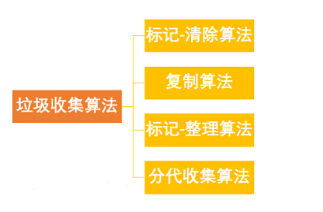

##### 3.1、标记-清除算法

首先标记出所有不需要回收的对象，在标记完成后统一回收掉所有没有被标记的对象。这种算法存在两个问题：效率问题与空间问题（标记清除后会产生大量不连续的碎片）

 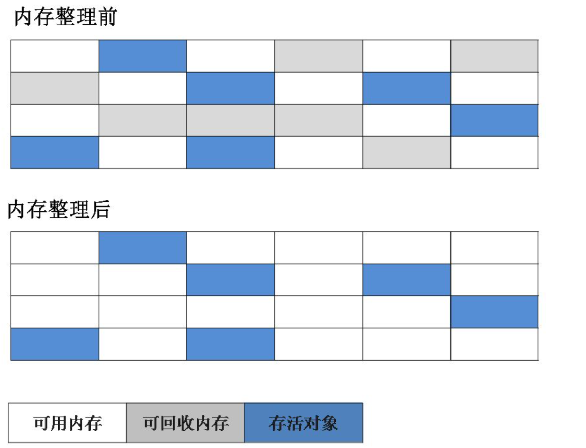

##### 3.2、标记-赋值算法

它将内存分为大小相同的两个区域，每次只使用其中一块。当一块内存用完之后，就将这块区域还存活的对象复制到另一块区域去，然后把使用的空间一次都清理掉。这样就使每次的内存回收都是对内存区间一般进行回收。

 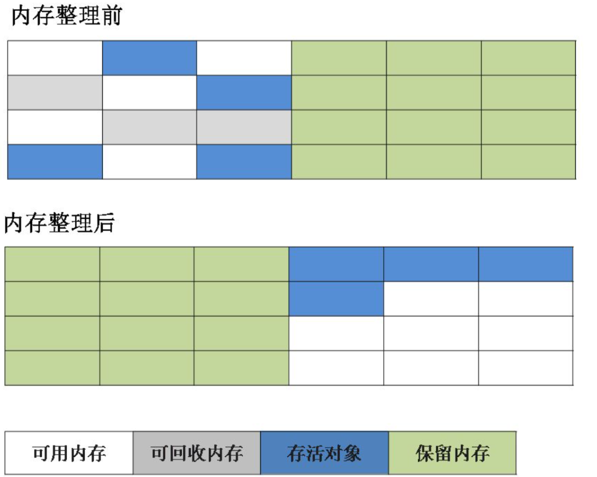

##### 3.3、标记-整理算法

根据老年代的特点提出的一种标记算法，首先标记出不需要被回收的对象，让然后直接让这些对象向一端移动，然后直接清理掉边界以外的内存。


##### 3.4、分代收集算法

当前虚拟机的垃圾收集都采用分代收集算法，这种算法没有什么新的思想，只是根据对象存活周期的不同将内存分为几块。一般将 java 堆分为新生代和老年代，这样我们就可以根据各个年代的特点选择合适的垃圾收集算法。

**比如在新生代中，每次收集都会有大量对象死去，所以可以选择”标记-复制“算法，只需要付出少量对象的复制成本就可以完成每次垃圾收集。而老年代的对象存活几率是比较高的，而且没有额外的空间对它进行分配担保，所以我们必须选择“标记-清除”或“标记-整理”算法进行垃圾收集。**

**延伸面试问题：** HotSpot 为什么要分为新生代和老年代？

根据上面的对分代收集算法的介绍回答。

#### 4.垃圾收集器

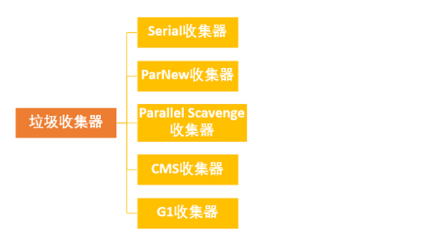

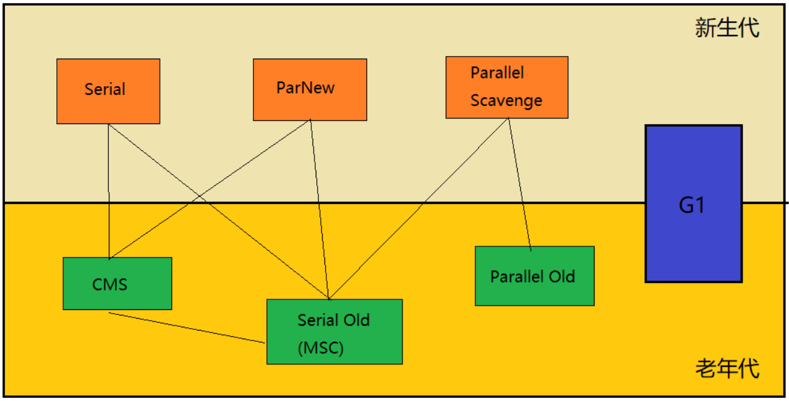


垃圾收集器就是上述算法的具体实现。要根据具体应用场景选择适合自己的垃圾收集器。

用于新生代的收集器有:Serial、ParNew、Paraller Scavenge

用于老年代的收集器有:CMS(Concurrent Mark Sweep)、Serial Old、Parallel Old

G1垃圾收集器相对比其他收集器而言，最大的区别在于它取消了年轻代、老年代的物理划分，取而代之的是将堆划分为若干个区域（Region），这些区域中包含了有逻辑上的年轻代、老年代区域。

##### 4.1、serial收集器

serial（串行）收集器是最基本、历史最悠久的垃圾收集器。这是一个单线程的垃圾收集器。它的单线程表示为它只会使用一条垃圾回收线程进行垃圾回收工作，更重要的是它在进行垃圾回收工作的适合必须暂停所有其他工作的线程（stop the world），直到它收集结束。

Serial / Serial Old收集器运行示意图

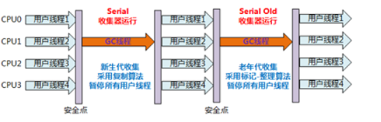

由于serial没有线程切换的开销，所以获得了很高的单线程收集效率。serial收集器对于运行在Client模式下的虚拟机来说是个不错的选择。

##### 4.2、ParNew收集器

**ParNew 收集器其实就是 Serial 收集器的多线程版本，除了使用多线程进行垃圾收集外，其余行为（控制参数、收集算法、回收策略等等）和 Serial 收集器完全一样。**

ParNew/Serial Old组合收集器运行示意图如下：

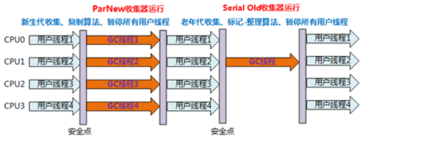


它是许多运行在 Server 模式下的虚拟机的首要选择，除了 Serial 收集器外，只有它能与 CMS 收集器（真正意义上的并发收集器，后面会介绍到）配合工作。

##### 4.3、Parallel Scavenge收集器

与吞吐量关系密切，故也称为吞吐量优先收集器。属于新生代收哦机器，是并行的多线程收集器。

**Parallel Scavenge 收集器关注点是吞吐量（高效率的利用 CPU）。CMS 等垃圾收集器的关注点更多的是用户线程的停顿时间（提高用户体验）。所谓吞吐量就是 CPU 中用于运行用户代码的时间与 CPU 总消耗时间的比值。**

GC自适应调节策略：Parallel Scavenge收集器可设置-XX:+UseAdptiveSizePolicy参数。当开关打开时不需要手动指定新生代的大小（-Xmn）、Eden与Survivor区的比例（-XX:SurvivorRation）、晋升老年代的对象年龄（-XX:PretenureSizeThreshold）等，虚拟机会根据系统的运行状况收集性能监控信息，动态设置这些参数以提供最优的停顿时间和最高的吞吐量，这种调节方式称为GC的自适应调节策略。

它是JDK1.8的默认收集器。JDK1.8 默认使用的是 Parallel Scavenge + Parallel Old，如果指定了-XX:+UseParallelGC 参数，则默认指定了-XX:+UseParallelOldGC，可以使用-XX:-UseParallelOldGC 来禁用该功能

##### 4.4、Serial Old收集器

Serial Old是Serial收集器的老年代版本。是单线程收集器，采用标记-整理算法。它主要有两大用途：一种用途是在 JDK1.5 以及以前的版本中与 Parallel Scavenge 收集器搭配使用，另一种用途是作为 CMS 收集器的后备方案。

##### 4.5、Parallel Old收集器

**Parallel Scavenge 收集器的老年代版本**。使用多线程和“标记-整理”算法。在注重吞吐量以及 CPU 资源的场合，都可以优先考虑 Parallel Scavenge 收集器和 Parallel Old 收集器。

##### 4.6、CMS收集器

CMS（Concurrent Mark Sweep）收集器是一种以获取最短回收停顿时间为目标的收集器。它非常符合在注重用户体验的应用上使用。CMS收集器是HoeSpot虚拟机第一款真正意义的并发收集器，它第一次实现了让垃圾收集线程与用户线程（基本上同时工作）。CMS是一种标记-清除算法实现的。整个过程分为四个步骤：

- 初始标记：暂停所有的其他线程，记录下直接与root相连的对象。这里的速度特别快。
- 并发标记：同时开启GC和用户线程。从GCRoots的直接关联对象开始遍历整个对象的过程，这个过程耗费时间较长但是不会停顿用户的线程。
- 重新标记：修正并发标记期间，因用户线程继续运行而导致标记产生变动的那一部分对象的标记记录，这个阶段的停顿时间比初始阶段稍长，远比并发标记时间短。
- 并发清除：清理删除掉标记阶段判断已经死亡的对象，释放内存空间。

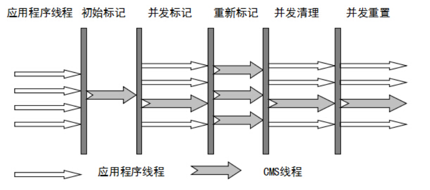

CMS的优点与缺点：

优点：并发收集，低停顿。

缺点：对CPU资源敏感，无法处理浮动垃圾，它使用的回收算法标记-清除会导致收集结束时会有大量空间碎片产生。

##### 4.7、G1收集器

G1（Garbage First）是一款面向服务器的垃圾收集器，主要针对配备多颗处理及及大容量内存的机器，以及高概率满足GC停顿时间要求的同时，还具备高吞吐量性能特征。

G1特点：

G1垃圾收集器相对比其他收集器而言，最大的区别在于它取消了年轻代、老年代的物理划分，取而代之的是将堆划分为若干个区域（Region），这些区域中包含了有逻辑上的年轻代、老年代区域。


- 并行与并发：
  - 并行：G1在回收期间，可以有多个GC线程同时工作，有效利用多核计算能力。此时用户线程STW
  - 并发：G1拥有与应用程序交替执行的能力，布恩工作可以与应用程序同时执行。
- 分代收集：虽然 G1 可以不需要其他收集器配合就能独立管理整个 GC 堆，但是还是保留了分代的概念。
- 空间整合：与 CMS 的“标记-清理”算法不同，G1 从整体来看是基于“标记-整理”算法实现的收集器；从局部上来看是基于“标记-复制”算法实现的。
- 可预测的停顿：这是 G1 相对于 CMS 的另一个大优势，降低停顿时间是 G1 和 CMS 共同的关注点，但 G1 除了追求低停顿外，还能建立可预测的停顿时间模型，能让使用者明确指定在一个长度为 M 毫秒的时间片段内。

G1 收集器的运作大致分为以下几个步骤：

- **初始标记**
- **并发标记**
- **最终标记**
- **筛选回收**

**G1 收集器在后台维护了一个优先列表，每次根据允许的收集时间，优先选择回收价值最大的 Region（区域）(这也就是它的名字 Garbage-First 的由来)** 。这种使用 Region 划分内存空间以及有优先级的区域回收方式，保证了 G1 收集器在有限时间内可以尽可能高的收集效率（把内存化整为零）。

### 4.1、双亲委派机制

我们在IDE中编写的Java源代码被编译器编译成**.class**的字节码文件。然后由我们得ClassLoader负责将这些class文件给加载到JVM中去执行。

类的加载器类别：

- BootstrapClassLoader（启动类加载器）：使用C++编写，加载核心库java.*，构造ExtClassLoader和AppClassLoader。开发则无法直接获取该加载器的引用。

  ```java
  String s = new String();
  System.out.println(s.getClass().getClassLoader());//null
  ```

- ExtClassLoader（标准扩展类加载器）:主要负责加载jre/lib/ext目录下的一些扩展的jar。

- AppClassLoader（系统类加载器）:负责加载第三方与自己编写的类。

  ```java
  System.out.println(User.class.getClassLoader());//sun.misc.Launcher$AppClassLoader@18b4aac2
  System.out.println(User.class.getClassLoader().getParent());//sun.misc.Launcher$ExtClassLoader@4554617c
  System.out.println(User.class.getClassLoader().getParent().getParent());//null
  ```

  

 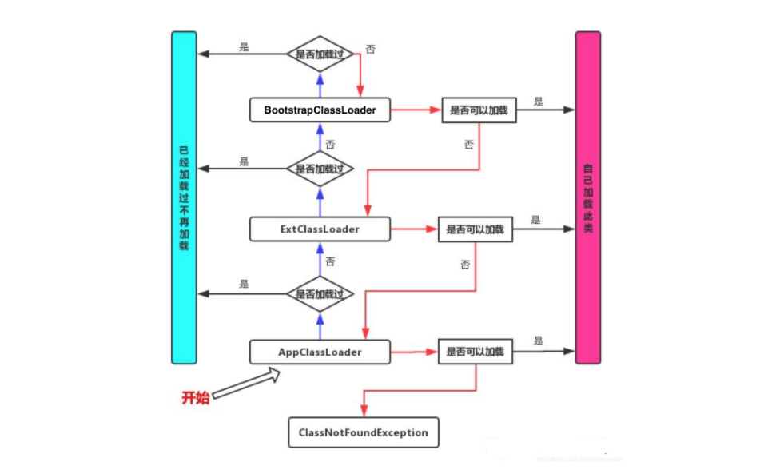

加载机制就是当一个class文件要被加载时，会先在AppClassLodaer加载器中检查是否已经被加载过，如果被加载过则无需再加载了，如果没有则再继续向上查找，这样一层一层找，找到最上层的BootstrapClassLoader如果也没有被加载过则判断该加载器是否可以加载，如果不可以则找到下一级的加载器进行判断，这样一级一级向下进行判断，如果到AppClassLoader还是不能加载则抛出ClassNotFoundException。

这样的加载的意义就是为了防止替换java的核心类。


# spring

## 1.spring了解

Spring 是一种轻量级开发框架，旨在提高开发人员的开发效率以及系统的可维护性。

我们一般说 Spring 框架指的都是 Spring Framework，它是很多模块的集合，使用这些模块可以很方便地协助我们进行开发。这些模块是：核心容器、数据访问/集成,、Web、AOP（面向切面编程）、工具、消息和测试模块。比如：Core Container 中的 Core 组件是Spring 所有组件的核心，Beans 组件和 Context 组件是实现IOC和依赖注入的基础，AOP组件用来实现面向切面编程。

Spring 官网列出的 Spring 的 6 个特征:

- **核心技术** ：依赖注入(DI)，AOP，事件(events)，资源，i18n，验证，数据绑定，类型转换，SpEL。
- **测试** ：模拟对象，TestContext框架，Spring MVC 测试，WebTestClient。
- **数据访问** ：事务，DAO支持，JDBC，ORM，编组XML。
- **Web支持** : Spring MVC和Spring WebFlux Web框架。
- **集成** ：远程处理，JMS，JCA，JMX，电子邮件，任务，调度，缓存。
- **语言** ：Kotlin，Groovy，动态语言。

## 2.Spring重要的模块

- **Spring Core：** 基础,可以说 Spring 其他所有的功能都需要依赖于该类库。主要提供 IoC 依赖注入功能。
- **Spring Aspects** ： 该模块为与AspectJ的集成提供支持。
- **Spring AOP** ：提供了面向切面的编程实现。
- **Spring JDBC** : Java数据库连接。
- **Spring JMS** ：Java消息服务。
- **Spring ORM** : 用于支持Hibernate等ORM工具。
- **Spring Web** : 为创建Web应用程序提供支持。
- **Spring Test** : 提供了对 JUnit 和 TestNG 测试的支持。

## 3.@Controller和@RestController

**`@Controller` 返回一个页面**

单独使用 `@Controller` 不加 `@ResponseBody`的话一般使用在要返回一个视图的情况，这种情况属于比较传统的Spring MVC 的应用，对应于前后端不分离的情况。

 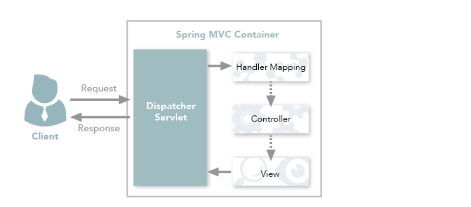

**`@RestController` 返回JSON 或 XML 形式数据**

但`@RestController`只返回对象，对象数据直接以 JSON 或 XML 形式写入 HTTP 响应(Response)中，这种情况属于 RESTful Web服务，这也是目前日常开发所接触的最常用的情况（前后端分离）。

 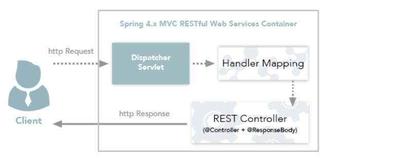

**`@Controller +@ResponseBody` 返回JSON 或 XML 形式数据**

如果你需要在Spring4之前开发 RESTful Web服务的话，你需要使用`@Controller` 并结合`@ResponseBody`注解，也就是说`@Controller` +`@ResponseBody`= `@RestController`（Spring 4 之后新加的注解）。

> `@ResponseBody` 注解的作用是将 `Controller` 的方法返回的对象通过适当的转换器转换为指定的格式之后，写入到HTTP 响应(Response)对象的 body 中，通常用来返回 JSON 或者 XML 数据，返回 JSON 数据的情况比较多。

 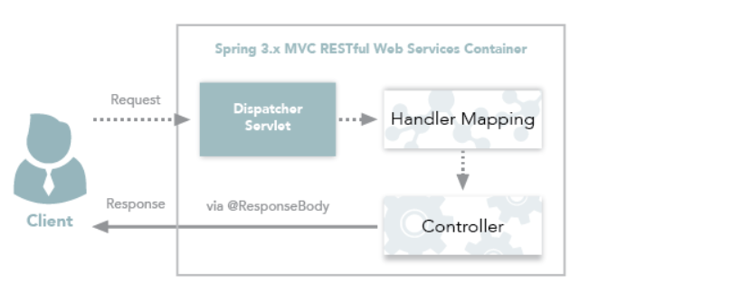

## 4.spring ioc与aop

**Spring AOP就是基于动态代理的**，如果要代理的对象，实现了某个接口，那么Spring AOP会使用**JDK Proxy**，去创建代理对象，而对于没有实现接口的对象，就无法使用 JDK Proxy 去进行代理了，这时候Spring AOP会使用**Cglib** ，这时候Spring AOP会使用 **Cglib** 生成一个被代理对象的子类来作为代理，如下图所示：

 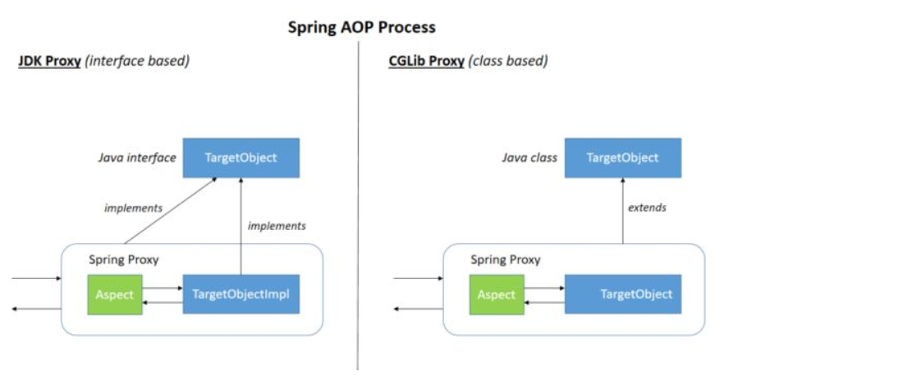

## 5.spring aop与 **AspectJ** aop

**Spring AOP 属于运行时增强，而 AspectJ 是编译时增强。** Spring AOP 基于代理(Proxying)，而 AspectJ 基于字节码操作(Bytecode Manipulation)。

Spring AOP 已经集成了 AspectJ ，AspectJ 应该算的上是 Java 生态系统中最完整的 AOP 框架了。AspectJ 相比于 Spring AOP 功能更加强大，但是 Spring AOP 相对来说更简单，

如果我们的切面比较少，那么两者性能差异不大。但是，当切面太多的话，最好选择 AspectJ ，它比Spring AOP 快很多。

> **AspectJ** aop需要额外学习

## 6.springBean

### 6.1、spring bean的作用域

- singleton : 唯一 bean 实例，Spring 中的 bean 默认都是单例的。
- prototype : 每次请求都会创建一个新的 bean 实例。
- request : 每一次HTTP请求都会产生一个新的bean，该bean仅在当前HTTP request内有效。
- session : 每一次HTTP请求都会产生一个新的 bean，该bean仅在当前 HTTP session 内有效。
- global-session： 全局session作用域，仅仅在基于portlet的web应用中才有意义，Spring5已经没有了。Portlet是能够生成语义代码(例如：HTML)片段的小型Java Web插件。它们基于portlet容器，可以像servlet一样处理HTTP请求。但是，与 servlet 不同，每个 portlet 都有不同的会话

### 6.2、springbean的单例安全的问题

如果bean为单例的，那么如果多个线程去操作这一个bean的时候确实会出现线程安全的问题。

但是，我们常用的@controller、@service、@dao这些bean是无状态的。无状态的bean不能保存数据，所以是线程安全的。

常见的两种解决办法：

1. 在类中定义一个 `ThreadLocal` 成员变量，将需要的可变成员变量保存在 `ThreadLocal` 中（推荐的一种方式）。
2. 改变 Bean 的作用域为 “prototype”：每次请求都会创建一个新的 bean 实例，自然不会存在线程安全问题。

### 6.3、@Component与@Bean

1. 作用对象不同: `@Component` 注解作用于类，而`@Bean`注解作用于方法。
2. `@Component`通常是通过类路径扫描来自动侦测以及自动装配到Spring容器中（我们可以使用 `@ComponentScan` 注解定义要扫描的路径从中找出标识了需要装配的类自动装配到 Spring 的 bean 容器中）。`@Bean` 注解通常是我们在标有该注解的方法中定义产生这个 bean,`@Bean`告诉了Spring这是某个类的示例，当我需要用它的时候还给我。
3. `@Bean` 注解比 `Component` 注解的自定义性更强，而且很多地方我们只能通过 `@Bean` 注解来注册bean。比如当我们引用第三方库中的类需要装配到 `Spring`容器时，则只能通过 `@Bean`来实现。

下面这个例子是通过@Component无法实现的

```java
@Bean
public OneService getService(status) {
    case (status)  {
        when 1:
                return new serviceImpl1();
        when 2:
                return new serviceImpl2();
        when 3:
                return new serviceImpl3();
    }
}
```

### 6.4、将一个类声明为spring中的bean的注解有哪些

我们一般使用 `@Autowired` 注解自动装配 bean，要想把类标识成可用于 `@Autowired` 注解自动装配的 bean 的类,采用以下注解可实现：

- `@Component` ：通用的注解，可标注任意类为 `Spring` 组件。如果一个Bean不知道属于哪个层，可以使用`@Component` 注解标注。
- `@Repository` : 对应持久层即 Dao 层，主要用于数据库相关操作。
- `@Service` : 对应服务层，主要涉及一些复杂的逻辑，需要用到 Dao层。
- `@Controller` : 对应 Spring MVC 控制层，主要用于接受用户请求并调用 Service 层返回数据给前端页面

### 6.5、spring中bean的生命周期

- Bean 容器找到配置文件中 Spring Bean 的定义。
- Bean 容器利用 Java Reflection API 创建一个Bean的实例。
- 如果涉及到一些属性值 利用 `set()`方法设置一些属性值。
- 如果 Bean 实现了 `BeanNameAware` 接口，调用 `setBeanName()`方法，传入Bean的名字。
- 如果 Bean 实现了 `BeanClassLoaderAware` 接口，调用 `setBeanClassLoader()`方法，传入 `ClassLoader`对象的实例。
- 与上面的类似，如果实现了其他 `*.Aware`接口，就调用相应的方法。
- 如果有和加载这个 Bean 的 Spring 容器相关的 `BeanPostProcessor` 对象，执行`postProcessBeforeInitialization()` 方法
- 如果Bean实现了`InitializingBean`接口，执行`afterPropertiesSet()`方法。
- 如果 Bean 在配置文件中的定义包含 init-method 属性，执行指定的方法。
- 如果有和加载这个 Bean的 Spring 容器相关的 `BeanPostProcessor` 对象，执行`postProcessAfterInitialization()` 方法
- 当要销毁 Bean 的时候，如果 Bean 实现了 `DisposableBean` 接口，执行 `destroy()` 方法。
- 当要销毁 Bean 的时候，如果 Bean 在配置文件中的定义包含 destroy-method 属性，执行指定的方法。

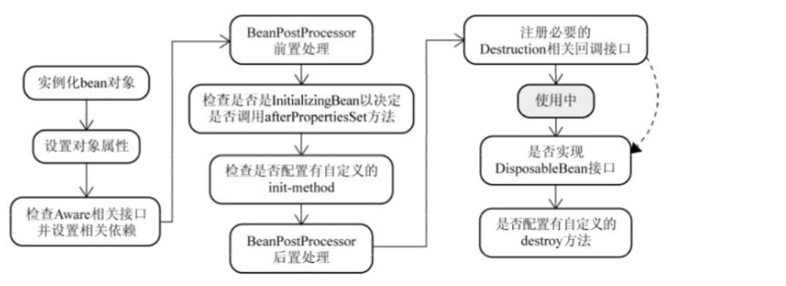


# redis

## 1.Redis 和 Memcached

**共同点** ：

1. 都是基于内存的数据库，一般都用来当做缓存使用。
2. 都有过期策略。
3. 两者的性能都非常高。

**区别** ：

1. **Redis 支持更丰富的数据类型（支持更复杂的应用场景）**。Redis 不仅仅支持简单的 k/v 类型的数据，同时还提供 list，set，zset，hash 等数据结构的存储。Memcached 只支持最简单的 k/v 数据类型。
2. **Redis 支持数据的持久化，可以将内存中的数据保持在磁盘中，重启的时候可以再次加载进行使用,而 Memecache 把数据全部存在内存之中。**
3. **Redis 有灾难恢复机制。** 因为可以把缓存中的数据持久化到磁盘上。
4. **Redis 在服务器内存使用完之后，可以将不用的数据放到磁盘上。但是，Memcached 在服务器内存使用完之后，就会直接报异常。**
5. **Memcached 没有原生的集群模式，需要依靠客户端来实现往集群中分片写入数据；但是 Redis 目前是原生支持 cluster 模式的.**
6. **Memcached 是多线程，非阻塞 IO 复用的网络模型；Redis 使用单线程的多路 IO 复用模型。** （Redis 6.0 引入了多线程 IO ）
7. **Redis 支持发布订阅模型、Lua 脚本、事务等功能，而 Memcached 不支持。并且，Redis 支持更多的编程语言。**
8. **Memcached 过期数据的删除策略只用了惰性删除，而 Redis 同时使用了惰性删除与定期删除。**

## 2.缓存数据的处理流程

1. 如果用户请求的数据在缓存中就直接返回。
2. 缓存中不存在的话就看数据库中是否存在。
3. 数据库中存在的话就更新缓存中的数据。
4. 数据库中不存在的话就返回空数据

## 3.为什么要用

**高并发：**

一般像 MySQL 这类的数据库的 QPS 大概都在 1w 左右（4 核 8g） ，但是使用 Redis 缓存之后很容易达到 10w+，甚至最高能达到 30w+（就单机 redis 的情况，redis 集群的话会更高）。

> QPS（Query Per Second）：服务器每秒可以执行的查询次数；

## 4.单线程模型

**Redis 基于 Reactor 模式来设计开发了自己的一套高效的事件处理模型** （Netty 的线程模型也基于 Reactor 模式，Reactor 模式不愧是高性能 IO 的基石），这套事件处理模型对应的是 Redis 中的文件事件处理器（file event handler）。由于文件事件处理器（file event handler）是单线程方式运行的，所以我们一般都说 Redis 是单线程模型。

**既然是单线程，那怎么监听大量的客户端连接呢？**

Redis 通过**IO 多路复用程序** 来监听来自客户端的大量连接（或者说是监听多个 socket），它会将感兴趣的事件及类型(读、写）注册到内核中并监听每个事件是否发生。

这样的好处非常明显： **I/O 多路复用技术的使用让 Redis 不需要额外创建多余的线程来监听客户端的大量连接，降低了资源的消耗**（和 NIO 中的 `Selector` 组件很像）。

> Reactor 模式与IO 多路复用程序。要额外进行了解

Redis 服务器是一个事件驱动程序，服务器需要处理两类事件： 1. 文件事件; 2. 时间事件。

文件事件处理器（file event handler）主要是包含 4 个部分：

- 多个 socket（客户端连接）
- IO 多路复用程序（支持多个客户端连接的关键）
- 文件事件分派器（将 socket 关联到相应的事件处理器）
- 事件处理器（连接应答处理器、命令请求处理器、命令回复处理器）

## 5.redis为什么不使用多线程

实际上，**Redis 在 4.0 之后的版本中就已经加入了对多线程的支持。**不过，Redis 4.0 增加的多线程主要是针对一些大键值对的删除操作的命令，使用这些命令就会使用主处理之外的其他线程来“异步处理”。

主要原因有下面 3 个：

1. 单线程编程容易并且更容易维护；
2. Redis 的性能瓶颈不再 CPU ，主要在内存和网络；
3. 多线程就会存在死锁、线程上下文切换等问题，甚至会影响性能。

## 6.redis6为什么引用了多线程

**Redis6.0 引入多线程主要是为了提高网络 IO 读写性能**，因为这个算是 Redis 中的一个性能瓶颈（Redis 的瓶颈主要受限于内存和网络）。

虽然，Redis6.0 引入了多线程，但是 Redis 的多线程只是在网络数据的读写这类耗时操作上使用了， 执行命令仍然是单线程顺序执行。因此，你也不需要担心线程安全问题。

## 7.redis设置有效期的作用

缓解内存消耗与某些业务场景（短信验证码或用户登录的token）。

## 8.Redis 是如何判断数据是否过期的呢？

redis通过一个过期字典来保存数据过期的时间。过期字典的键指向redis数据库中的某个key。过期字典的值保存的就是这个key的过期时间。

## 9.过期数据的删除策略

常用的过期删除策略：

- **惰性删除** ：只会在取出 key 的时候才对数据进行过期检查。这样对 CPU 最友好，但是可能会造成太多过期 key 没有被删除。
- **定期删除** ： 每隔一段时间抽取一批 key 执行删除过期 key 操作。并且，Redis 底层会通过限制删除操作执行的时长和频率来减少删除操作对 CPU 时间的影响。

Redis 采用的是 **定期删除+惰性/懒汉式删除** 。

但是，仅仅通过给 key 设置过期时间还是有问题的。因为还是可能存在定期删除和惰性删除漏掉了很多过期 key 的情况。这样就导致大量过期 key 堆积在内存里，然后就 Out of memory 了。

怎么解决这个问题呢？答案就是： **Redis 内存淘汰机制。**

## 10.redis内存淘汰机制

> 相关问题：MySQL 里有 2000w 数据，Redis 中只存 20w 的数据，如何保证 Redis 中的数据都是热点数据?

Redis 提供 6 种数据淘汰策略：

1. **volatile-lru（least recently used）**：从已设置过期时间的数据集（server.db[i].expires）中挑选最近最少使用的数据淘汰
2. **volatile-ttl**：从已设置过期时间的数据集（server.db[i].expires）中挑选将要过期的数据淘汰
3. **volatile-random**：从已设置过期时间的数据集（server.db[i].expires）中任意选择数据淘汰
4. **allkeys-lru（least recently used）**：当内存不足以容纳新写入数据时，在键空间中，移除最近最少使用的 key（这个是最常用的）
5. **allkeys-random**：从数据集（server.db[i].dict）中任意选择数据淘汰
6. **no-eviction**：禁止驱逐数据，也就是说当内存不足以容纳新写入数据时，新写入操作会报错。这个应该没人使用吧！

4.0 版本后增加以下两种：

1. **volatile-lfu（least frequently used）**：从已设置过期时间的数据集(server.db[i].expires)中挑选最不经常使用的数据淘汰
2. **allkeys-lfu（least frequently used）**：当内存不足以容纳新写入数据时，在键空间中，移除最不经常使用的 key

## 11.redis持久化机制

**Redis 的一种持久化方式叫快照（snapshotting，RDB），另一种方式是只追加文件（append-only file, AOF）**。

- 快照 rdb是redis默认的持久化机制

  Redis 可以通过创建快照来获得存储在内存里面的数据在某个时间点上的副本。Redis 创建快照之后，可以对快照进行备份，可以将快照复制到其他服务器从而创建具有相同数据的服务器副本（Redis 主从结构，主要用来提高 Redis 性能），还可以将快照留在原地以便重启服务器的时候使用。根据相关的配置做对应的持久化操作。

  ```bash
  save 900 1 #在900秒(15分钟)之后，如果至少有1个key发生变化，Redis就会自动触发BGSAVE命令创建快照。
  
  save 300 10 #在300秒(5分钟)之后，如果至少有10个key发生变化，Redis就会自动触发BGSAVE命令创建快照。
  
  save 60 10000 #在60秒(1分钟)之后，如果至少有10000个key发生变化，Redis就会自动触发BGSAVE命令创建快照。
  ```

- AOF持久化

  与快照持久化相比，AOF 持久化 的实时性更好，因此已成为主流的持久化方案。默认情况下 Redis 没有开启 AOF（append only file）方式的持久化，可以通过 appendonly 参数开启：

  ```bash
  appendonly yes
  ```

  在redis没执行写操作的时候都会将操作命令存储在AOF文件中。Redis 的配置文件中存在三种不同的 AOF 持久化方式。

  ```properties
  appendfsync always    #每次有数据修改发生时都会写入AOF文件,这样会严重降低Redis的速度
  appendfsync everysec  #每秒钟同步一次，显示地将多个写命令同步到硬盘
  appendfsync no        #让操作系统决定何时进行同步
  ```

## 12.redis事务

Redis 可以通过 **MULTI，EXEC，DISCARD 和 WATCH** 等命令来实现事务(transaction)功能。

使用 [MULTI](https://redis.io/commands/multi)命令后可以输入多个命令。Redis 不会立即执行这些命令，而是将它们放到队列，当调用了[EXEC](https://redis.io/commands/exec)命令将执行所有命令。

但是，Redis 的事务和我们平时理解的关系型数据库的事务不同。我们知道事务具有四大特性： **1. 原子性**，**2. 隔离性**，**3. 持久性**，**4. 一致性**。

1. **原子性（Atomicity）：** 事务是最小的执行单位，不允许分割。事务的原子性确保动作要么全部完成，要么完全不起作用；
2. **隔离性（Isolation）：** 并发访问数据库时，一个用户的事务不被其他事务所干扰，各并发事务之间数据库是独立的；
3. **持久性（Durability）：** 一个事务被提交之后。它对数据库中数据的改变是持久的，即使数据库发生故障也不应该对其有任何影响。
4. **一致性（Consistency）：** 执行事务前后，数据保持一致，多个事务对同一个数据读取的结果是相同的；

**Redis 是不支持 roll back 的，因而不满足原子性的（而且不满足持久性）。**

Redis 官网也解释了自己为啥不支持回滚。简单来说就是 Redis 开发者们觉得没必要支持回滚，这样更简单便捷并且性能更好。Redis 开发者觉得即使命令执行错误也应该在开发过程中就被发现而不是生产过程中。

你可以将 Redis 中的事务就理解为 ：**Redis 事务提供了一种将多个命令请求打包的功能。然后，再按顺序执行打包的所有命令，并且不会被中途打断。**

## 13.缓存击穿

***缓存击穿是指缓存中没有但数据库中有的数据（一般是缓存时间到期）***，这时由于并发用户特别多，同时读缓存没读到数据，又同时去数据库去取数据，引起数据库压力瞬间增大，造成过大压力。

解决办法：

1.设置key永不过期

2.**使用互斥锁(mutex key)**

业界比较常用的做法，是使用mutex。简单地来说，就是在缓存失效的时候（判断拿出来的值为空），不是立即去load db，而是先使用缓存工具的某些带成功操作返回值的操作（比如Redis的SETNX或者Memcache的ADD）去set一个mutex key，当操作返回成功时，再进行load db的操作并回设缓存；否则，就重试整个get缓存的方法。

SETNX，是「SET if Not eXists」的缩写，也就是只有不存在的时候才设置，可以利用它来实现锁的效果。


## 14.缓存击透

缓存穿透说简单点就是大量请求的 key 根本不存在于缓存中，导致请求直接到了数据库上，根本没有经过缓存这一层。举个例子：某个黑客故意制造我们缓存中不存在的 key 发起大量请求，导致大量请求落到数据库。

解决办法：

最基本的就是首先做好参数校验，一些不合法的参数请求直接抛出异常信息返回给客户端。比如查询的数据库 id 不能小于 0、传入的邮箱格式不对的时候直接返回错误消息给客户端等等。

**1）缓存无效 key**

如果缓存和数据库都查不到某个 key 的数据就写一个到 Redis 中去并设置过期时间，具体命令如下： `SET key value EX 10086` 。这种方式可以解决请求的 key 变化不频繁的情况，如果黑客恶意攻击，每次构建不同的请求 key，会导致 Redis 中缓存大量无效的 key 。很明显，这种方案并不能从根本上解决此问题。如果非要用这种方式来解决穿透问题的话，尽量将无效的 key 的过期时间设置短一点比如 1 分钟。

另外，这里多说一嘴，一般情况下我们是这样设计 key 的： `表名:列名:主键名:主键值` 。

**2）布隆过滤器**

布隆过滤器是一个非常神奇的数据结构，通过它我们可以非常方便地判断一个给定数据是否存在于海量数据中。我们需要的就是判断 key 是否合法，有没有感觉布隆过滤器就是我们想要找的那个“人”。

具体是这样做的：把所有可能存在的请求的值都存放在布隆过滤器中，当用户请求过来，先判断用户发来的请求的值是否存在于布隆过滤器中。不存在的话，直接返回请求参数错误信息给客户端，存在的话才会走下面的流程。


但是，需要注意的是布隆过滤器可能会存在误判的情况。总结来说就是： **布隆过滤器说某个元素存在，小概率会误判。布隆过滤器说某个元素不在，那么这个元素一定不在。**

我们先来看一下，**当一个元素加入布隆过滤器中的时候，会进行哪些操作：**

1. 使用布隆过滤器中的哈希函数对元素值进行计算，得到哈希值（有几个哈希函数得到几个哈希值）。
2. 根据得到的哈希值，在位数组中把对应下标的值置为 1。

我们再来看一下，**当我们需要判断一个元素是否存在于布隆过滤器的时候，会进行哪些操作：**

1. 对给定元素再次进行相同的哈希计算；
2. 得到值之后判断位数组中的每个元素是否都为 1，如果值都为 1，那么说明这个值在布隆过滤器中，如果存在一个值不为 1，说明该元素不在布隆过滤器中。

然后，一定会出现这样一种情况：**不同的字符串可能哈希出来的位置相同。** （可以适当增加位数组大小或者调整我们的哈希函数来降低概率）

自定义简单布隆过滤器

```java
import java.util.BitSet;

public class MyBloomFilter {

    /**
     * 位数组的大小
     */
    private static final int DEFAULT_SIZE = 2 << 24;
    /**
     * 通过这个数组可以创建 6 个不同的哈希函数
     */
    private static final int[] SEEDS = new int[]{3, 13, 46, 71, 91, 134};

    /**
     * 位数组。数组中的元素只能是 0 或者 1
     */
    private BitSet bits = new BitSet(DEFAULT_SIZE);

    /**
     * 存放包含 hash 函数的类的数组
     */
    private SimpleHash[] func = new SimpleHash[SEEDS.length];

    /**
     * 初始化多个包含 hash 函数的类的数组，每个类中的 hash 函数都不一样
     */
    public MyBloomFilter() {
        // 初始化多个不同的 Hash 函数
        for (int i = 0; i < SEEDS.length; i++) {
            func[i] = new SimpleHash(DEFAULT_SIZE, SEEDS[i]);
        }
    }

    /**
     * 添加元素到位数组
     */
    public void add(Object value) {
        for (SimpleHash f : func) {
            bits.set(f.hash(value), true);
        }
    }

    /**
     * 判断指定元素是否存在于位数组
     */
    public boolean contains(Object value) {
        boolean ret = true;
        for (SimpleHash f : func) {
            ret = ret && bits.get(f.hash(value));
        }
        return ret;
    }

    /**
     * 静态内部类。用于 hash 操作！
     */
    public static class SimpleHash {

        private int cap;
        private int seed;

        public SimpleHash(int cap, int seed) {
            this.cap = cap;
            this.seed = seed;
        }

        /**
         * 计算 hash 值
         */
        public int hash(Object value) {
            int h;
            return (value == null) ? 0 : Math.abs(seed * (cap - 1) & ((h = value.hashCode()) ^ (h >>> 16)));
        }

    }
}
```


## 15.缓存雪崩

实际上，缓存雪崩描述的就是这样一个简单的场景：**缓存在同一时间大面积的失效，后面的请求都直接落到了数据库上，造成数据库短时间内承受大量请求。**

造成原因有两个：

1.系统的缓存模块出了问题比如宕机导致不可用。造成系统的所有访问，都要走数据库。

2.**有一些被大量访问数据（热点缓存）在某一时刻大面积失效，导致对应的请求直接落到了数据库上。**

解决办法：

**针对 Redis 服务不可用的情况：**

1. 采用 Redis 集群，避免单机出现问题整个缓存服务都没办法使用。
2. 限流，避免同时处理大量的请求。

**针对热点缓存失效的情况：**

1. 设置不同的失效时间比如随机设置缓存的失效时间。
2. 缓存永不失效。

## 16.如何保证缓存与数据库的一致

Cache Aside Pattern 中遇到写请求是这样的：更新 DB，然后直接删除 cache 。

如果更新数据库成功，而删除缓存这一步失败的情况的话，简单说两个解决方案：

1. **缓存失效时间变短（不推荐，治标不治本）** ：我们让缓存数据的过期时间变短，这样的话缓存就会从数据库中加载数据。另外，这种解决办法对于先操作缓存后操作数据库的场景不适用。
2. **增加 cache 更新重试机制（常用）**： 如果 cache 服务当前不可用导致缓存删除失败的话，我们就隔一段时间进行重试，重试次数可以自己定。如果多次重试还是失败的话，我们可以把当前更新失败的 key 存入队列中，等缓存服务可用之后，再将 缓存中对应的 key 删除即可。

# mysql

```mysql
##查看所有引擎
mysql> show engines;
```

## 1.MyISAM 和 InnoDB 的区别

MySQL 5.5 之前，MyISAM 引擎是 MySQL 的默认存储引擎，可谓是风光一时。

虽然，MyISAM 的性能还行，各种特性也还不错（比如全文索引、压缩、空间函数等）。但是，MyISAM 不支持事务和行级锁，而且最大的缺陷就是崩溃后无法安全恢复。

5.5 版本之后，MySQL 引入了 InnoDB（事务性数据库引擎），MySQL 5.5 版本后默认的存储引擎为 InnoDB。

**1.是否支持行级锁**

MyISAM 只有表级锁(table-level locking)，而 InnoDB 支持行级锁(row-level locking)和表级锁,默认为行级锁。

也就说，MyISAM 一锁就是锁住了整张表，这在并发写的情况下是多么滴憨憨啊！这也是为什么 InnoDB 在并发写的时候，性能更牛皮了！

**2.是否支持事务**

MyISAM 不提供事务支持。

InnoDB 提供事务支持，具有提交(commit)和回滚(rollback)事务的能力。

**3.是否支持外键**

MyISAM 不支持，而 InnoDB 支持。

**4.是否支持数据库异常崩溃后的安全恢复**

MyISAM 不支持，而 InnoDB 支持。

使用 InnoDB 的数据库在异常崩溃后，数据库重新启动的时候会保证数据库恢复到崩溃前的状态。这个恢复的过程依赖于 `redo log` 。

🌈 拓展一下：

- MySQL InnoDB 引擎使用 **redo log(重做日志)** 保证事务的**持久性**，使用 **undo log(回滚日志)** 来保证事务的**原子性**。
- MySQL InnoDB 引擎通过 **锁机制**、**MVCC(Mutil-Version Concurrency Control 多版本并发控制)** 等手段来保证事务的隔离性（ 默认支持的隔离级别是 **`REPEATABLE-READ`** ）。
- 保证了事务的持久性、原子性、隔离性之后，一致性才能得到保障。

**5.是否支持 MVCC**

MyISAM 不支持，而 InnoDB 支持。

MVCC 可以看作是行级锁的一个升级，可以有效减少加锁操作，提供性能。

## 2.锁机制与InnoDB锁算法

- MyISAM采用的是表级锁(table-level locking)
- InnoDb采用的是行级锁(row-level locking)

**表级锁和行级锁对比：**

- **表级锁：** MySQL 中锁定 **粒度最大** 的一种锁，对当前操作的整张表加锁，实现简单，资源消耗也比较少，加锁快，不会出现死锁。其锁定粒度最大，触发锁冲突的概率最高，并发度最低，MyISAM 和 InnoDB 引擎都支持表级锁。
- **行级锁：** MySQL 中锁定 **粒度最小** 的一种锁，只针对当前操作的行进行加锁。 行级锁能大大减少数据库操作的冲突。其加锁粒度最小，并发度高，但加锁的开销也最大，加锁慢，会出现死锁。

**InnoDB 存储引擎的锁的算法有三种：**

- Record lock：单个行记录上的锁
- Gap lock：间隙锁，锁定一个范围，不包括记录本身
- Next-key lock：record+gap 锁定一个范围，包含记录本身

## 3.事务

事务是逻辑上的一组操作，要么都执行，要么都不执行。

```mysql
# 开启一个事务
START TRANSACTION;
# 多条 SQL 语句
SQL1,SQL2...
## 提交事务
COMMIT;
```

关系型数据库都具有ACID特性。

1. **原子性**（`Atomicity`） ： 事务是最小的执行单位，不允许分割。事务的原子性确保动作要么全部完成，要么完全不起作用；
2. **一致性**（`Consistency`）： 执行事务前后，数据保持一致，例如转账业务中，无论事务是否成功，转账者和收款人的总额应该是不变的；
3. **隔离性**（`Isolation`）： 并发访问数据库时，一个用户的事务不被其他事务所干扰，各并发事务之间数据库是独立的；
4. **持久性**（`Durabilily`）： 一个事务被提交之后。它对数据库中数据的改变是持久的，即使数据库发生故障也不应该对其有任何影响。

**数据事务的实现原理呢？**

我们这里以 MySQL 的 InnoDB 引擎为例来简单说一下。

MySQL InnoDB 引擎使用 **redo log(重做日志)** 保证事务的**持久性**，使用 **undo log(回滚日志)** 来保证事务的**原子性**。

MySQL InnoDB 引擎通过 **锁机制**、**MVCC** 等手段来保证事务的隔离性（ 默认支持的隔离级别是 **`REPEATABLE-READ`** ）。

保证了事务的持久性、原子性、隔离性之后，一致性才能得到保障。

### 并发事务

在典型的应用程序中，多个事务并发运行，经常会操作相同的数据来完成各自的任务（多个用户对同一数据进行操作）。并发虽然是必须的，但可能会导致以下的问题。

- **脏读（Dirty read）:** 当一个事务正在访问数据并且对数据进行了修改，而这种修改还没有提交到数据库中，这时另外一个事务也访问了这个数据，然后使用了这个数据。因为这个数据是还没有提交的数据，那么另外一个事务读到的这个数据是“脏数据”，依据“脏数据”所做的操作可能是不正确的。
- **丢失修改（Lost to modify）:** 指在一个事务读取一个数据时，另外一个事务也访问了该数据，那么在第一个事务中修改了这个数据后，第二个事务也修改了这个数据。这样第一个事务内的修改结果就被丢失，因此称为丢失修改。 例如：事务 1 读取某表中的数据 A=20，事务 2 也读取 A=20，事务 1 修改 A=A-1，事务 2 也修改 A=A-1，最终结果 A=19，事务 1 的修改被丢失。
- **不可重复读（Unrepeatableread）:** 指在一个事务内多次读同一数据。在这个事务还没有结束时，另一个事务也访问该数据。那么，在第一个事务中的两次读数据之间，由于第二个事务的修改导致第一个事务两次读取的数据可能不太一样。这就发生了在一个事务内两次读到的数据是不一样的情况，因此称为不可重复读。
- **幻读（Phantom read）:** 幻读与不可重复读类似。它发生在一个事务（T1）读取了几行数据，接着另一个并发事务（T2）插入了一些数据时。在随后的查询中，第一个事务（T1）就会发现多了一些原本不存在的记录，就好像发生了幻觉一样，所以称为幻读。

SQL 标准定义了四个隔离级别：

- **READ-UNCOMMITTED(读取未提交)：** 最低的隔离级别，允许读取尚未提交的数据变更，**可能会导致脏读、幻读或不可重复读**。
- **READ-COMMITTED(读取已提交)：** 允许读取并发事务已经提交的数据，**可以阻止脏读，但是幻读或不可重复读仍有可能发生**。
- **REPEATABLE-READ(可重复读)：** 对同一字段的多次读取结果都是一致的，除非数据是被本身事务自己所修改，**可以阻止脏读和不可重复读，但幻读仍有可能发生**。
- **SERIALIZABLE(可串行化)：** 最高的隔离级别，完全服从 ACID 的隔离级别。所有的事务依次逐个执行，这样事务之间就完全不可能产生干扰，也就是说，**该级别可以防止脏读、不可重复读以及幻读**。

 

Mysql InnoDB引擎的默认隔离级别未RR

```mysql
mysql> SELECT @@tx_isolation;
+-----------------+
| @@tx_isolation  |
+-----------------+
| REPEATABLE-READ |
+-----------------+
```

SERIALIZABLE的隔离级别可防止幻读问题，但是RR的隔离级别还是会存在幻读问题，使用加锁可以解决该问题。

```mysql
select * from user where id = 1 for update;
```

# 消息队列

我们可以把消息队列看作是一个存放消息的容器，当我们使用消息的时候，直接从容器中取出消息供自己使用。

为什么要使用消息队列：

1.同步异步处理提高系统性能

2.削峰/限流

3.降低系统耦合性

## 1.RabbitMQ

Windows安装：

首先确定自己使用的RabbitMQ的版本然后安装对应版本的Erlang。

安装Erlang之后配置环境变量，cmd输入erl检查是否安装成功。

然后安装RabbitMQ，解压缩之后配置环境变量，然后要在sbin下面输入“set ERLANG_HOME=E:\software\erl-24.0”配置一下，不然会报错。

然后输入“rabbitmq-plugins.bat enable rabbitmq_management”安装插件，安装完成之后输入“rabbitmq-server.bat”启动。

rabbitmq启动成功，浏览器中[http://localhost:15672](http://localhost:15672/)，输入guest，guest的登录控制台。


