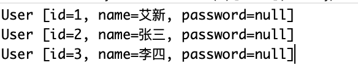
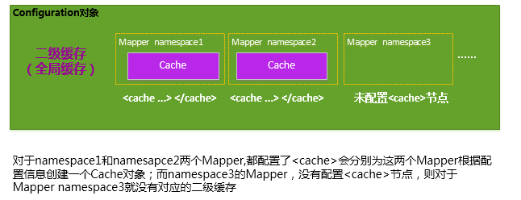

# mybatis

## 1.环境搭建

1. 导入相关依赖

   ```xml
   <!-- https://mvnrepository.com/artifact/junit/junit -->
   <dependency>
     <groupId>junit</groupId>
     <artifactId>junit</artifactId>
     <version>4.12</version>
     <scope>test</scope>
   </dependency>
   
   <!--mysqlq驱动-->
   <dependency>
       <groupId>mysql</groupId>
       <artifactId>mysql-connector-java</artifactId>
       <version>8.0.12</version>
   </dependency>
   
   <!-- https://mvnrepository.com/artifact/org.mybatis/mybatis -->
   <dependency>
     <groupId>org.mybatis</groupId>
     <artifactId>mybatis</artifactId>
     <version>3.4.6</version>
   </dependency>
   ```

2. 创建mybatis核心配置文件

   ```xml
   <?xml version="1.0" encoding="UTF-8" ?>
   <!DOCTYPE configuration
     PUBLIC "-//mybatis.org//DTD Config 3.0//EN"
     "http://mybatis.org/dtd/mybatis-3-config.dtd">
   <configuration>
     <environments default="development">
       <environment id="development">
         <transactionManager type="JDBC"/>
         <dataSource type="POOLED">
           <property name="driver" value="com.mysql.cj.jdbc.Driver"/>
           <property name="url" value="jdbc:mysql://localhost:3306/mybatis?useSSL=true&amp;useUnicode=true&amp;characterEncoding=utf8"/>
           <property name="username" value="root"/>
           <property name="password" value="root"/>
         </dataSource>
       </environment>
     </environments>
     <mappers>
       <mapper resource="com/xin/dao/UserMapper.xml"/>
     </mappers>
   </configuration>
   ```

   注意点：

   - mysql的jar包版本不同 driver的驱动不同，版本5的为原来的驱动，5以上的为····mysql.cj.jdbc.Diver

3. 创建sqlsession生成工具类与相关类
   sqlsession生成工具类

   ```java
   public class MybatisUtils {
   	private static SqlSessionFactory sqlSessionFactory;
   	 
       static {
           try {
               String resource = "mybatis-config.xml";
               InputStream inputStream = Resources.getResourceAsStream(resource);
               sqlSessionFactory = new SqlSessionFactoryBuilder().build(inputStream);
           } catch (IOException e) {
               e.printStackTrace();
           }
       }
    
       //获取SqlSession连接
       public static SqlSession getSession(){
           return sqlSessionFactory.openSession();
       }
   
   }
   ```

4. 创建mapper接口与mapper.xml配置文件

   ```java
   public interface UserMapper {
   
   	List<User> getAllUsers();
   	
   }
   ```

   ```xml
   <?xml version="1.0" encoding="UTF-8" ?>
   <!DOCTYPE mapper
           PUBLIC "-//mybatis.org//DTD Mapper 3.0//EN"
           "http://mybatis.org/dtd/mybatis-3-mapper.dtd">
           
   <mapper namespace="com.xin.dao.UserMapper">
     <select id="getAllUsers" resultType="com.xin.beans.User">
       select * from user;
     </select>
   </mapper>
   ```

5. 测试

   ```java
   public class MyTest {
   	@Test
   	public void selectTest() {
   		SqlSession sqlSession = MybatisUtils.getSession();
   		
   		UserMapper mapper = sqlSession.getMapper(UserMapper.class);
   		
   		List<User> users = mapper.getAllUsers();
   		
   		for (User user : users) {
   			System.out.println(user);
   		}
   		
   		sqlSession.close();
   	}
   }
   ```

注意点：

- 如果接口方法中有多个参数的时候必须使用注解来标明参数

  ```java
  //如果多个参数则必须添加参数注解
  User getUserByParam(@Param("id") int id,@Param("name")String name);
  ```

- 如果修改了项目中依赖包的版本后子项目依赖包的版本还是原来版本，则进入子项目进行 mvn clean。

  

## 2.增删改

增

```java
//增
int create(User user);
```

```xml
<insert id="create" parameterType="com.xin.beans.User">
  insert into user (id,name,pwd) values (#{id},#{name},#{pwd});
</insert>
```

改

```java
//改
int update(User user);
```

```xml
<update id="update" parameterType="com.xin.beans.User">
  update user set name=#{name},pwd=#{pwd} where id = #{id};
</update>
```

删

```java
//删
int deleteById(int id);
```

```xml
<delete id="deleteById">
  delete from user where id = #{id};
</delete>
```

测试代码：

```java
@Test
public void createTest() {

  SqlSession session = MybatisUtils.getSession();

  UserMapper mapper = session.getMapper(UserMapper.class);
  User user = new User();
  user.setId(4);
  user.setName("哈哈");
  user.setPwd("666sss");
  mapper.create(user);
  session.commit();

  session.close();

}

@Test
public void updateTest() {

  SqlSession session = MybatisUtils.getSession();

  UserMapper mapper = session.getMapper(UserMapper.class);
  List<User> users = mapper.getAllUsers();
  User user = new User();
  System.out.println("==============update前================");
  for (User user1 : users) {
    System.out.println(user1);
    if(user1.getId() == 1) {
      user = user1;
    }
  }
  user.setPwd("aaabbb");
  mapper.update(user);
  session.commit();
  users = mapper.getAllUsers();
  System.out.println("==============update后================");
  for (User user1 : users) {
    System.out.println(user1);
  }

  session.close();

}

@Test
public void deleteTest() {
  SqlSession session = MybatisUtils.getSession();

  UserMapper mapper = session.getMapper(UserMapper.class);
  List<User> users = mapper.getAllUsers();
  System.out.println("==============delete前================");
  for (User user1 : users) {
    System.out.println(user1);
  }
  mapper.deleteById(4);
  session.commit();
  users = mapper.getAllUsers();
  System.out.println("==============delete后================");
  for (User user1 : users) {
    System.out.println(user1);
  }

  session.close();
}
```

注意：增删改操作后必须使用commit，否则不生效。

## 3.配置解析

### 3.1、核心配置文件

mybatis-config.xml文件的配置项。MyBatis 的配置文件包含了会深深影响 MyBatis 行为的设置和属性信息。

```xml
configuration（配置）
    properties（属性）
    settings（设置）
    typeAliases（类型别名）
    typeHandlers（类型处理器）
    objectFactory（对象工厂）
    plugins（插件）
    environments（环境配置）
        environment（环境变量）
            transactionManager（事务管理器）
            dataSource（数据源）
    databaseIdProvider（数据库厂商标识）
    mappers（映射器）
<!-- 注意元素节点的顺序！顺序不对会报错 -->
```

主要配置项：

#### 3.1.1、properties

使用外部properties配置文件或者在配置文件中使用properties标签进行赋值，为核心配置文件赋值

第一种：创建mysql.properties配置文件

```properties
driver=com.mysql.cj.jdbc.Driver
url=jdbc:mysql://localhost:3306/mybatis?useSSL=true&useUnicode=true&characterEncoding=utf8
username=root
password=root
```

第二种：在mybatis核心配置文件中

```xml
<properties>
  <property name="driver" value="com.mysql.cj.jdbc.Driver"/>
  <property name="url" value="jdbc:mysql://localhost:3306/mybatis?useSSL=true&amp;useUnicode=true&amp;characterEncoding=utf8"/>
  <property name="username" value="root"/>
  <property name="password" value="root"/>
</properties>
```

也可以第一种与第二种混合使用

```xml
<properties resource="org/mybatis/example/config.properties">
  <property name="username" value="dev_user"/>
  <property name="password" value="F2Fa3!33TYyg"/>
</properties>
```

核心配置文件修改

```xml
<properties resource="mysql.properties">
</properties>

<environments default="development">
  <environment id="development">
    <transactionManager type="JDBC"/>
    <dataSource type="POOLED">
      <property name="driver" value="${driver}"/>
      <property name="url" value="${url}"/>
      <property name="username" value="${username}"/>
      <property name="password" value="${password}"/>
    </dataSource>
  </environment>
</environments>
```

注意：核心配置文件里value的值需要使用双引号引上。在properties文件中&不需要使用转义字符&amp;

#### 3.1.2、typeAliases（类型别名）

类型别名是为 Java 类型设置一个短的名字。它只和 XML 配置有关，存在的意义仅在于用来减少类完全

限定名的冗余。

第一种写法：

```xml
<typeAliases>
  <typeAlias type="com.xin.beans.User" alias="user"/>
</typeAliases>
```

当这样配置时，user就可以在任何使用com.xin.beans.User的地方。

第二种写法：扫描包

```xml
<typeAliases>
 	<package name="com.xin.beans"/>
</typeAliases>
```

```java
@Alias("user")
public class User 
```

如果包中的bean上没有添加别名注解，那则以此类名的首字母小写作为别名。

#### 3.1.2、environments元素

```xml
<environments default="development">
    <environment id="development">
      <transactionManager type="JDBC"/>
      <dataSource type="POOLED">
        <property name="driver" value="${driver}"/>
        <property name="url" value="${url}"/>
        <property name="username" value="${username}"/>
        <property name="password" value="${password}"/>
      </dataSource>
    </environment>
  </environments>
```

- mybatis可以配置多个运行环境，将SQL映射到多个不同的数据库上，必须指定其中一个为默认运行

  环境（通过default指定）

  

- 子元素节点：environment

  - 具体的一套环境，通过id区分，id保证唯一。

  - 子元素节点：transactionManager-[事务管理器]

    ```xml
    <!-- 语法 --> 
    <transactionManager type="[ JDBC | MANAGED ]"/>
    ```

  - 子元素节点：dataSource-数据源

    - dataSource 元素使用标准的 JDBC 数据源接口来配置 JDBC 连接对象的资源。

    - 数据源是必须配置的

    - 有三种内建的数据源类型

      ```xml
      type="[UNPOOLED|POOLED|JNDI]"）
      ```

      UNPOOLED:这个数据源的实现只是每次被请求时打开和关闭连接。

      POOLED: 这种数据源的实现利用“池”的概念将 JDBC 连接对象组织起来 , 这是一种使得

      ​                 并发 Web 应用快速响应请求的流行处理方式。

      JNDI：这个数据源的实现是为了能在如 Spring 或应用服务器这类容器中使用，容器可以

      ​			集中或在外部配置数据源，然后放置一个 JNDI 上下文的引用。

      数据源也有很多第三方的实现，比如dbcp，c3p0，druid等等....

#### 3.1.3、mappers元素

**mappers：**

- 映射器：定义映射sql语句的文件

- 既然 MyBatis 的行为其他元素已经配置完了，我们现在就要定义 SQL 映射语句了。但是首先我们

  需要告诉 MyBatis 到哪里去找到这些语句。 Java 在自动查找这方面没有提供一个很好的方法，所

  以最佳的方式是告诉 MyBatis 到哪里去找映射文件。你可以使用相对于类路径的资源引用， 或完

  全限定资源定位符（包括 file:/// 的 URL），或类名和包名等。映射器是MyBatis中最核心

  的组件之一，在MyBatis 3之前，只支持xml映射器，即：所有的SQL语句都必须在xml文件中配

  置。而从MyBatis 3开始，还支持接口映射器，这种映射器方式允许以Java代码的方式注解定义SQL

  语句，非常简洁。

**引入资源方式：**

```xml
<!-- 使用相对于类路径的资源引用 -->
<mappers>
  <mapper resource="com/xin/dao/UserMapper.xml"/>
</mappers>
```

```xml
<!-- 使用完全限定资源定位符（URL） -->
<mappers>
    <mapper url="file:///Users/aixin/Desktop/tijcode/springStudy/springProject1.0/mybatisTest/src/main/java/com/xin/dao/UserMapper.xml"/>
  </mappers>
```

```xml
<!-- 使用映射器接口实现类的完全限定类名 需要配置文件名称和接口名称一致，并且位于同一目录下 -->
<mappers>
    <mapper class = "com.xin.dao.UserMapper"/>
</mappers>
```

```xml
<!-- 将包内的映射器接口实现全部注册为映射器 但是需要配置文件名称和接口名称一致，并且位于同一目录下 -->
<mappers>
  <package name="com.xin.dao"/>
</mappers>
```

**mapper文件：**

```xml
<?xml version="1.0" encoding="UTF-8" ?>
<!DOCTYPE mapper
        PUBLIC "-//mybatis.org//DTD Mapper 3.0//EN"
        "http://mybatis.org/dtd/mybatis-3-mapper.dtd">
        
<mapper namespace="com.xin.dao.UserMapper">
  
  <select id="getAllUsers" resultType="user">
    select * from user;
  </select>
  
</mapper>
```

- namespace:命名空间。绑定接口类。
- sql方法标签中的ID要与绑定的接口的方法保持一致。

### 3.2、其他配置

完整的setting配置：

```xml
<settings>
  <setting name="cacheEnabled" value="true"/>
  <setting name="lazyLoadingEnabled" value="true"/>
  <setting name="multipleResultSetsEnabled" value="true"/>
  <setting name="useColumnLabel" value="true"/>
  <setting name="useGeneratedKeys" value="false"/>
  <setting name="autoMappingBehavior" value="PARTIAL"/>
  <setting name="autoMappingUnknownColumnBehavior" value="WARNING"/>
  <setting name="defaultExecutorType" value="SIMPLE"/>
  <setting name="defaultStatementTimeout" value="25"/>
  <setting name="defaultFetchSize" value="100"/>
  <setting name="safeRowBoundsEnabled" value="false"/>
  <setting name="mapUnderscoreToCamelCase" value="false"/>
  <setting name="localCacheScope" value="SESSION"/>
  <setting name="jdbcTypeForNull" value="OTHER"/>
  <setting name="lazyLoadTriggerMethods" value="equals,clone,hashCode,toString"/>
</settings>
```

### 3.3、作用域与生命周期


作用域理解：

- SqlSessionFactoryBuilder的作用在于创建SqlSessionFactory，创建成功后SqlSessionFactoryBuilder 就失去了作用，所以它就只应该存在与创建SqlSessionFactory的方法中，而不要长期存在。因此**SqlSessionFactoryBuilder实例的最佳作用域是方法作用域（局部方法变量）。**
- SqlSessionFactory 可以被认为是一个数据库连接池，它的作用是创建 SqlSession 接口对象。因为MyBatis 的本质就是 Java 对数据库的操作，所以 SqlSessionFactory 的生命周期存在于整个MyBatis 的应用之中，所以一旦创建了 SqlSessionFactory，就要长期保存它，直至不再使用MyBatis 应用，所以可以认为SqlSessionFactory 的生命周期就等同于 MyBatis 的应用周期。
- 由于 SqlSessionFactory 是一个对数据库的连接池，所以它占据着数据库的连接资源。如果创建多个 SqlSessionFactory，那么就存在多个数据库连接池，这样不利于对数据库资源的控制，也会导致数据库连接资源被消耗光，出现系统宕机等情况，所以尽量避免发生这样的情况。因此在一般的应用中我们往往希望 SqlSessionFactory 作为一个单例，让它在应用中被共享。所以说 **SqlSessionFactory** **的最佳作用域是应用作用域。**
- 如果说 SqlSessionFactory 相当于数据库连接池，那么 SqlSession 就相当于一个数据库连接（Connection 对象），你可以在一个事务里面执行多条 SQL，然后通过它的 commit、rollback等方法，提交或者回滚事务。所以它应该存活在一个业务请求中，处理完整个请求后，应该关闭这条连接，让它归还给SqlSessionFactory，否则数据库资源就很快被耗费精光，系统就会瘫痪，所以用 try...catch...finally... 语句来保证其正确关闭。**所以 SqlSession 的最佳的作用域是请求或方法作用域**。


## 4.ResultMap

解决的问题：类字段与数据库表的字段名不一致。

搭建环境：把之前的环境复制过来，然后把实体类的字段修改为和数据库表不一致

查询后的接口该字段数据为null



分析原因：

- select * from user where id = #{id} 可以看做
  select id,name,pwd from user where id = #{id}
- mybatis会根据这些查询的列名(会将列名转化为小写,数据库不区分大小写) , 去对应的实体类中查找
  相应列名的set方法设值 , 由于找不到setPwd() , 所以password返回null ; 【自动映射】

解决方法：

方法一：为列名指定别名 , 别名和java实体类的属性名一致 。

```xml
<select id="getAllUsers" resultType="user">
  select id,name,pwd as password from user;
</select>
```

方法二：修改set方法，不推荐。

```java

//	public void setPassword(String password) {
//		this.password = password;
//	}
	
	public void setPwd(String password) {
			this.password = password;
	}
```

方法三：**使用结果集映射->ResultMap** 【推荐】

```xml
<!--column不做限制，可以为任意表的字段，而property须为type 定义的pojo属性-->
<resultMap id="唯一的标识" type="映射的pojo对象">
  <id column="表的主键字段，或者可以为查询语句中的别名字段" jdbcType="字段类型" property="映射pojo对象的主键属性" />
  <result column="表的一个字段（可以为任意表的一个字段）" jdbcType="字段类型" property="映射到pojo对象的一个属性（须为type定义的pojo对象中的一个属性）"/>
  <association property="pojo的一个对象属性" javaType="pojo关联的pojo对象">
    <id column="关联pojo对象对应表的主键字段" jdbcType="字段类型" property="关联pojo对象的主席属性"/>
    <result  column="任意表的字段" jdbcType="字段类型" property="关联pojo对象的属性"/>
  </association>
  <!-- 集合中的property须为oftype定义的pojo对象的属性-->
  <collection property="pojo的集合属性" ofType="集合中的pojo对象">
    <id column="集合中pojo对象对应的表的主键字段" jdbcType="字段类型" property="集合中pojo对象的主键属性" />
    <result column="可以为任意表的字段" jdbcType="字段类型" property="集合中的pojo对象的属性" />  
  </collection>
</resultMap>
```

```xml
<resultMap type="com.xin.beans.User" id="userMap">
  <id column="id" property="id"/>
  <result column="name" property="name"/>
  <result column="pwd" property="password"/>
</resultMap>

<select id="getAllUsers" resultMap="userMap">
 select * from user;
</select>
```

如果世界总是这么简单就好了。但是肯定不是的，数据库中，存在一对多，多对一的情况，我们之后会使用到一些高级的结果集映射，association，collection这些，我们将在之后讲解，今天你们需要把这些知识都消化掉才是最重要的！理解结果集映射的这个概念！

## 5.分页

### 5.1、日志

Mybatis内置的日志工厂提供日志功能，具体的日志实现有以下几种工具：

- SLF4J
- Apache Commons Logging
- Log4j 2
- Log4j
- JDK logging

具体选择哪个日志实现工具由MyBatis的内置日志工厂确定。它会使用最先找到的（按上文列举的顺序查找）。 如果一个都未找到，日志功能就会被禁用。

**标准日志实现**

```xml
<settings>
    <setting name="logImpl" value="STDOUT_LOGGING"/>
</settings>
```

注意点：该配置放的位置要按照核心配置的顺序，不然会报错。

控制台输出结果：

```properties
Logging initialized using 'class org.apache.ibatis.logging.stdout.StdOutImpl' adapter.
PooledDataSource forcefully closed/removed all connections.
PooledDataSource forcefully closed/removed all connections.
PooledDataSource forcefully closed/removed all connections.
PooledDataSource forcefully closed/removed all connections.
Opening JDBC Connection
Created connection 492079624.
Setting autocommit to false on JDBC Connection [com.mysql.cj.jdbc.ConnectionImpl@1d548a08]
==>  Preparing: select * from user; 
==> Parameters: 
<==    Columns: id, name, pwd
<==        Row: 1, 艾新, aaabbb
<==        Row: 2, 张三, abcdef
<==        Row: 3, 李四, 987654
<==      Total: 3
User [id=1, name=艾新, password=aaabbb]
User [id=2, name=张三, password=abcdef]
User [id=3, name=李四, password=987654]
Resetting autocommit to true on JDBC Connection [com.mysql.cj.jdbc.ConnectionImpl@1d548a08]
Closing JDBC Connection [com.mysql.cj.jdbc.ConnectionImpl@1d548a08]
Returned connection 492079624 to pool.
```

### 5.2、Log4J

- Log4j是Apache的一个开源项目
- 通过使用Log4j，我们可以控制日志信息输送的目的地：控制台，文本，GUI组件....
- 我们也可以控制每一条日志的输出格式；
- 通过定义每一条日志信息的级别，我们能够更加细致地控制日志的生成过程。最令人感兴趣的就是，这些可以通过一个配置文件来灵活地进行配置，而不需要修改应用的代码。

**使用方法:**

**导入jar包：**

```xml
<dependency> 
		<groupId>log4j</groupId> 
		<artifactId>log4j</artifactId> 
		<version>1.2.17</version> 
</dependency>
```

**在resources文件夹中创建log4j.properties：**

```properties
#将等级为DEBUG的日志信息输出到console和file这两个目的地，console和file的定义在下 面的代码 
log4j.rootLogger=DEBUG,console,file

#控制台输出的相关设置
log4j.appender.console = org.apache.log4j.ConsoleAppender
log4j.appender.console.Target = System.out
log4j.appender.console.Threshold=DEBUG
log4j.appender.console.layout = org.apache.log4j.PatternLayout
log4j.appender.console.layout.ConversionPattern=[%c]-%m%n

#文件输出的相关设置
log4j.appender.file = org.apache.log4j.RollingFileAppender
log4j.appender.file.File=./log/mybatis.log
log4j.appender.file.MaxFileSize=10mb
log4j.appender.file.Threshold=DEBUG
log4j.appender.file.layout=org.apache.log4j.PatternLayout
log4j.appender.file.layout.ConversionPattern=[%p][%d{yy-MM-dd}][%c]%m%n

#日志输出级别
log4j.logger.org.mybatis=DEBUG
log4j.logger.java.sql=DEBUG
log4j.logger.java.sql.Statement=DEBUG
log4j.logger.java.sql.ResultSet=DEBUG
log4j.logger.java.sql.PreparedStatement=DEBUG
```

**在核心配置文件中设置：**

```xml
<settings>
  	<setting name="logImpl" value="LOG4J"/>
</settings>
```

**测试类中使用：**

```java
public class MyTest {

	static Logger logger = Logger.getLogger(MyTest.class);
	
	@Test
	public void selectTest() {
		SqlSession sqlSession = MybatisUtils.getSession();
		
		UserMapper mapper = sqlSession.getMapper(UserMapper.class);
		
		List<User> users = mapper.getAllUsers();
    
		logger.info("info：进入selectTest方法"); 
		logger.debug("debug：进入selectTest方法"); 
		logger.error("error: 进入selectTest方法");
    
		for (User user : users) {
			System.out.println(user);
		}
		
		sqlSession.close();
	}
	
}
```

### 5.3、limit实现分页

**为什么要使用分页:**

如果查询大量数据的时候，我们往往使用分页进行查询，也就是每次处理小部分数据，这样对
数据库压力就在可控范围内。

**使用limit实现分页：**

```sql
#语法 
SELECT * FROM table LIMIT stratIndex，pageSize 

SELECT * FROM table LIMIT 5,10; // 检索记录行 6-15 

// 检索记录行 96-last. #如果只给定一个参数，它表示返回最大的记录行数目： 
SELECT * FROM table LIMIT 5;

//检索前 5 个记录行 #换句话说，LIMIT n 等价于 LIMIT 0,n。
```

**使用步骤：**

1.UserMapper接口添加方法

```java
//分页查询
List<User> selectLimit(Map<String,Integer> map);
```

2.UserMapper.xml中实现

```xml
<select id="selectLimit" parameterType="map" resultMap="userMap">
     select * from user limit #{start},#{size}
</select>
```

**注意：返回类型必须写。**

3.测试

```java
 @Test
public void testLimit(){
    SqlSession sqlSession = MybatisUtil.getSqlSession();
    UserMapper mapper = sqlSession.getMapper(UserMapper.class);
    Map<String,Integer> map = new HashMap<String,Integer>();
    map.put("start",1);
    map.put("size",3);
    List<User> users = mapper.selectLimit(map);
    for (User user : users) {
        System.out.println(user);
    }
    sqlSession.close();
}
```


### 5.4、RowBounds分页

我们除了使用Limit在SQL层面实现分页，也可以使用RowBounds在Java代码层面实现分页。

**在User Mapper中添加接口**

```java
List<User> selectRowBounds();
```

**在xml中实现**

```xml
<select id="selectRowBounds" resultType="user">
    select * from user;
</select>
```

**测试**

```java
@Test
public void testRowBounds(){
    SqlSession session = MybatisUtil.getSqlSession();

    int currentPage = 2; //第几页
    int pageSize = 2; //每页显示几个
    RowBounds rowBounds = new RowBounds((currentPage- 1)*pageSize,pageSize);
    List<User> users = session.selectList("selectRowBounds", null, rowBounds);
    for (User user : users) {
        System.out.println(user);
    }

    session.close();
}
```

### 5.5、PageHelper

外部插件

1.导入jar包

```xml
<!-- https://mvnrepository.com/artifact/com.github.pagehelper/pagehelper -->
<dependency>
    <groupId>com.github.pagehelper</groupId>
    <artifactId>pagehelper</artifactId>
    <version>5.2.0</version>
</dependency>
```

2.在核心配置文件中进行配置

```xml
<plugins>
    <plugin interceptor="com.github.pagehelper.PageInterceptor">
        <!-- 使用MySQL方言的分页 -->
        <property name="helperDialect" value="mysql"/><!--如果使用mysql，这里value为mysql-->
        <property name="pageSizeZero" value="true"/>
    </plugin>
</plugins>
```

**注意：<plugins>标签要按照顺序写入，不然报错。**

3.测试使用

```java
@Test
public void testPageHelper(){
    SqlSession sqlSession = MybatisUtil.getSqlSession();
    UserMapper mapper = sqlSession.getMapper(UserMapper.class);
    PageHelper.startPage(2,2);
    List<User> users = mapper.sselectAllUsers();
    PageInfo<User> userPageInfo = new PageInfo<User>(users);
    System.out.println(userPageInfo.toString());
    for (User user : userPageInfo.getList()) {
        System.out.println(user);
    }
    sqlSession.close();
}
```

**注意：xml中sselectAllUsers方法实现的sql语句后面不能加“；”，因为pagehelper是在该sql语句后拼接limit，如果添加";"则sql语句不正确。**

**三种分页的区别：**

limit分页是在sql查询的时候就进行分页了，rowBounds是把所有的结果都查询出来然后再进行分页处理，pagehelper原理就是limit分页。rowBounds分页为逻辑分页，pagehelper为物理分页。

## 6.使用注解开发

### 6.1、面向接口编程

根本原因 : 解耦 , 可拓展 , 提高复用 , 分层开发中 , 上层不用管具体的实现 , 大家都遵守共同的标准, 使得开发变得容易 , 规范性更好

**关于接口的理解：**

- 接口从更深层次的理解就是，定义（规范、约束）与实现的分离
- 接口的本身反应设计人员对系统的抽象理解

面向对象是指，我们考虑问题时，以对象为单位，考虑它的属性及方法 .
面向过程是指，我们考虑问题时，以一个具体的流程（事务过程）为单位，考虑它的实现 .
接口设计与非接口设计是针对复用技术而言的，与面向对象（过程）不是一个问题.更多的体现就是
对系统整体的架构

### 6.2、使用注解开发

sql的主要注解：

@select()、@insert()、@update、@delete()

注意：使用注解开发就不需要mapper.xml文件了。

步骤：

1.接口中编写方法与添加注解

```java
//查询
@Select("select id,name,pwd as password from user")
List<User> getAllUsers();
```

2.在核心配置文件中绑定

```xml
<mappers>
  <mapper class = "com.xin.dao.UserMapper"/>
</mappers>
```

3.测试

```java
@Test
	public void test() {	
		SqlSession session = MybatisUtils.getSession();
		UserMapper mapper = session.getMapper(UserMapper.class);
		List<User> users = mapper.getAllUsers();
		for(User user:users) {
			System.out.println(user);
		}
		session.close();
	}
```

增删改

```java
@Insert("insert into user (id,name,pwd) values (#{id},#{name},#{password})")
int create(User user);

@Update("update user set name=#{name},pwd=#{password} where id = #{id}")
int update(User user);

@Delete("delete from user where id=#{id}")
int delete(int id);
```

**注意：可以在此处设置增删改自动提交事务**

```java
//获取SqlSession连接
public static SqlSession getSession(){
    //添加true参数，设置sqlsession自动提交事务
    return sqlSessionFactory.openSession(true);
}
```

### 6.3、关于@param，#与$的区别

@param注解用于给方法的参数起一个名字

- 再方法只有一个参数的情况可以不适用该参数
- 方法有多个参数的时候必须加入@param注解

#{}：占位符，即sql预编译，变量替换后会自动为对应的变量加上单引号''，可以防止sql注入。

${}：拼接符，即sql拼接，变量替换后不会自动为对应的变量加上单引号''，不能方式sql注入。

## 7.lombok的使用

1.需要在idea中安装插件

 File -> Setting -> Plugins 搜索Lombok，选择小辣椒那个插件点击安装然后重启idea。

2.引入maven依赖

```xml
<!-- https://mvnrepository.com/artifact/org.projectlombok/lombok -->
<dependency>
    <groupId>org.projectlombok</groupId>
    <artifactId>lombok</artifactId>
    <version>1.18.12</version>
</dependency>
```

3.在类中使用

```java
@Data
public class Student {
    private int id;
    private String name;
    private Teacher teacher;
}
```

**lombok常用注解：**

@Getter / @Setter
  可以作用在类上和属性上，放在类上，会对所有的非静态(non-static)属性生成Getter/Setter方法，放在属性上，会对该属性生成Getter/Setter方法。并可以指定Getter/Setter方法的访问级别。

@EqualsAndHashCode
  默认情况下，会使用所有非瞬态(non-transient)和非静态(non-static)字段来生成equals和hascode方法，也可以指定具体使用哪些属性。

@ToString
  生成toString方法，默认情况下，会输出类名、所有属性，属性会按照顺序输出，以逗号分割。

@NoArgsConstructor, @RequiredArgsConstructor and @AllArgsConstructor
  无参构造器、部分参数构造器、全参构造器，当我们需要重载多个构造器的时候，Lombok就无能为力了。

@Data
  @ToString, @EqualsAndHashCode, 所有属性的@Getter, 所有non-final属性的@Setter和@RequiredArgsConstructor的组合，通常情况下，我们使用这个注解就足够了。

## 8.多对一的处理

多对一：

采用学生与老师的关系，多个学生对应一个老师。

### 8.1、数据库设计

数据库表与数据语句

```sql
CREATE TABLE `teacher` (
		`id` INT(10) NOT NULL,
		`name` VARCHAR(30) DEFAULT NULL,
		PRIMARY KEY (`id`)
) ENGINE=INNODB DEFAULT CHARSET=utf8

INSERT INTO teacher(`id`,`name`) VALUES(1,'老师1');

CREATE TABLE `student`(
		`id` INT(10) NOT NULL,
		`name` VARCHAR(30) DEFAULT NULL,
		`tid` INT(10) DEFAULT NULL,
		PRIMARY KEY (`id`),
		KEY `fktid` (`tid`),
		CONSTRAINT `fktid` FOREIGN KEY (`tid`) REFERENCES `teacher` (`id`)
) ENGINE=INNODB DEFAULT CHARSET=utf8


INSERT INTO `student` (`id`, `name`, `tid`) VALUES ('1', '小明', '1'); 
INSERT INTO `student` (`id`, `name`, `tid`) VALUES ('2', '小红', '1'); 
INSERT INTO `student` (`id`, `name`, `tid`) VALUES ('3', '小张', '1'); 
INSERT INTO `student` (`id`, `name`, `tid`) VALUES ('4', '小李', '1'); 
INSERT INTO `student` (`id`, `name`, `tid`) VALUES ('5', '小王', '1');
```


### 8.2、搭建测试环境

1.实体类

学生类：

```java
@Data
public class Student {
    private int id;
    private String name;
    private Teacher teacher;
}
```

老师类：

```java
@Data
public class Teacher {
    private int id;
    private String name;
}
```

2.接口

学生接口：

```java
public interface StudentMapper {
    
}
```


老师接口：

```java
public interface TeacherMapper {
    
}
```

3.mapper.xml

```xml
<?xml version="1.0" encoding="UTF-8" ?>
<!DOCTYPE mapper
        PUBLIC "-//mybatis.org//DTD Mapper 3.0//EN"
        "http://mybatis.org/dtd/mybatis-3-mapper.dtd">

<mapper namespace="com.xin.dao.StudentMapper">

</mapper>
```

```
<?xml version="1.0" encoding="UTF-8" ?>
<!DOCTYPE mapper
        PUBLIC "-//mybatis.org//DTD Mapper 3.0//EN"
        "http://mybatis.org/dtd/mybatis-3-mapper.dtd">

<mapper namespace="com.xin.dao.TeacherMapper">

</mapper>
```

### 8.3、按查询嵌套处理

1.增加查询方法

```java
//查询所有学生
public void selectAllStudent();
```

2.在对应的xml文件中进行实现

```xml
<select id="selectAllStudent" resultMap="studentMap">
    select * from student
</select>

<resultMap id="studentMap" type="Student">
    <association property="teacher" column="{id=tid}" javaType="teacher" select="getTeacher"></association>
</resultMap>

<select id="getTeacher" resultType="teacher">
    select * from teacher where id = #{id}
</select>
```

**注意点：**

Student中存有Teacher对象，但是对应的数据库表中并没有对应的字段存储对象类型，所以需要使用resultMap进行重新配置。

使用<association>来处理关系映射。property代表student类的属性名，javatype代表属性的java类型，column代表两个表关联的属性值，如果有多个可以使用column="{id=tid,name=tname}"这种方式，tid、tname必须在数据库表中有对应的字段。select表示的是对应的查询方法，通过关联属性进行映射对象的查找

3.测试

```java
@Test
public void test(){
    SqlSession session = MybatisUtil.getSqlSession();

    StudentMapper mapper = session.getMapper(StudentMapper.class);
    List<Student> students = mapper.selectAllStudent();
    for (Student student : students) {
        System.out.println(student);
    }

    session.close();
}
```


### 8.4、按结果嵌套查询

1.mapper中添加方法

```java
///按照结果嵌套查询
public List<Student> selectAllStudent2();
```

2.在mapper.xml文件中进行实现

```xml
<select id="selectAllStudent2" resultMap="studentMap2">
    select s.id as sid,s.name as sname,t.name as tname,t.id as tid
    from student s,teacher t
    where s.tid = t.id
</select>

<resultMap id="studentMap2" type="student">
    <id property="id" column="sid"/>
    <result property="name" column="sname"/>
    <association property="teacher" javaType="teacher">
        <id property="id" column="tid"/>
        <result property="name" column="tname"/>
    </association>
</resultMap>
```

3.测试

```java
@Test
public void test2(){
    SqlSession session = MybatisUtil.getSqlSession();

    StudentMapper mapper = session.getMapper(StudentMapper.class);
    List<Student> students = mapper.selectAllStudent2();
    for (Student student : students) {
        System.out.println(student);
    }

    session.close();
}
```

**该方法为先将所有需要的字段数据查询出来，然后再resultMap里再进行组装。**

==今天在测试的时候遇到了一个mybatis连接mysql的错误==

```
Public Key Retrieval is not allowed
```

原因与解决方法：


在mybatis-config.xml文件中，mysql的url中加入下面一行

```
&amp;allowPublicKeyRetrieval=true
```

小结：

- 按查询嵌套相当于mysql的子查询
- 按结果嵌套相当于mysql的连表查询

## 9.一对多的处理

一对多

采用学生与老师的关系，一个老师对应多个学生

### 9.1、数据库设计

还是按照多对一中的数据库进行测试

### 9.2、环境搭建

student类：

```java
@Data //该注解将GET与Set方法，toString方法，有参、无参构造函数
public class Student {
    private int id;
    private String name;
    private int tid;
}
```

teacher类：

```java
@Data
public class Teacher {
    private int id;
    private String name;
    private List<Student> students;
}
```

其余配置与类同8

### 9.3、按照结果嵌套处理

1.teacherMapper增加查询方法

```java
public Teacher getTeacher(int id);
```

2.mapper.xml中进行实现

```xml
<select id="getTeacher" resultMap="teacherMap">
    select t.name tname,t.id tid,s.id sid,s.name sname
    from student s,teacher t
    where s.tid = t.id and t.id= #{id}
</select>

<resultMap id="teacherMap" type="teacher">
    <result property="id" column="tid"/>
    <result property="name" column="tname"/>
    <collection property="students" javaType="ArrayList" ofType="student">
        <id property="id" column="sid"/>
        <result property="name" column="sname"/>
        <result property="tid" column="tid"/>
    </collection>
</resultMap>
```

**ofType与javaType：javaType代表指的是该标签配置的属性，如果为list可以省略。ofType指定的这个List所存放的javaBean的类型。**

3.测试

```java
@Test
public void test(){
    SqlSession sqlSession = MybatisUtil.getSqlSession();
    TeacherMapper mapper = sqlSession.getMapper(TeacherMapper.class);
    Teacher teacher = mapper.getTeacher(1);
    System.out.println(teacher);
    sqlSession.close();
}
```

### 9.4、按查询嵌套处理

1.teacherMapper增加查询方法

```java
public Teacher getTeacher2(int id);
```

2.mapper.xml中进行实现

```xml
<select id="getTeacher2" resultMap="teacherMap2">
    select * from teacher where id=#{id1}
</select>

<resultMap id="teacherMap2" type="teacher">
    <collection property="students" column="{tid = id}" ofType="student" javaType="ArrayList" select="getStudent"/>
</resultMap>

<select id="getStudent" resultType="student">
    select * from student where tid=#{tid}
</select>
```

**我认为在resultMap 的collection标签中的Column表示的是两个表之间关联的字段，需要使用数据库表中该字段将两个表进行关联起来。 column="{tid = id}" tid代表是在下面的查询语句中的参数名，id则为teacher表的id，该id与student的tid可以关联上。**

3.测试

```java
@Test
public void test2(){
    SqlSession sqlSession = MybatisUtil.getSqlSession();
    TeacherMapper mapper = sqlSession.getMapper(TeacherMapper.class);
    Teacher teacher = mapper.getTeacher2(1);
    System.out.println(teacher);
    sqlSession.close();
}
```

**小结：**

1.关联-association

2.集合-collection

3.association是用来一对一与多对一，collection是用来一对多的关联

## 10.动态sql

### 10.1、介绍

动态sql：动态sql指的是根据不同的查询条件，生成不同的sql语句。

```
官网描述： 
	MyBatis 的强大特性之一便是它的动态 SQL。如果你有使用 JDBC 或其它类似框架的经验，你 就能体会到根据不同条件拼接 SQL 语句的痛苦。例如拼接时要确保不能忘记添加必要的空格，还要注意 去掉列表最后一个列名的逗号。利用动态 SQL 这一特性可以彻底摆脱这种痛苦。 
	虽然在以前使用动态 SQL 并非一件易事，但正是 MyBatis 提供了可以被用在任意 SQL 映射语 句中的强大的动态 SQL 语言得以改进这种情形。
    动态 SQL 元素和 JSTL 或基于类似 XML 的文本处理器相似。在 MyBatis 之前的版本中，有 很多元素需要花时间了解。MyBatis 3 大大精简了元素种类，现在只需学习原来一半的元素便可。 MyBatis 采用功能强大的基于 OGNL 的表达式来淘汰其它大部分元素。
------------------------------- 
- if 
- choose (when, otherwise) 
- trim (where, set) 
- foreach 
-------------------------------
```

### 10.2、搭建环境

1.新建一个数据库表：blog

```sql
CREATE TABLE `blog` ( 
	`id` varchar(50) NOT NULL COMMENT '博客id', 
	`title` varchar(100) NOT NULL COMMENT '博客标题', 
	`author` varchar(30) NOT NULL COMMENT '博客作者', 
	`create_time` datetime NOT NULL COMMENT '创建时间', 
	`views` int(30) NOT NULL COMMENT '浏览量' 
) ENGINE=InnoDB DEFAULT CHARSET=utf8
```


2.创建java Bean

```java
@Data
public class Blog {

    private String id;
    private String title;
    private String author;
    private Date createTime;
    private int views;

}
```

3.创建mapper与xml

```java
int addBlog(Blog blog);
```

```java
<insert id="addBlog" parameterType="blog">
    insert into blog (id, title, author, create_time, views)
    values(#{id},#{title},#{author},#{createTime},#{views})
</insert>
```

4.测试

```java
@Test
public void addInitBlog() {
    SqlSession session = MybatisUtil.getSqlSession();
    BlogMapper mapper = session.getMapper(BlogMapper.class);
    Blog blog = new Blog();
    blog.setId("1");
    blog.setTitle("Mybatis如此简单");
    blog.setAuthor("狂神说");
    blog.setCreateTime(new Date());
    blog.setViews(9999);
    mapper.addBlog(blog);
    blog.setId("2");
    blog.setTitle("Java如此简单");
    mapper.addBlog(blog);
    blog.setId("3");
    blog.setTitle("Spring如此简单");
    mapper.addBlog(blog);
    blog.setId("4");
    blog.setTitle("微服务如此简单");
    mapper.addBlog(blog);
    session.close();
}
```

初始化数据完毕。记得要使用自动提交事务，如果没加则要显示的添加提交操作。

### 10.3、if语句

相当于java中的if判断。

1.mapper方法

```java
List<Blog> selectBlogIf(Map map);
```

2.xml实现

```xml
<select id="selectBlogIf" parameterType="map" resultType="blog">
    select * from blog where
    <if test="title !=null">
        title=#{title}
    </if>
    <if test="author != null">
        and author=#{author}
    </if>
</select>
```

3.测试

```java
@Test
public void testIf(){
    SqlSession sqlSession = MybatisUtil.getSqlSession();
    BlogMapper mapper = sqlSession.getMapper(BlogMapper.class);
    Map<String,Object> map = new HashMap<String,Object>();
    map.put("title","Mybatis如此简单");
    map.put("author","狂神说");
    List<Blog> blogs = mapper.selectBlogIf(map);
    for (Blog blog : blogs) {
        System.out.println(blog);
    }
    sqlSession.close();
}
```

**问题：如果title为空的话，该查询语句就会报错。因为sql语句为：**

```
Preparing: select * from blog where and author=?
```

接下来就使用where标签来解决此问题。

### 10.4、where

1.mapper方法

```java
List<Blog> selectBlogWhere(Map map);
```

2.xml实现

```xml
<select id="selectBlogWhere" parameterType="map" resultType="blog">
    select * from blog
    <where>
        <if test="title !=null">
            title=#{title}
        </if>
        <if test="author != null">
            and author=#{author}
        </if>
    </where>
</select>
```

3.测试

```java
@Test
public void testWhere(){
    SqlSession sqlSession = MybatisUtil.getSqlSession();
    BlogMapper mapper = sqlSession.getMapper(BlogMapper.class);
    Map<String,Object> map = new HashMap<String,Object>();
//        map.put("title","Mybatis如此简单");
    map.put("author","狂神说");
    List<Blog> blogs = mapper.selectBlogWhere(map);
    for (Blog blog : blogs) {
        System.out.println(blog);
    }
    sqlSession.close();
}
```

添加where标签，可以将紧挨着where多余的and或or进行自动去除，使sql语句变得正确。

### 10.5、set

当在 update 语句中使用if标签时，如果前面的if没有执行，则或导致逗号多余错误。使用set标签可以将动态的配置 SET 关键字，并剔除追加到条件末尾的任何不相关的逗号。

1.mapper方法

```java
int updateSet(Blog blog);
```

2.xml实现

```xml
<update id="updateSet" parameterType="blog">
    update blog
    <set>
        <if test="title != null">
            title=#{title},
        </if>
        <if test="author != null">
            author=#{author}
        </if>
    </set>
    where id=#{id}
</update>
```

3.测试

```java
@Test
public void testUpdateSet(){
    SqlSession sqlSession = MybatisUtil.getSqlSession();
    BlogMapper mapper = sqlSession.getMapper(BlogMapper.class);
    Blog blog = new Blog();
    blog.setId("1");
//        blog.setAuthor("aixin");
    blog.setTitle("thinking in java");
    mapper.updateSet(blog);

    sqlSession.close();
}
```

### 10.6、choose

choose标签相当于java中的switch语句，如果条件中满足一个那么接下来的条件就不会执行。

1.mapper方法

```java
List<Blog> selectBlogChoose(Map map);
```

2.xml实现

```xml
<select id="selectBlogChoose" parameterType="map" resultType="blog">
    select * from blog
    <where>
        <choose>
            <when test="title != null">
                title=#{title}
            </when>
            <when test="author!=null">
                author=#{author}
            </when>
        </choose>
    </where>
</select>
```

3.测试

```java
@Test
public void testChoose(){
    SqlSession sqlSession = MybatisUtil.getSqlSession();
    BlogMapper mapper = sqlSession.getMapper(BlogMapper.class);
    Map<String,Object> map = new HashMap<String,Object>();
    map.put("title","Mybatis如此简单");
    map.put("author","狂神说");
    List<Blog> blogs = mapper.selectBlogChoose(map);
    for (Blog blog : blogs) {
        System.out.println(blog);
    }
    sqlSession.close();
}
```

测试结果只使用了title查询条件，author条件并没有生效。

### 10.7、sql片段

当某些sql片段被重复使用的时候，可以抽离出为一个sql片段，减少重复工作。

```xml
<select id="selectBlogWhere" parameterType="map" resultType="blog">
    select * from blog
    <where>
        <include refid="ifSql"/>
    </where>
</select>

<sql id="ifSql">
    <if test="title !=null">
        title=#{title}
    </if>
    <if test="author != null">
        and author=#{author}
    </if>
</sql>
```

### 10.8、foreach

1.mapper方法

```java
List<Blog> selectBlogForeach(Map map);
```

2.xml实现

```xml
<select id="selectBlogForeach" parameterType="map" resultType="blog">
    select * from blog
    <where>
        <foreach collection="ids" item="id" open="and (" close=")" separator="or">
            id=#{id}
        </foreach>
    </where>
</select>
```

**注意：如果open里的and与(之间没有空格，那么where语句将无法自动去除and**

生成的sql语句如下：

```
==>  Preparing: select * from blog WHERE ( id=? or id=? )
==> Parameters: 1(String), 2(String)
```

3.测试

```java
@Test
public void testForeach(){
    SqlSession sqlSession = MybatisUtil.getSqlSession();
    BlogMapper mapper = sqlSession.getMapper(BlogMapper.class);
    List<String> ids = new LinkedList<String>();
    ids.add("1");
    ids.add("2");
    Map<String,Object> map = new HashMap<String,Object>();
    map.put("ids",ids);
    List<Blog> blogs = mapper.selectBlogForeach(map);
    for (Blog blog : blogs) {
        System.out.println(blog);
    }
    sqlSession.close();
}
```

foreach为for循环，collection表示为列表的名称，item表示为每次遍历生成的对象，open为开始遍历拼接的字符串，close为结束遍历时拼接的字符串，separator为连接各个循环之间的分隔符。

## 11.缓存

### 11.1、简介

1.什么是缓存（cache）：

- 存在内存中的临时数据

2.为什么使用缓存

- 将用户经常查询的数据放在缓存（内存）中，用户查询数据就不用从数据库查询，从缓存中查询减少和数据库交互的次数，减少系统开销，提高系统效率。

3.什么样的数据可以使用缓存

经常查询并且不经常修改的数据


mybatis包含了一个非常强大的查询缓存特性，它可以非常方便的定制和配置缓存。缓存可以极大的提高查询效率

mybatis定义了两级缓存：一级缓存与二级缓存

### 11.2、一级缓存


一级缓存默认开始，不需要任何配置。使用sqlsession第一次查询后，mybatis会将此次查询放入缓存中，如果缓存没有被关闭或者刷新，当下一次查询与第一次查询一致的时候会直接从一级缓存中获取数据。

测试：

```java
@Test
public void testCache(){
    SqlSession sqlSession = MybatisUtil.getSqlSession();
    BlogMapper mapper = sqlSession.getMapper(BlogMapper.class);
    Blog blog1 = mapper.selectById("1");
    System.out.println(blog1);
    System.out.println("===============================================");
    Blog blog2 = mapper.selectById("1");
    System.out.println(blog2);
    System.out.println(blog1 == blog2);
    sqlSessio.close();
}
```

输出结果：


结果表明第二次查询并没有再次连接数据库进行查询，而且两个数据引用地址都是一样的。

**一级缓存的生命周期：**

1. MyBatis在开启一个数据库会话时，会 创建一个新的SqlSession对象，SqlSession对象中会有一个新的Executor对象。Executor对象中持有一个新的PerpetualCache对象；当会话结束时，SqlSession对象及其内部的Executor对象还有PerpetualCache对象也一并释放掉。
2. 如果SqlSession调用了close()方法，会释放掉一级缓存PerpetualCache对象，一级缓存将不可用。
3. 如果SqlSession调用了clearCache()，会清空PerpetualCache对象中的数据，但是该sqlsession对象仍可使用。
4. SqlSession中执行了任何一个update操作(update()、delete()、insert()) ，都会清空PerpetualCache对象的数据，但是该sqlsession对象可以继续使用

### 11.3、二级缓存


二级缓存为application级别的，它可以提高对数据库查询的效率，以提高应用的性能。

二级缓存并不是对整个Application就只有一个Cache缓存对象，它将缓存划分的更细，即是mapper级别的：

1.为每一个mapper分配一个cache缓存对象（使用<cache>节点配置）



上述的每一个cache对象，都会有自己所属的namespace命名空间，并且会将mapper的namespace作为它们的id


2.多个mapper共用一个cache缓存对象（使用<cache-ref>节点配置）


使用：

==使用二级缓存必须将实体类实现序列化接口==

1.java bean

```java
@Data
public class Blog implements Serializable {

    private String id;
    private String title;
    private String author;
    private Date createTime;
    private int views;

}
```


2.在配置文件中进行配置

mybatis-config.xml

```xml
<settings>
	//日志
    <setting name="logImpl" value="STDOUT_LOGGING"/>
    //驼峰命名
    <setting name="mapUnderscoreToCamelCase" value="true"/>
    //二级缓存开启
    <setting name="cacheEnabled" value="true"/>
</settings>
```

mapper.xml

```xml
<cache/>
```

或

```xml
<!--
        eviction:代表的是缓存回收策略，目前MyBatis提供以下策略。
        (1) LRU,最近最少使用的，一处最长时间不用的对象
        (2) FIFO,先进先出，按对象进入缓存的顺序来移除他们
        (3) SOFT,软引用，移除基于垃圾回收器状态和软引用规则的对象
        (4) WEAK,弱引用，更积极的移除基于垃圾收集器状态和弱引用规则的对象。这里采用的是LRU，
                移除最长时间不用的对形象

        flushInterval:刷新间隔时间，单位为毫秒，这里配置的是100秒刷新，如果你不配置它，那么当
        SQL被执行的时候才会去刷新缓存。

        size:引用数目，一个正整数，代表缓存最多可以存储多少个对象，不宜设置过大。设置过大会导致内存溢出。
        这里配置的是1024个对象

        readOnly:只读，意味着缓存数据只能读取而不能修改，这样设置的好处是我们可以快速读取缓存，缺点是我们没有
        办法修改缓存，他的默认值是false，不允许我们修改
    -->
<cache eviction="LRU" flushInterval="100000" readOnly="true" size="1024"/>
```

测试代码：

```java
@Test
public void testCache(){
    SqlSession sqlSession = MybatisUtil.getSqlSession();
    SqlSession sqlSession2 = MybatisUtil.getSqlSession();
    BlogMapper mapper = sqlSession.getMapper(BlogMapper.class);
    BlogMapper mapper2 = sqlSession2.getMapper(BlogMapper.class);
    Blog blog1 = mapper.selectById("1");
    System.out.println(blog1);
    System.out.println("===============================================");
    Blog blog2 = mapper.selectById("1");
    System.out.println(blog2);
    System.out.println(blog1 == blog2);
    sqlSession.close();
    Blog blog3 = mapper2.selectById("1");
    System.out.println(blog3);
    System.out.println(blog1 == blog3);
    sqlSession2.close();
}
```

测试结果：


第二次比对结果为false原因是，mybatis将查询的数据从一级缓存放在了二级缓存中，所以物理地址发生了变化。

查询的数据默认先放在一级缓存中，只有会话提交或者关闭以后，一级缓存中的数据才会转到二级缓存中。

查询顺序：二级缓存 -----> 一级缓存 ----->数据库


