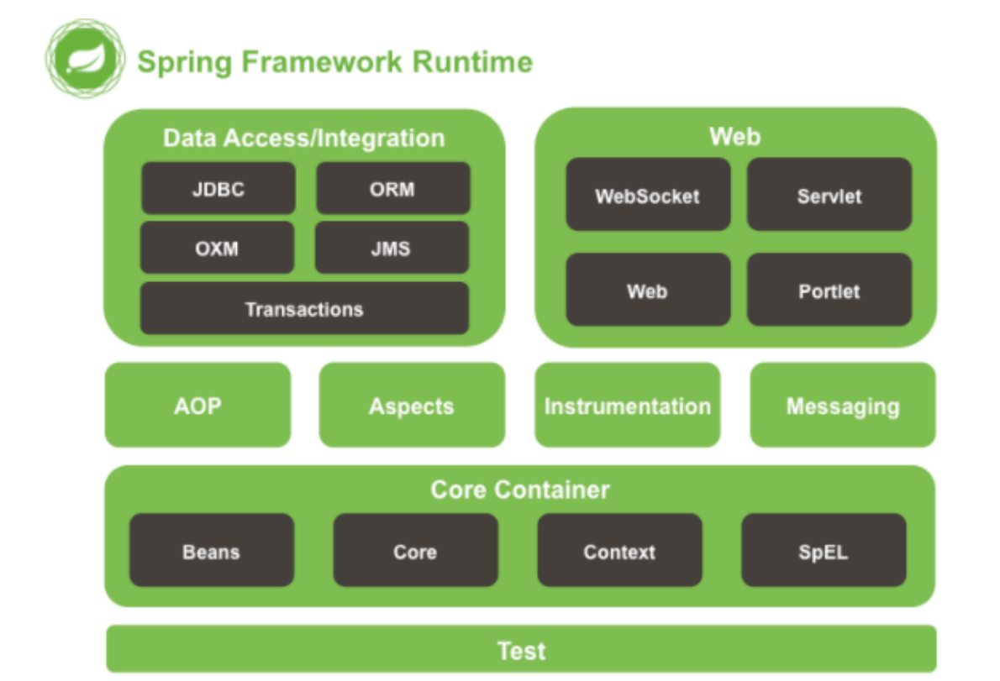
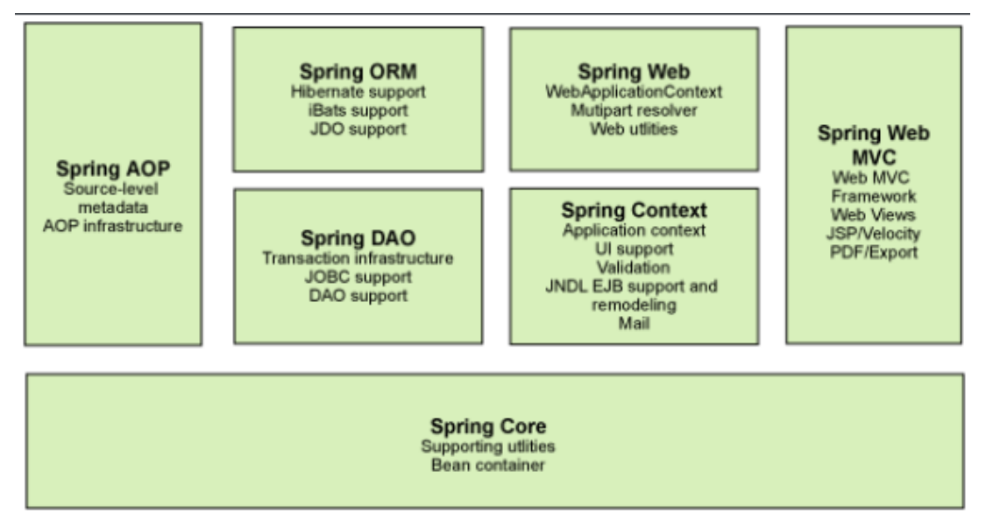
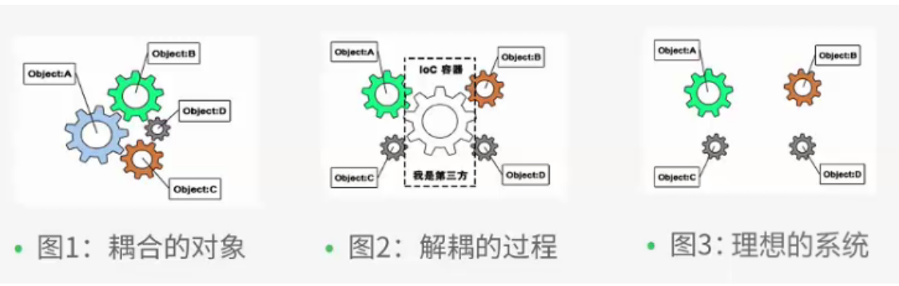
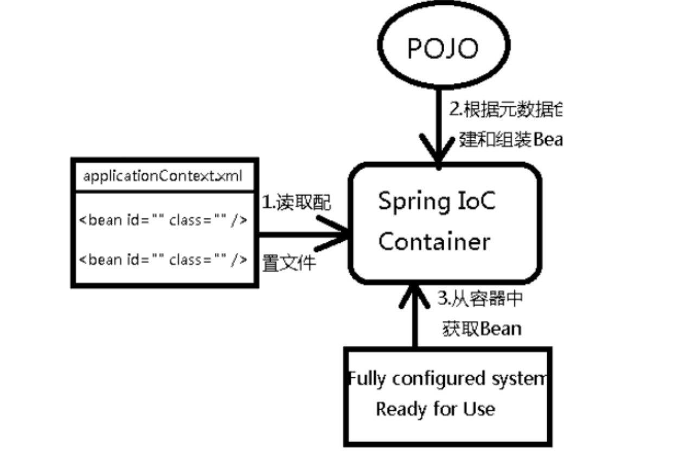

# spring

## 1.spring概述

官网 : http://spring.io/

官方下载地址 : https://repo.spring.io/libs-release-local/org/springframework/spring/

GitHub : https://github.com/spring-projects

- 2002年首次推出spring框架的雏形interface21框架
- 2004年，以interface21为基础经过重新设计发布了spring1.0版本
- spring使现有技术变得更加容易使用，整合现有的框架技术

### 1.1、优点

- spring使一个开源的免费框架
- spring是一个轻量级的框架、非入侵式的
- 控制反转（IOC）、面向切面（AOP）
- 对事务的支持，对其余框架的支持

一句话概述：spring是一个轻量级的控制反转与面向切面的容器

### 1.2、组成



spring框架是一个分层架构，由7个定义良好的模块组成。spring模块构建在核心容器之上，核心容器定义了创建、配置和管理bean的方式。



组成spring框架的每个模块（或组件）都可以单独存在，或者与其他一个或多个模块联合实现。

- 核心容器：核心容器提供spring框架的基本功能。核心容器的主要组件是BeanFactory，它是工厂模式的实现。BeanFactory使用控制反转模式将应用程序的配置和依赖规范与实际的应用程序代码分开。
- spring上下文：spring上下文是一个配置文件，向spring框架提供上下文信息。spring上下文包括企业服务，例如JNDI，EJB，电子邮件，国际化，校验与调度功能。
- spring　AOP：通过配置管理特性，Spring AOP 模块直接将面向切面的编程功能 , 集成到了 Spring框架中。所以，可以很容易地使 Spring 框架管理任何支持 AOP的对象。Spring AOP 模块为基于Spring 的应用程序中的对象提供了事务管理服务。通过使用 Spring AOP，不用依赖组件，就可以将声明性事务管理集成到应用程序中。
- spring DAO: JDBC DAO 抽象层提供了有意义的异常层次结构，可用该结构来管理异常处理和不同数据库供应商抛出的错误消息。异常层次结构简化了错误处理，并且极大地降低了需要编写的异常代码数量（例如打开和关闭连接）。Spring DAO 的面向 JDBC 的异常遵从通用的 DAO 异常层次结构。
- spring ORM: Object Relational Mapping，即对象关系映射。它的实现思想就是将关系数据库中表的数据映射成为对象，以对象的形式展现。Spring 框架插入了若干个 ORM 框架，从而提供了 ORM 的对象关系工具，其中包括 JDO、Hibernate 和 iBatis SQL Map。所有这些都遵从 Spring 的通用事务和 DAO 异常层次结构。
- springweb模块：Web 上下文模块建立在应用程序上下文模块之上，为基于 Web 的应用程序提供了上下文。所以，Spring 框架支持与 Jakarta Struts 的集成。Web 模块还简化了处理多部分请求以及将请求参数绑定到域对象的工作。
- spring mvc：VC 框架是一个全功能的构建 Web 应用程序的 MVC 实现。通过策略接口，MVC 框架变成为高度可配置的，MVC 容纳了大量视图技术，其中包括 JSP、Velocity、Tiles、iText和 POI。 

### 1.3、扩展

**Spring Boot与Spring Cloud**

- Spring Boot 是 Spring 的一套快速配置脚手架，可以基于Spring Boot 快速开发单个微服务;
- Spring Cloud是基于Spring Boot实现的；
- Spring Boot专注于快速、方便集成的单个微服务个体，Spring Cloud关注全局的服务治理框架；
- Spring Boot使用了约束优于配置的理念，很多集成方案已经帮你选择好了，能不配置就不配置 ,Spring Cloud很大的一部分是基于Spring Boot来实现，Spring Boot可以离开Spring Cloud独立使用开发项目，但是Spring Cloud离不开Spring Boot，属于依赖的关系。
- SpringBoot在SpringClound中起到了承上启下的作用，如果你要学习SpringCloud必须要学习SpringBoot。 


## 2.IOC基础

### 2.1、ioc的分析

利用一段代码来表达IOC的思想：

显示普通代码实现流程：

首先DAO层代码

```java
public interface UserDao {
    public void getUser();
}
```

```java
public class UserDaoImpl implements UserDao{
    public void getUser() {
        System.out.println("获取用户");
    }
}
```


service层代码

```java
public interface UserService {
    public void getUser();
}
```

```java
public class UserServiceImpl implements UserService{

    private UserDao userDao = new UserDaoImpl();
    //private UserDao userDao = new UserMysqlDaoImpl();
    //private UserDao userDao = new UserOracleDaoImpl();
    
    public void getUser() {
        userDao.getUser();
    }
}
```

测试

```java
public class MyTest {
    @Test
    public void test(){
        UserService userService = new UserServiceImpl();
        userService.getUser();

    }
}
```

此处如果需求编程又添加了一个UserMysqlDaoImpl，那么service实现类也要对应的进行修改。那么如何解决呢？

我们只需要在需要用到它的地方添加一个setter方法，修改erviceImpl代码如下：

```java
public class UserServiceImpl implements UserService{

    private UserDao userDao;

    public void setUserDao(UserDao userDao){
        this.userDao = userDao;
    }

    public void getUser() {
        userDao.getUser();
    }
}
```

如果需求变更只需要在使用它的地方给他传入不同的UserDao即可。

```java
@Test
public void testIoc(){

    UserDao userDao = new UserDaoImpl();
    UserDao userDaoMysql = new UserDaoMysqlImpl();

    UserServiceImpl userService = new UserServiceImpl();
    userService.setUserDao(userDao);
    userService.getUser();
    userService.setUserDao(userDaoMysql);
    userService.getUser();

}
```

其实这就是一个简单的IOC思想的实现，我们将UserDao的不同类型的使用从service层移动到了客户使用的地方。减少了代码的耦合性。

### 2.2、IOC本质

**控制反转IoC(Inversion of Control)，是一种设计思想，DI(依赖注入)是实现IoC的一种方法**，也有人认为DI只是IoC的另一种说法。没有IoC的程序中 , 我们使用面向对象编程 , 对象的创建与对象间的依赖关系完全硬编码在程序中，对象的创建由程序自己控制，控制反转后将对象的创建转移给第三方，个人认为所谓控制反转就是：获得依赖对象的方式反转了。



**IoC是Spring框架的核心内容**，使用多种方式完美的实现了IoC，可以使用XML配置，也可以使用注解，新版本的Spring也可以零配置实现IoC。
Spring容器在初始化时先读取配置文件，根据配置文件或元数据创建与组织对象存入容器中，程序使用时再从Ioc容器中取出需要的对象。



采用XML方式配置Bean的时候，Bean的定义信息是和实现分离的，而采用注解的方式可以把两者合为一体，Bean的定义信息直接以注解的形式定义在实现类中，从而达到了零配置的目的。
**控制反转是一种通过描述（XML或注解）并通过第三方去生产或获取特定对象的方式。在Spring中实现控制反转的是IoC容器，其实现方法是依赖注入（Dependency Injection,DI）。**


## 3.hello spring

先导入相关依赖

```xml
<!-- https://mvnrepository.com/artifact/org.springframework/spring-webmvc -->
<dependency>
    <groupId>org.springframework</groupId>
    <artifactId>spring-webmvc</artifactId>
    <version>5.3.4</version>
</dependency>
```


### 3.1、新建bean

```java
public class Hello {

    private String id;
    private String name;

    public String getId() {
        return id;
    }

    public void setId(String id) {
        this.id = id;
    }

    public String getName() {
        return name;
    }

    public void setName(String name) {
        this.name = name;
    }
}
```

### 3.2、编写beans.xml

```xml
<?xml version="1.0" encoding="UTF-8"?>
<beans xmlns="http://www.springframework.org/schema/beans"
       xmlns:xsi="http://www.w3.org/2001/XMLSchema-instance"
       xsi:schemaLocation="http://www.springframework.org/schema/beans
        https://www.springframework.org/schema/beans/spring-beans.xsd">

    <bean id="hello" class="com.xin.beans.Hello">
        <property name="name" value="haha"/>
    </bean>

</beans>
```

### 3.3、测试

```java
public class MyTest {

    @Test
    public void test(){
        ApplicationContext context = new ClassPathXmlApplicationContext("beans.xml");
        Hello hello = context.getBean("hello", Hello.class);
        System.out.println(hello.getName());
    }

}
```

### 总结：

hello对象是由spring容器创建并为属性赋值的。这个过程就叫做控制反转，对象由spring容器进行管理。


## 4.IOC创建对象方式

### 4.1、通过无参构造器来创建

在上一列子中在无参构造器中添加输入方法。

```java
public Hello(String name){
    System.out.println("无参构造器");
}
```

再次进行测试的时候发现控制台输出了语句。说明spring中通过<property>赋值时是使用无参构造器来进行创建对象的。所以在使用此标签赋值的类必须有无参构造器（如果只显示的添加有参构造器就会将无参构造器去除，所以如果添加了有参构造器也必须加入无参构造器）

### 4.2、通过有参构造器来创建

在类中加入有参构造器

```java
public Hello(String name){
    this.name = name;
    System.out.println("有参构造器");
}
```

在beans.xml中进行配置

```xml
<!--    通过参数名来赋值-->
<bean id="hello2" class="com.xin.beans.Hello">
    <constructor-arg name="name" value="lala"/>
</bean>
<!--    通过参数类型来赋值-->
<bean id="hello3" class="com.xin.beans.Hello">
    <constructor-arg type="java.lang.String" value="lala"/>
</bean>
<!--    通过参数位置来赋值-->
<bean id="hello4" class="com.xin.beans.Hello">
    <constructor-arg index="0" value="lala"/>
</bean>
```

测试

```java
 @Test
public void test(){
    ApplicationContext context = new ClassPathXmlApplicationContext("beans.xml");
    Hello hello = context.getBean("hello2", Hello.class);
    System.out.println(hello.getName());
}
```


在测试结果中可以看到，默认的将所有写在beans.xml中的对象都进行创建了。

结论：在配置文件加载的时候。其中管理的对象都已经初始化了！

## 5.spring配置

### 5.1、别名

```xml
<!--    name代表配置已配置了bean的id，alias代表为此bean起的别名-->
<alias name="hello" alias="helloAlias"/>
```

```java
Hello hello = context.getBean("helloAlias", Hello.class);
```

### 5.2、bean的配置

```xml
<bean id="hello" name="hello11,hello22,hello33" class="com.xin.beans.Hello">
    <property name="name" value="haha"/>
</bean>
```

id代表了bean的唯一标识符，如果没有设置id，则name默认为标识符。如果配置了id，那么name就为该bean的别名，name里的内容可以有多个用“,”隔开。

### 5.3、import

可以导入其他的配置文件

```xml
<import resource="{path}/beans.xml"/>
```

## 6.依赖注入

目录4已经大致的讲述了set方法注入与有参构造器注入。

### 6.1、复杂类型注入

1.建bean

```java
public class Bike {

    private String color;

    public String getColor() {
        return color;
    }

    public void setColor(String color) {
        this.color = color;
    }

    @Override
    public String toString() {
        return "Bike{" +
                "color='" + color + '\'' +
                '}';
    }
}
```

```java
public class Student {

    private String name;
    private Integer age;
    private Boolean isBoy;
    private Bike bike;
    private String[] books;
    private List<String> hobbys;
    private Map<String,String> achievement;
    private Set<String> games;
    private String wife;
    private Properties info;

    public String getName() {
        return name;
    }

    public void setName(String name) {
        this.name = name;
    }

    public Integer getAge() {
        return age;
    }

    public void setAge(Integer age) {
        this.age = age;
    }

    public Boolean getBoy() {
        return isBoy;
    }

    public void setBoy(Boolean boy) {
        isBoy = boy;
    }

    public Bike getBike() {
        return bike;
    }

    public void setBike(Bike bike) {
        this.bike = bike;
    }

    public String[] getBooks() {
        return books;
    }

    public void setBooks(String[] books) {
        this.books = books;
    }

    public List<String> getHobbys() {
        return hobbys;
    }

    public void setHobbys(List<String> hobbys) {
        this.hobbys = hobbys;
    }

    public Map<String, String> getAchievement() {
        return achievement;
    }

    public void setAchievement(Map<String, String> achievement) {
        this.achievement = achievement;
    }

    public Set<String> getGames() {
        return games;
    }

    public void setGames(Set<String> games) {
        this.games = games;
    }

    public String getWife() {
        return wife;
    }

    public void setWife(String wife) {
        this.wife = wife;
    }

    public Properties getInfo() {
        return info;
    }

    public void setInfo(Properties info) {
        this.info = info;
    }

    @Override
    public String toString() {
        return "Student{" +
                "name='" + name + '\'' +
                ", age=" + age +
                ", isBoy=" + isBoy +
                ", bike=" + bike +
                ", books=" + Arrays.toString(books) +
                ", hobbys=" + hobbys +
                ", achievement=" + achievement +
                ", games=" + games +
                ", wife='" + wife + '\'' +
                ", info=" + info +
                '}';
    }
}
```

2.beans.xml

常量注入

```xml
<bean id="student" class="com.xin.beans.Student">
    <property name="name" value="john"/>
    <property name="boy" value="true"/>
    <property name="age" value="18"/>
</bean>
```

引用注入

```xml
<bean id="bike" class="com.xin.beans.Bike">
    <property name="color" value="黑色"/>
</bean>
```

```xml
<property name="bike" ref="bike"/>
```

数组

```xml
 <!--数组-->
<property name="books">
    <array>
        <value>西游记</value>
        <value>水浒传</value>
    </array>
</property>
```

列表

```xml
<!--列表-->
<property name="hobbys">
    <list>
        <value>看书</value>
        <value>玩游戏</value>
    </list>
</property>
```

map

```xml
<property name="achievement">
    <map>
        <entry key="数学" value="100"/>
        <entry key="语文" value="100"/>
    </map>
</property>
```

set

```xml
<property name="games">
    <set>
        <value>LOL</value>
        <value>CS</value>
    </set>
</property>
```

properties

```xml
<property name="info">
    <props>
        <prop key="学号">0001</prop>
        <prop key="班级">一班</prop>
    </props>
</property>
```

null

```xml
<property name="wife"><null/></property>
```

### 6.2、p命名空间与c命名空间

 需要在头文件中假如约束文件

```xml
xmlns:p="http://www.springframework.org/schema/p"
xmlns:c="http://www.springframework.org/schema/c"
```

```xml
<bean id="student1" class="com.xin.beans.Student" p:name="lala" p:age="18"/>
<bean id="student2" class="com.xin.beans.Student" c:name="lala" c:bike-ref="bike"/>
```

c命名空间必须在所配置的bean中加入有参构造器


