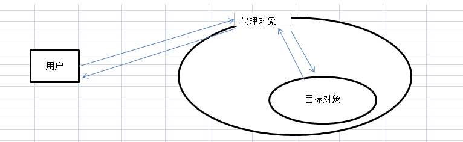
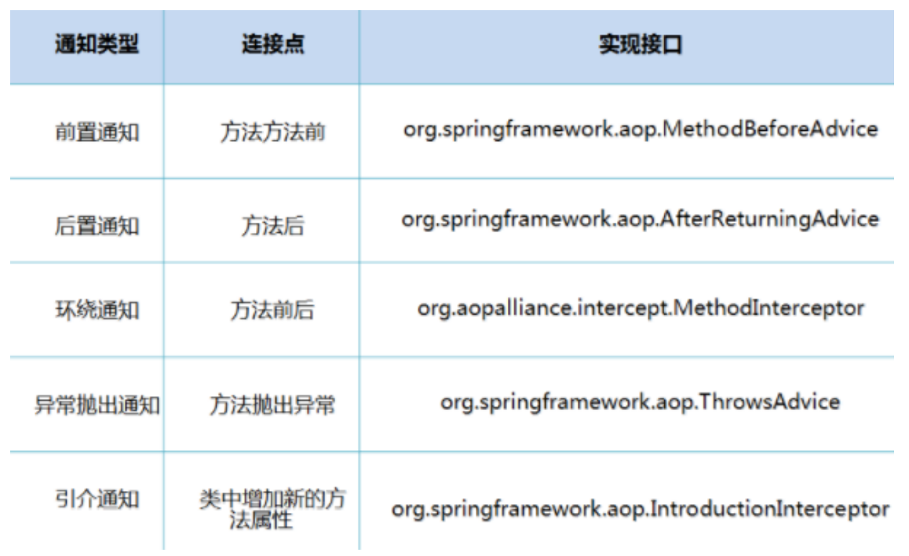

# spring

## 1.spring概述

官网 : http://spring.io/

官方下载地址 : https://repo.spring.io/libs-release-local/org/springframework/spring/

GitHub : https://github.com/spring-projects

- 2002年首次推出spring框架的雏形interface21框架
- 2004年，以interface21为基础经过重新设计发布了spring1.0版本
- spring使现有技术变得更加容易使用，整合现有的框架技术

### 1.1、优点

- spring使一个开源的免费框架
- spring是一个轻量级的框架、非入侵式的
- 控制反转（IOC）、面向切面（AOP）
- 对事务的支持，对其余框架的支持

一句话概述：spring是一个轻量级的控制反转与面向切面的容器

### 1.2、组成


spring框架是一个分层架构，由7个定义良好的模块组成。spring模块构建在核心容器之上，核心容器定义了创建、配置和管理bean的方式。


组成spring框架的每个模块（或组件）都可以单独存在，或者与其他一个或多个模块联合实现。

- 核心容器：核心容器提供spring框架的基本功能。核心容器的主要组件是BeanFactory，它是工厂模式的实现。BeanFactory使用控制反转模式将应用程序的配置和依赖规范与实际的应用程序代码分开。
- spring上下文：spring上下文是一个配置文件，向spring框架提供上下文信息。spring上下文包括企业服务，例如JNDI，EJB，电子邮件，国际化，校验与调度功能。
- spring　AOP：通过配置管理特性，Spring AOP 模块直接将面向切面的编程功能 , 集成到了 Spring框架中。所以，可以很容易地使 Spring 框架管理任何支持 AOP的对象。Spring AOP 模块为基于Spring 的应用程序中的对象提供了事务管理服务。通过使用 Spring AOP，不用依赖组件，就可以将声明性事务管理集成到应用程序中。
- spring DAO: JDBC DAO 抽象层提供了有意义的异常层次结构，可用该结构来管理异常处理和不同数据库供应商抛出的错误消息。异常层次结构简化了错误处理，并且极大地降低了需要编写的异常代码数量（例如打开和关闭连接）。Spring DAO 的面向 JDBC 的异常遵从通用的 DAO 异常层次结构。
- spring ORM: Object Relational Mapping，即对象关系映射。它的实现思想就是将关系数据库中表的数据映射成为对象，以对象的形式展现。Spring 框架插入了若干个 ORM 框架，从而提供了 ORM 的对象关系工具，其中包括 JDO、Hibernate 和 iBatis SQL Map。所有这些都遵从 Spring 的通用事务和 DAO 异常层次结构。
- springweb模块：Web 上下文模块建立在应用程序上下文模块之上，为基于 Web 的应用程序提供了上下文。所以，Spring 框架支持与 Jakarta Struts 的集成。Web 模块还简化了处理多部分请求以及将请求参数绑定到域对象的工作。
- spring mvc：VC 框架是一个全功能的构建 Web 应用程序的 MVC 实现。通过策略接口，MVC 框架变成为高度可配置的，MVC 容纳了大量视图技术，其中包括 JSP、Velocity、Tiles、iText和 POI。 

### 1.3、扩展

**Spring Boot与Spring Cloud**

- Spring Boot 是 Spring 的一套快速配置脚手架，可以基于Spring Boot 快速开发单个微服务;
- Spring Cloud是基于Spring Boot实现的；
- Spring Boot专注于快速、方便集成的单个微服务个体，Spring Cloud关注全局的服务治理框架；
- Spring Boot使用了约束优于配置的理念，很多集成方案已经帮你选择好了，能不配置就不配置 ,Spring Cloud很大的一部分是基于Spring Boot来实现，Spring Boot可以离开Spring Cloud独立使用开发项目，但是Spring Cloud离不开Spring Boot，属于依赖的关系。
- SpringBoot在SpringClound中起到了承上启下的作用，如果你要学习SpringCloud必须要学习SpringBoot。 


## 2.IOC基础

### 2.1、ioc的分析

利用一段代码来表达IOC的思想：

显示普通代码实现流程：

首先DAO层代码

```java
public interface UserDao {
    public void getUser();
}
```

```java
public class UserDaoImpl implements UserDao{
    public void getUser() {
        System.out.println("获取用户");
    }
}
```


service层代码

```java
public interface UserService {
    public void getUser();
}
```

```java
public class UserServiceImpl implements UserService{

    private UserDao userDao = new UserDaoImpl();
    //private UserDao userDao = new UserMysqlDaoImpl();
    //private UserDao userDao = new UserOracleDaoImpl();
    
    public void getUser() {
        userDao.getUser();
    }
}
```

测试

```java
public class MyTest {
    @Test
    public void test(){
        UserService userService = new UserServiceImpl();
        userService.getUser();

    }
}
```

此处如果需求编程又添加了一个UserMysqlDaoImpl，那么service实现类也要对应的进行修改。那么如何解决呢？

我们只需要在需要用到它的地方添加一个setter方法，修改erviceImpl代码如下：

```java
public class UserServiceImpl implements UserService{

    private UserDao userDao;

    public void setUserDao(UserDao userDao){
        this.userDao = userDao;
    }

    public void getUser() {
        userDao.getUser();
    }
}
```

如果需求变更只需要在使用它的地方给他传入不同的UserDao即可。

```java
@Test
public void testIoc(){

    UserDao userDao = new UserDaoImpl();
    UserDao userDaoMysql = new UserDaoMysqlImpl();

    UserServiceImpl userService = new UserServiceImpl();
    userService.setUserDao(userDao);
    userService.getUser();
    userService.setUserDao(userDaoMysql);
    userService.getUser();

}
```

其实这就是一个简单的IOC思想的实现，我们将UserDao的不同类型的使用从service层移动到了客户使用的地方。减少了代码的耦合性。

### 2.2、IOC本质

**控制反转IoC(Inversion of Control)，是一种设计思想，DI(依赖注入)是实现IoC的一种方法**，也有人认为DI只是IoC的另一种说法。没有IoC的程序中 , 我们使用面向对象编程 , 对象的创建与对象间的依赖关系完全硬编码在程序中，对象的创建由程序自己控制，控制反转后将对象的创建转移给第三方，个人认为所谓控制反转就是：获得依赖对象的方式反转了。


**IoC是Spring框架的核心内容**，使用多种方式完美的实现了IoC，可以使用XML配置，也可以使用注解，新版本的Spring也可以零配置实现IoC。
Spring容器在初始化时先读取配置文件，根据配置文件或元数据创建与组织对象存入容器中，程序使用时再从Ioc容器中取出需要的对象。


采用XML方式配置Bean的时候，Bean的定义信息是和实现分离的，而采用注解的方式可以把两者合为一体，Bean的定义信息直接以注解的形式定义在实现类中，从而达到了零配置的目的。
**控制反转是一种通过描述（XML或注解）并通过第三方去生产或获取特定对象的方式。在Spring中实现控制反转的是IoC容器，其实现方法是依赖注入（Dependency Injection,DI）。**


## 3.hello spring

先导入相关依赖

```xml
<!-- https://mvnrepository.com/artifact/org.springframework/spring-webmvc -->
<dependency>
    <groupId>org.springframework</groupId>
    <artifactId>spring-webmvc</artifactId>
    <version>5.3.4</version>
</dependency>
```


### 3.1、新建bean

```java
public class Hello {

    private String id;
    private String name;

    public String getId() {
        return id;
    }

    public void setId(String id) {
        this.id = id;
    }

    public String getName() {
        return name;
    }

    public void setName(String name) {
        this.name = name;
    }
}
```

### 3.2、编写beans.xml

```xml
<?xml version="1.0" encoding="UTF-8"?>
<beans xmlns="http://www.springframework.org/schema/beans"
       xmlns:xsi="http://www.w3.org/2001/XMLSchema-instance"
       xsi:schemaLocation="http://www.springframework.org/schema/beans
        https://www.springframework.org/schema/beans/spring-beans.xsd">

    <bean id="hello" class="com.xin.beans.Hello">
        <property name="name" value="haha"/>
    </bean>

</beans>
```

### 3.3、测试

```java
public class MyTest {

    @Test
    public void test(){
        ApplicationContext context = new ClassPathXmlApplicationContext("beans.xml");
        Hello hello = context.getBean("hello", Hello.class);
        System.out.println(hello.getName());
    }

}
```

### 总结：

hello对象是由spring容器创建并为属性赋值的。这个过程就叫做控制反转，对象由spring容器进行管理。


## 4.IOC创建对象方式

### 4.1、通过无参构造器来创建

在上一列子中在无参构造器中添加输入方法。

```java
public Hello(String name){
    System.out.println("无参构造器");
}
```

再次进行测试的时候发现控制台输出了语句。说明spring中通过<property>赋值时是使用无参构造器来进行创建对象的。所以在使用此标签赋值的类必须有无参构造器（如果只显示的添加有参构造器就会将无参构造器去除，所以如果添加了有参构造器也必须加入无参构造器）

### 4.2、通过有参构造器来创建

在类中加入有参构造器

```java
public Hello(String name){
    this.name = name;
    System.out.println("有参构造器");
}
```

在beans.xml中进行配置

```xml
<!--    通过参数名来赋值-->
<bean id="hello2" class="com.xin.beans.Hello">
    <constructor-arg name="name" value="lala"/>
</bean>
<!--    通过参数类型来赋值-->
<bean id="hello3" class="com.xin.beans.Hello">
    <constructor-arg type="java.lang.String" value="lala"/>
</bean>
<!--    通过参数位置来赋值-->
<bean id="hello4" class="com.xin.beans.Hello">
    <constructor-arg index="0" value="lala"/>
</bean>
```

测试

```java
 @Test
public void test(){
    ApplicationContext context = new ClassPathXmlApplicationContext("beans.xml");
    Hello hello = context.getBean("hello2", Hello.class);
    System.out.println(hello.getName());
}
```


在测试结果中可以看到，默认的将所有写在beans.xml中的对象都进行创建了。

结论：在配置文件加载的时候。其中管理的对象都已经初始化了！

## 5.spring配置

### 5.1、别名

```xml
<!--    name代表配置已配置了bean的id，alias代表为此bean起的别名-->
<alias name="hello" alias="helloAlias"/>
```

```java
Hello hello = context.getBean("helloAlias", Hello.class);
```

### 5.2、bean的配置

```xml
<bean id="hello" name="hello11,hello22,hello33" class="com.xin.beans.Hello">
    <property name="name" value="haha"/>
</bean>
```

id代表了bean的唯一标识符，如果没有设置id，则name默认为标识符。如果配置了id，那么name就为该bean的别名，name里的内容可以有多个用“,”隔开。

### 5.3、import

可以导入其他的配置文件

```xml
<import resource="{path}/beans.xml"/>
```

## 6.依赖注入

目录4已经大致的讲述了set方法注入与有参构造器注入。

### 6.1、复杂类型注入

1.建bean

```java
public class Bike {

    private String color;

    public String getColor() {
        return color;
    }

    public void setColor(String color) {
        this.color = color;
    }

    @Override
    public String toString() {
        return "Bike{" +
                "color='" + color + '\'' +
                '}';
    }
}
```

```java
public class Student {

    private String name;
    private Integer age;
    private Boolean isBoy;
    private Bike bike;
    private String[] books;
    private List<String> hobbys;
    private Map<String,String> achievement;
    private Set<String> games;
    private String wife;
    private Properties info;

    public String getName() {
        return name;
    }

    public void setName(String name) {
        this.name = name;
    }

    public Integer getAge() {
        return age;
    }

    public void setAge(Integer age) {
        this.age = age;
    }

    public Boolean getBoy() {
        return isBoy;
    }

    public void setBoy(Boolean boy) {
        isBoy = boy;
    }

    public Bike getBike() {
        return bike;
    }

    public void setBike(Bike bike) {
        this.bike = bike;
    }

    public String[] getBooks() {
        return books;
    }

    public void setBooks(String[] books) {
        this.books = books;
    }

    public List<String> getHobbys() {
        return hobbys;
    }

    public void setHobbys(List<String> hobbys) {
        this.hobbys = hobbys;
    }

    public Map<String, String> getAchievement() {
        return achievement;
    }

    public void setAchievement(Map<String, String> achievement) {
        this.achievement = achievement;
    }

    public Set<String> getGames() {
        return games;
    }

    public void setGames(Set<String> games) {
        this.games = games;
    }

    public String getWife() {
        return wife;
    }

    public void setWife(String wife) {
        this.wife = wife;
    }

    public Properties getInfo() {
        return info;
    }

    public void setInfo(Properties info) {
        this.info = info;
    }

    @Override
    public String toString() {
        return "Student{" +
                "name='" + name + '\'' +
                ", age=" + age +
                ", isBoy=" + isBoy +
                ", bike=" + bike +
                ", books=" + Arrays.toString(books) +
                ", hobbys=" + hobbys +
                ", achievement=" + achievement +
                ", games=" + games +
                ", wife='" + wife + '\'' +
                ", info=" + info +
                '}';
    }
}
```

2.beans.xml

常量注入

```xml
<bean id="student" class="com.xin.beans.Student">
    <property name="name" value="john"/>
    <property name="boy" value="true"/>
    <property name="age" value="18"/>
</bean>
```

引用注入

```xml
<bean id="bike" class="com.xin.beans.Bike">
    <property name="color" value="黑色"/>
</bean>
```

```xml
<property name="bike" ref="bike"/>
```

数组

```xml
 <!--数组-->
<property name="books">
    <array>
        <value>西游记</value>
        <value>水浒传</value>
    </array>
</property>
```

列表

```xml
<!--列表-->
<property name="hobbys">
    <list>
        <value>看书</value>
        <value>玩游戏</value>
    </list>
</property>
```

map

```xml
<property name="achievement">
    <map>
        <entry key="数学" value="100"/>
        <entry key="语文" value="100"/>
    </map>
</property>
```

set

```xml
<property name="games">
    <set>
        <value>LOL</value>
        <value>CS</value>
    </set>
</property>
```

properties

```xml
<property name="info">
    <props>
        <prop key="学号">0001</prop>
        <prop key="班级">一班</prop>
    </props>
</property>
```

null

```xml
<property name="wife"><null/></property>
```

### 6.2、p命名空间与c命名空间

 需要在头文件中假如约束文件

```xml
xmlns:p="http://www.springframework.org/schema/p"
xmlns:c="http://www.springframework.org/schema/c"
```

```xml
<bean id="student1" class="com.xin.beans.Student" p:name="lala" p:age="18"/>
<bean id="student2" class="com.xin.beans.Student" c:name="lala" c:bike-ref="bike"/>
```

c命名空间必须在所配置的bean中加入有参构造器

### 6.3、Bean的作用域

在spring中，哪些组成应用程序的主体及由spring ioc容器所管理的对象，被称之为bean。bean就是IOC容器初始化、装配及管理的对象。


request与session作用域仅基于web应用中使用。

#### 6.3.1、singleton（单例）

单例模式，当一个bean的作用域为singleton，那么spring ioc容器中只能存在一个共享的bean实例。就是在创建容器的时候就同时自动创建一个bean的对象，不管你是否使用，他都存在了，每次获取到的对象都是同一个对象。注意，Singleton作用域是Spring中的缺省作用域，默认就是单例模式，如果要显示的配置如下

```xml
<bean id="hello" name="hello11,hello22,hello33" class="com.xin.beans.Hello" scope="singleton">
    <property name="name" value="haha"/>
</bean>
```

测试：

```java
@Test
public void testSingleton(){
    ApplicationContext context = new ClassPathXmlApplicationContext("helloBeans.xml");
    Hello hello= context.getBean("hello", Hello.class);
    Hello hello1= context.getBean("hello", Hello.class);
    System.out.println(hello == hello1);
}
```

结果为true

#### 6.3.2、prototype（原型类型）

此作用域的bean对应多个对象实例，每次对该bean请求（将其注入到其他bean中或以程序的方式调用容器的getBean方法）的时候都会创建一个新的bean实例。    它在我们创建容器的时候并没有实例化，而是当我们获取bean的时候才会去创建一个对象，而且每次都是不同的对象。

```xml
<bean id="hello" name="hello11,hello22,hello33" class="com.xin.beans.Hello" scope="prototype">
    <property name="name" value="haha"/>
</bean>
```

再次使用上个测试结果为false。

新版spring配置文件中好像不支持singleton="false"这种写法了，我自己测试的时候报错？

#### 6.3.3、Request

当一个bean的作用域为Request，表示在一次HTTP请求中，一个bean定义对应一个实例；即每个HTTP请求都会有各自的bean实例，它们依据某个bean定义创建而成。该作用域仅在基于web的SpringApplicationContext情形下有效。

```xml
<bean id="loginAction" class=cn.csdn.LoginAction" scope="request"/>
```

针对每次HTTP请求，Spring容器会根据loginAction bean的定义创建一个全新的LoginAction bean实例，且该loginAction bean实例仅在当前HTTP request内有效，因此可以根据需要放心的更改所建实例的内部状态，而其他请求中根据loginAction bean定义创建的实例，将不会看到这些特定于某个请求的状态变化。当处理请求结束，request作用域的bean实例将被销毁。

#### 6.4.4、session

当一个bean的作用域为Session，表示在一个HTTP Session中，一个bean定义对应一个实例。该作用域仅在基于web的Spring ApplicationContext情形下有效。

```xml
<bean id="userPreferences" class="com.foo.UserPreferences" scope="session"/>
```

针对某个HTTP Session，Spring容器会根据userPreferences bean定义创建一个全新的userPreferences bean实例，且该userPreferences bean仅在当前HTTP Session内有效。与request作用域一样，可以根据需要放心的更改所创建实例的内部状态，而别的HTTP Session中根据userPreferences创建的实例，将不会看到这些特定于某个HTTP Session的状态变化。当HTTP Session最终被废弃的时候，在该HTTP Session作用域内的bean也会被废弃掉。

## 7.bean的自动装配

- 自动装配是使用spring满足bean依赖的一种方法
- spring会在应用上下文中为某个bean寻找其依赖的bean

spring中bean有三种装配机制：

1. 在xml中显示配置
2. 在java中显示配置
3. 隐式的bean发现机制和自动装配

spring的自动装配需要从两个角度实现：

1.组件扫面（component scanning）spring会自动发现应用上下文中所创建的bean

2.自动装配（autoWiring）：spring自动满足bean之间的依赖，也就是IOC/DI

### 7.1、测试环境搭建

新建实体类

```java
public class Cat {
    public void speak(){
        System.out.println("miao~~~");
    }
}
```

```java
public class Dog {
    public void speak(){
        System.out.println("wang~~~");
    }
}
```

```java
public class Student {

    private String name;
    private Cat cat;
    private Dog dog;
    
    public String getName() {
        return name;
    }
    public void setName(String name) {
        this.name = name;
    }
    public Cat getCat() {
        return cat;
    }
    public void setCat(Cat cat) {
        this.cat = cat;
    }
    public Dog getDog() {
        return dog;
    }
    public void setDog(Dog dog) {
        this.dog = dog;
    }
}

```

编写配置文件

```xml
<?xml version="1.0" encoding="UTF-8"?>
<beans xmlns="http://www.springframework.org/schema/beans"
       xmlns:xsi="http://www.w3.org/2001/XMLSchema-instance"
       xsi:schemaLocation="http://www.springframework.org/schema/beans
       http://www.springframework.org/schema/beans/spring-beans.xsd">

    <bean id="cat" class="com.xin.beans.Cat"/>
    <bean id="dog" class="com.xin.beans.Dog"/>

    <bean id="student" class="com.xin.beans.Student">
        <property name="name" value="haha"/>
        <property name="cat" ref="cat"/>
        <property name="dog" ref="dog"/>
    </bean>

</beans>
```

测试

```java
@Test
public void test(){
    ApplicationContext context = new ClassPathXmlApplicationContext("beans.xml");
    Student student = context.getBean("student", Student.class);
    student.getCat().speak();
    student.getDog().speak();
}
```

### 7.2、byName

按名称自动装配

修改beans配置文件

```xml
<bean id="student" class="com.xin.beans.Student" autowire="byName">
    <property name="name" value="haha"/>
</bean>
```

byName是按照student类中的setCat、setDog方法去在IOC容器中查找名为cat、dog（获得将set去掉并且首字母小写的字符串）的bean，如果找到则进行装配，如果没有则报空指针异常。

### 7.3、byType

按照类型自动装配

修改beans配置文件

```xml
<bean id="student" class="com.xin.beans.Student" autowire="byType">
    <property name="name" value="haha"/>
</bean>
```

byType必须保证同一类型的对象在spring容器中唯一。如果一个类型存在多个bean实例，则会报错。NoUniqueBeanDefinitionException

### 7.4、使用注解

Java5开始支持注解，spring2.5开始全面支持注解。

使用注解开发需要在spring配置文件中配置头文件并开启注解支持属性

```xml
xmlns:context="http://www.springframework.org/schema/context"

http://www.springframework.org/schema/context
http://www.springframework.org/schema/context/spring-context.xsd

<!--    开启注解支持-->
<context:annotation-config/>
```

#### 7.4.1、@Autowired

@Autowired是按照类型自动匹配的，不支持id匹配。需要导入spring-aop的包。

1.修改student类

```java
public class Student {

    private String name;
    @Autowired
    private Cat cat;
    @Autowired
    private Dog dog;

    public String getName() {
        return name;
    }

    public void setName(String name) {
        this.name = name;
    }

    public Cat getCat() {
        return cat;
    }

    public Dog getDog() {
        return dog;
    }

}
```

2.spring配置文件进行配置

```xml
<bean class="com.xin.beans.Cat"/>
<bean class="com.xin.beans.Dog"/>
<bean id="student" class="com.xin.beans.Student"/>
```

cat与dog类不添加id也可以自动匹配上

3.测试通过。

@Autowired(required=false) 说明： false，对象可以为null；true，对象必须存对象，不能为null。 默认为true，如果没有显示的改为false那么如果为null的话会报异常。

#### 7.4.2、@Qualifier

@Autowired是按照类型自动匹配的，加上@Qualifier则可以根据byName的方式进行自动装配，@Qualifier不能单独使用。

1.先修改spring配置文件

```xml
<bean id="cat1" class="com.xin.beans.Cat"/>
<bean id="dog1" class="com.xin.beans.Dog"/>
<bean id="cat2" class="com.xin.beans.Cat"/>
<bean id="dog2" class="com.xin.beans.Dog"/>
<bean id="student" class="com.xin.beans.Student"/>
```

2.测试发现报错。

3.添加@Qualifier注解

```java
private String name;
@Autowired
@Qualifier(value = "cat1")
private Cat cat;
@Autowired
@Qualifier(value = "dog1")
private Dog dog;
```

测试通过

#### 7.4.3、@Resource

@Resource默认按 byName自动注入罢了。@Resource有两个属性是比较重要的，分是name和type，Spring将@Resource注解的name属性解析为bean的名字，而type属性则解析为bean的类型。所以如果使用name属性，则使用byName的自动注入策略，而使用type属性时则使用byType自动注入策略。如果既不指定name也不指定type属性，这时将通过反射机制使用byName自动注入策略。

@Resource装配顺序

1. 如果同时指定了name和type，则从Spring上下文中找到唯一匹配的bean进行装配，找不到则抛出异常

2. 如果指定了name，则从上下文中查找名称（id）匹配的bean进行装配，找不到则抛出异常

3. 如果指定了type，则从上下文中找到类型匹配的唯一bean进行装配，找不到或者找到多个，都会抛出异常。**网上是这么说的但是经过我测试发现，如果找到多个那么会根据那么去匹配，如果都匹配不到则报异常。**

4. 如果既没有指定name，又没有指定type，则自动按照byName方式进行装配；如果没有匹配，则回退为一个原始类型进行匹配，如果匹配则自动装配；

```java
@Resource(name = "dog1")
private Dog dog;
@Resource
private Cat cat;
@Resource(type = Cat.class)
private Cat cat1;
```

### 7.5、小结

@Autowired 与@Resource的区别：

- @Autowired与@Resource都可以用来装配bean. 都可以写在字段上,或写在setter方法上。
- @Autowired默认按类型装配（这个注解是属业spring的），如果通过类型无法匹配则按照名称进行自动装配。默认情况下必须要求依赖对象必须存在，如果要允许null值，可以设置它的required属性为false，如：@Autowired(required=false) ，如果我们想使用名称装配可以结合@Qualifier注解进行使用。
- @Resource（这个注解属于J2EE的），默认按照名称进行装配，名称可以通过name属性进行指定，如果没有指定name属性，当注解写在字段上时，默认取字段名进行安装名称查找，如果注解写在setter方法上默认取属性名进行装配。当找不到与名称匹配的bean时才按照类型进行装配。但是需要注意的是，如果name属性一旦指定，就只会按照名称进行装配。

## 8.使用注解开发

在spring4之后，使用注解开发必须导入aop的包，然后在spring配置文件中加入头文件与注解支持（上面有）。

### 8.1、Bean的实现

1.首先配置扫面哪些包下的注解

```xml
<context:component-scan base-package="com.xin.beans"/>
```

2.在指定包下编写类

```java
@Component("dog")
public class Dog {
    public void speak(){
        System.out.println("wang~~~");
    }
}
```

@Component("dog")相当于：<bean id="dog" class="com.xin.beans.Dog"/>

3.测试。

### 8.2、属性注入

使用注解注入属性

1.可以直接写在属性上

```java
@Component("student")
public class Student {

    @Value("aixin")
    public String name;

    public String getName() {
        return name;
    }

    public void setName(String name) {
        this.name = name;
    }
}
```

2.可以直接写在set方法上

```java
@Component("student")
public class Student {

    public String name;

    public String getName() {
        return name;
    }
    
    @Value("aixin")
    public void setName(String name) {
        this.name = name;
    }
}
```

### 8.3、衍生注解

@Component三个衍生注解

为了更好的分层，spring可以使用其他三个注解，功能一样。

- @Controller： web层
- @Service：service层
- @Repository：到层

写上这些注解，就i相当于将这个类交给spring管理装配了。

### 8.4、作用域

@Scope

- singleton：默认的，Spring会采用单例模式创建这个对象。关闭工厂 ，所有的对象都会销毁。
- prototype：多例模式。关闭工厂 ，所有的对象不会销毁。内部的垃圾回收机制会回收

```java
@Component("student")
@Scope("prototype")
public class Student {

    public String name;

    public String getName() {
        return name;
    }

    @Value("aixin")
    public void setName(String name) {
        this.name = name;
    }
}
```

### 8.5、基于java类进行配置

JavaConfig 原来是 Spring 的一个子项目，它通过 Java 类的方式提供 Bean 的定义信息，在 Spring4 的版本， JavaConfig 已正式成为 Spring4 的核心功能 。

1.编写实体类

```java
@Component("dog")
public class Dog {
    public void speak(){
        System.out.println("wang~~~");
    }
}
```

2.编写配置类

```java
@Configuration//代表这是一个配置类
public class MyConfig {
    @Bean//通过方法注册一个bean，这里的返回值就Bean的类型，方法名就是bean的id！
    public Dog dog(){
        return new Dog();
    }
}
```

3.测试

```java
@Test
public void test2(){
    ApplicationContext context = new AnnotationConfigApplicationContext(MyConfig.class);
    Dog dog = context.getBean("dog",Dog.class);
    dog.speak();
}
```


导入其他配置类

```java
@Configuration
@Import(MyConfig.class)
public class MyConfig2 {
    
}
```

## 9.代理模式

代理（proxy）是一种设计模式，提供了对目标对象另外的访问方式，即通过代理对象访问目标对象，这样做的好处是可以在目标对象实现的基础上增强额外的功能操作，即扩展目标对象的功能，

这里使用到编程中的一个思想，不要随意去修改别人已经写好的代码或者方法，如果需要修改可以通过代理的方式来扩展该方法。



### 9.1、静态代理

静态代理在使用的时候，需要定义接口或者父类，被代理对象与 代理对象一起实现相同的接口或者是继承相同的父类。

示例：

1.接口

```java
public interface PersonService {
    public void updatePerson();
}
```

2.实现类与代理类

```java
public class PersonServiceImpl implements PersonService {
    public void updatePerson() {
        System.out.println("更改用户信息");
    }
}
```

```java
public class PersonServiceImplProxy implements PersonService {
    private PersonService target;
    public PersonServiceImplProxy(PersonService target){
        this.target = target;
    }
    public void updatePerson() {
        System.out.println("代理前");
        target.updatePerson();
        System.out.println("代理后");
    }
}
```

3.测试

```java
@Test
public void test(){
    PersonService personService = new PersonServiceImpl();
    PersonServiceImplProxy proxy = new PersonServiceImplProxy(personService);
    proxy.updatePerson();
}
```

静态代理就是将目标对象放入代理对象中，然后只想代理对象的方法，在执行了目标对象的方法时同时也加入了代理对象中的一些处理。

静态代理：可以做到在不修改目标对象的功能前提下,对目标功能扩展.

缺点：因为代理对象需要与目标对象实现一样的接口,所以会有很多代理类,类太多.同时,一旦接口增加方法,目标对象与代理对象都要维护。

### 9.2、动态代理

#### 9.2.1、接口动态代理

java动态代理机制中有两个重要的类和接口InvocationHandler（接口）和Proxy（类），这一个类Proxy和接口InvocationHandler是我们实现动态代理的核心。

1.InvocationHandler接口是proxy代理实例的调用处理程序实现的一个接口，每一个proxy代理实例都有一个关联的调用处理程序；在代理实例调用方法时，方法调用被编码分派到调用处理程序的invoke方法。

每一个动态代理类的调用处理程序都必须实现InvocationHandler接口，并且每个代理类的实例都关联到了实现该接口的动态代理类调用处理程序中，当我们通过动态代理对象调用一个方法时候，这个方法的调用就会被转发到实现InvocationHandler接口类的invoke方法来调用，看如下invoke方法：

```java
  /**
    * proxy:代理类代理的真实代理对象com.sun.proxy.$Proxy0
    * method:我们所要调用某个对象真实的方法的Method对象
    * args:指代代理对象方法传递的参数
    */
    public Object invoke(Object proxy, Method method, Object[] args)
        throws Throwable;
```

2.Proxy类就是用来创建一个代理对象的类，它提供了很多方法，但是我们最常用的是newProxyInstance方法。

```java
public static Object newProxyInstance(ClassLoader loader,Class<?>[] interfaces, InvocationHandler h)
```

- loader：一个classloader对象，定义了由哪个classloader对象对生成的代理类进行加载
- interfaces：一个interface对象数组，表示我们将要给我们的代理对象提供一组什么样的接口，如果我们提供了这样一个接口对象数组，那么也就是声明了代理类实现了这些接口，代理类就可以调用接口中声明的所有方法。
- h：一个InvocationHandler对象，表示的是当动态代理对象调用方法的时候会关联到哪一个InvocationHandler对象上，并最终由其调用.

示例：

代理类：

```java
public class MyProxy implements InvocationHandler {

    private Object target;

    public MyProxy(Object target){
        this.target = target;
    }

    public Object getProxy(){
        return Proxy.newProxyInstance(this.getClass().getClassLoader(),target.getClass().getInterfaces(),this);
    }

    public Object invoke(Object proxy, Method method, Object[] args) throws Throwable {
        System.out.println("代理前");
        Object invoke = method.invoke(target, args);
        System.out.println("代理后");
        return invoke;
    }
}
```

method.invoke里的参数为目标对象

测试

```java
@Test
public void test2(){
    PersonService personService = new PersonServiceImpl();
    MyProxy proxy = new MyProxy(personService);
    PersonService proxyService = (PersonService) proxy.getProxy();
    proxyService.updatePerson();
}
```

#### 9.2.2、cglib动态代理(暂时不太懂)

CGLIB是基于继承机制,继承被代理类,所以方法不要声明为final,通过重写父类方法达到增强类的作用

1.导入cglib依赖

```xml
<!-- https://mvnrepository.com/artifact/cglib/cglib -->
<dependency>
    <groupId>cglib</groupId>
    <artifactId>cglib</artifactId>
    <version>3.3.0</version>
</dependency>
```

2.编写方法类

```java
public class UserUtil {
    public void update(){
        System.out.println("更新成员");
    }
}
```

3.编写代理类

```java
public class CglibProxy implements MethodInterceptor {

    private Object traget;

    public CglibProxy(Object traget) {
        this.traget = traget;
    }

    public Object createProxy(){
        //创建加强器，用来创建动态代理类
        Enhancer enhancer = new Enhancer();
        //为加强器指定要代理的业务类（即：为下面生成的代理类指定父类）
        enhancer.setSuperclass(traget.getClass());

        //设置回调：对于代理类上所有方法的调用，都会调用CallBack，而Callback则需要实现intercept()方法进行拦
        enhancer.setCallback(this);
        return enhancer.create();
    }

    public Object intercept(Object o, Method method, Object[] objects, MethodProxy methodProxy) throws Throwable {
        System.out.println("cglib代理");
        Object result = methodProxy.invokeSuper(o, objects);
        return result;
    }

}
```

4.测试

```java
@Test
public void test3(){
    UserUtil util = new UserUtil();
    CglibProxy proxy = new CglibProxy(util);
    //创建加强器，
    UserUtil o = (UserUtil) proxy.createProxy();
    o.update();
}
```

底层是基于asm第三方框架,把代理对象类的class文件加载进来,通过修改其字节码生成新的子类来处理

动态代理的好处：

可以使得我们的真实角色更加纯粹 . 不再去关注一些公共的事情 .公共的业务由代理来完成 . 实现了业务的分工 ,公共业务发生扩展时变得更加集中和方便 .一个动态代理 , 一般代理某一类业务，一个动态代理可以代理多个类，代理的是接口！

## 10.AOP

### 10.1、什么是AOP

AOP(Aspect Oriented Programming)意为：面向切面编程，通过预编译的方法和运行期动态代理的实现程序功能的统一维护的一种技术。大致意思就是统一管理可复用的部分，对纯业务的代码不进行修改，只在业务的代码被使用的时候做一些额外的操作。


### 10.2、AOP在spring中的作用

提供声明式事务；允许用户自定义切面。

- 横切关注点：与我们业务逻辑无关，但是我们需要关注额部分，就是横切关注点。如日志，安全，缓存，事务等等。。。
- 切面(Aspect)：横切关注点被模块化的特殊对象，即它是一个类
- 通知(Advice)：切面必须要完成的工作，即一个方法
- 目标(Target)：被通知的对象
- 代理(Proxy)：想目标对象应用通知之后创建的对象
- 连接点(JointPoint)：与切入点匹配的执行点。典型的包括方法调用，对类成员的访问以及异常处理程序块的执行等等，它自身还可以嵌套其它 joint point。
- 切入点(PointCut)：切面通知执行的地点的定义，也就是一组连接点。这些 joint point 或是通过逻辑关系组合起来，或是通过通配、正则表达式等方式集中起来，它定义了相应的 Advice 将要发生的地方。


在springAOP中，通过Advice定义横切逻辑，Spring中支持物种类型的Advice：



### 10.3、aop的使用

使用aop需要导入依赖

```xml
<!-- https://mvnrepository.com/artifact/org.aspectj/aspectjweaver -->
<dependency>
    <groupId>org.aspectj</groupId>
    <artifactId>aspectjweaver</artifactId>
    <version>1.9.6</version>
</dependency>
```

#### 10.3.1、通过spring api实现

1.建service与impl

```java
public interface UserService {
    public void getUsers();
    public void add();
}
```

```java
public class UserServiceImpl implements UserService {
    public void getUsers(){
        System.out.println("查询所有用户");
    }
    public void add(){
        System.out.println("添加用户");
    }
}
```

2.编写切面

```java
public class BeforeLog implements MethodBeforeAdvice {
    public void before(Method method, Object[] objects, Object o) throws Throwable {
        System.out.println(o.getClass().getName()+"的"+method.getName()+"方法被执行了");
    }
}
```

```java
public class AfterLog implements AfterReturningAdvice {
    public void afterReturning(Object o, Method method, Object[] objects, Object o1) throws Throwable {
        System.out.println(o1.getClass().getName()+"的"+method.getName()+"方法被执行完毕，返回结果为："+o);
    }
}
```

3.在spring配置文件中进行配置

```xml
<?xml version="1.0" encoding="UTF-8"?>
<beans xmlns="http://www.springframework.org/schema/beans"
       xmlns:xsi="http://www.w3.org/2001/XMLSchema-instance"
       xmlns:aop="http://www.springframework.org/schema/aop"
       xsi:schemaLocation="http://www.springframework.org/schema/beans
                           http://www.springframework.org/schema/beans/spring-beans.xsd
                           http://www.springframework.org/schema/aop
                           http://www.springframework.org/schema/aop/spring-aop.xsd">

    <bean id="userService" class="com.xin.serviceImpl.UserServiceImpl"/>
    <bean id="beforeLog" class="com.xin.aop.BeforeLog"/>
    <bean id="afterLog" class="com.xin.aop.AfterLog"/>

    <aop:config>
        <!--切入点 expression:表达式匹配要执行的方法-->
        <aop:pointcut id="pointcut" expression="execution(* com.xin.serviceImpl.UserServiceImpl.*(..))"/>
        <!--执行环绕; advice-ref执行方法 . pointcut-ref切入点-->
        <aop:advisor advice-ref="beforeLog" pointcut-ref="pointcut"/>
        <aop:advisor advice-ref="afterLog" pointcut-ref="pointcut"/>
    </aop:config>

</beans>
```

需要加入头文件。

4.测试


