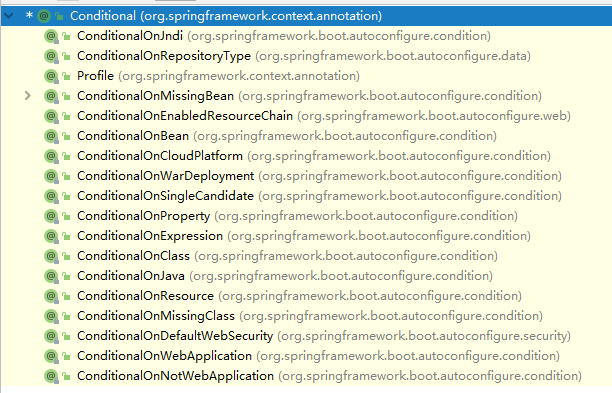
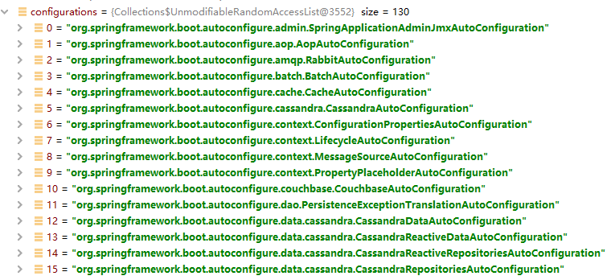
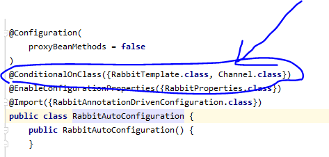
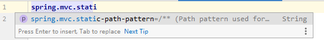
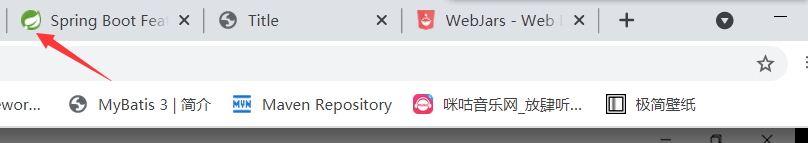

# 一、springBoot入门

## 1.了解springBoot

springBoot就是一个基于spring但是简化了spring各种复杂配置的一个框架。简化开发，约定大于配置。

### 1.1、搭建springBoot环境

1.新建一个maven项目，再pom.xml文件中添加依赖

```xml
<parent>
    <groupId>org.springframework.boot</groupId>
    <artifactId>spring-boot-starter-parent</artifactId>
    <version>2.4.4</version>
    <relativePath/>
</parent>

<dependencies>
    <dependency>
        <groupId>org.springframework.boot</groupId>
        <artifactId>spring-boot-starter-web</artifactId>
    </dependency>
</dependencies>
```

### 1.2、创建运行主程序

```java
@SpringBootApplication
public class HelloWorld {
    public static void main(String[] args) {
        SpringApplication.run(HelloWorld.class);
    }
}
```

然后直接启动main方法就ok。相当简单了。

### 1.3、创建controller

```java
@RestController
@RequestMapping("/hello")
public class HelloController {
    @RequestMapping("/hello")
    public String hello(){
        return "hello";
    }
}
```

运行主程序访问localhost:8080/hello/hello可以读取hello字符串。

### 1.4、打包

再pom.xml文件中添加打包插件

```xml
<build>
    <plugins>
        <plugin>
            <groupId>org.springframework.boot</groupId>
            <artifactId>spring-boot-maven-plugin</artifactId>
            <configuration>
                <fork>true</fork>
            </configuration>
        </plugin>
    </plugins>
</build>
```

运行 mvn clean package就可以生成可运行jar包。运行java -jar jar包名。就可以直接运行与访问了

## 2.了解自动装配

### 2.1、springboot特点

1.依赖管理

- 父项目做依赖管理

  ```xml
  <parent>
      <groupId>org.springframework.boot</groupId>
      <artifactId>spring-boot-starter-parent</artifactId>
      <version>2.4.4</version>
      <relativePath/>
  </parent>
  他的父项目
  <parent>
      <groupId>org.springframework.boot</groupId>
      <artifactId>spring-boot-dependencies</artifactId>
      <version>2.4.4</version>
  </parent>
  该父项目几乎声明了所有开发中常用的依赖版本号，自动版本仲裁。该父项目中使用的是dependencyManagement来管理依赖包，只声明依赖不实现导入。
  ```

- 开发导入starter场景启动器

  ```xml
  <dependency>
      <groupId>org.springframework.boot</groupId>
      <artifactId>spring-boot-starter-web</artifactId>
  </dependency>
  
  spring-boot-starter-*，*就代表了某种场景，只要引入了starter，这个场景所有的常会需要的依赖就会自动导入。
  springBoot支持的所有场景：
  https://docs.spring.io/spring-boot/docs/current/reference/html/using-spring-boot.html#using-boot-starter
  支持第三方提供的场景启动器，命名规则：*-spring-boot-starter。
  所有场景启动最底层的依赖
  <dependency>
    <groupId>org.springframework.boot</groupId>
    <artifactId>spring-boot-starter</artifactId>
    <version>2.4.4</version>
    <scope>compile</scope>
  </dependency>
  ```

- 无需关注版本号，自动版本仲裁，可以修改版本号。

  ```xml
  如果引入了某个springboot已经管理的依赖可以不写版本号。如果要修改版本号首先要看spring-boot-dependencies里规定当前依赖版本号的命名。
  然后再当前项目的pom.xml中进行修改.例如修改mysql的依赖版本
  <properties>
      <mysql.version>5.1.43</mysql.version>
  </properties>
  ```

2.自动装配

查看当前环境容器中的依赖

```java
public static void main(String[] args) {
    //1.返回我们的IOC容器
    ConfigurableApplicationContext run = SpringApplication.run(MainApplication.class);
    //2.查看当前容器里的组件
    String[] beanDefinitionNames = run.getBeanDefinitionNames();
    for (String beanDefinitionName : beanDefinitionNames) {
        System.out.println(beanDefinitionName);
    }
}
```

springBoot将所有我们需要配置的东西自动配置进来，tomcat、springMVC、web常见功能。==原理后面会细研究。==

**默认的包结构**：主程序所在的包以及下面的子包都会被扫描。

如果修改包扫描路径：

```java
@SpringBootApplication(scanBasePackages = "com.xin")
```

也可以：

```java
@SpringBootConfiguration
@EnableAutoConfiguration
@ComponentSca("com.xin")
这三个注解就相当于一个@SpringBootApplication(scanBasePackages = "com.xin")注解
```

**各种配置的默认值：**

默认配置最终都是要映射到某个类上，这个类会在容器中创建对象

**按需加载所有自动配置项：**

引入了哪些场景，这个场景才会自动配置。springBoot所有的自动配置功能都是在

```xml
<dependency>
  <groupId>org.springframework.boot</groupId>
  <artifactId>spring-boot-autoconfigure</artifactId>
  <version>2.4.4</version>
  <scope>compile</scope>
</dependency>
```

它管理了所有依赖的自动导入。==后面会讲到按照条件进行装配==

### 2.2、容器功能

#### 2.2.1、组件添加

使用注解进行bean的装配。（该内容为spring的知识点，请见spring笔记中的使用注解开发）

```java
public class Person {
    private String name;
    private Pet pet;

    public Person(String name) {
        this.name = name;
    }
    public Person() {
    }
    public String getName() {
        return name;
    }
    public void setName(String name) {
        this.name = name;
    }
    public Pet getPet() {
        return pet;
    }
    public void setPet(Pet pet) {
        this.pet = pet;
    }
    @Override
    public String toString() {
        return "Person{" +
                "name='" + name + '\'' +
                ", pet=" + pet +
                '}';
    }
}
```

```java
public class Pet {
    private String name;

    public Pet() {
    }
    public Pet(String name) {
        this.name = name;
    }
    public String getName() {
        return name;
    }
    public void setName(String name) {
        this.name = name;
    }
    @Override
    public String toString() {
        return "Pet{" +
                "name='" + name + '\'' +
                '}';
    }
}
```

```java
@Configuration
public class MyConfig {
    @Bean
    public Person user01(){
        return new Person("aixin");
    }
    @Bean("tom01")
    public Pet tomcat(){
        return new Pet("tomcat");
    }
}
```

在主程序导出容器中的组件名称中就可以看到user01与tom01了。

```java
public static void main(String[] args) {
    //1.返回我们的IOC容器
    ConfigurableApplicationContext run = SpringApplication.run(MainApplication.class);
    MyConfig myConfig = run.getBean("myConfig", MyConfig.class);
    System.out.println(myConfig);
}
输出结果：
com.xin.config.MyConfig$$EnhancerBySpringCGLIB$$cffbd24a@781a9412
```

可以看到Myconfig是一个被spring增强了的代理对象。因为@Configuration中的proxyBeanMethods默认为true代表了该配置类为一个代理对象。springboot就总会检查容器中是否有user01与tom01等组件，如果有就直接使用。就默认都是单例的。

```java
public static void main(String[] args) {
    //1.返回我们的IOC容器
    ConfigurableApplicationContext run = SpringApplication.run(MainApplication.class);
    MyConfig myConfig = run.getBean("myConfig", MyConfig.class);
    System.out.println(myConfig);
    Person user01 = run.getBean("user01", Person.class);
    Person user02 = run.getBean("user01", Person.class);
    System.out.println(user01 == user02);
    Person user03 = myConfig.user01();
    Person user04 = myConfig.user01();
    System.out.println(user03 == user04);
}
结果都为true
```

无论是直接从容器中去获取还是直接通过myconfig的方法调用，两个对象都是一样的。就说明只要调用了这个方法springBoot就会去容器中查找是否有该组件，如果有就使用这个组件。

如果改为false：

```java
@Configuration(proxyBeanMethods = false)//默认不写为true
public class MyConfig {
    @Bean
    public Person user01(){
        return new Person("aixin");
    }
    @Bean("tom01")
    public Pet tomcat(){
        return new Pet("tomcat");
    }
}
```

```java
public static void main(String[] args) {
    //1.返回我们的IOC容器
    ConfigurableApplicationContext run = SpringApplication.run(MainApplication.class);
    MyConfig myConfig = run.getBean("myConfig", MyConfig.class);
    System.out.println(myConfig);
    Person user01 = run.getBean("user01", Person.class);
    Person user02 = run.getBean("user01", Person.class);
    System.out.println(user01 == user02);
    Person user03 = myConfig.user01();
    Person user04 = myConfig.user01();
    System.out.println(user03 == user04);
}
结果都为
com.xin.config.MyConfig@6b7d1df8
true
false
```


总结：

配置的两个模式

- Full（全模式）：@Configuration(proxyBeanMethods = true)或默认不写
- Lite（轻量级模式）：@Configuration(proxyBeanMethods = false)。该模式优点，springBoot就不会去检查配置方法中的返回值是否在容器中存在组件，启动模式快，加载起来也会快。

#### 2.2.2、@Import

@Import给容器中自动创建出该类型的组件，默认组件的名字就是全类名

```java
@Import({Person.class})
@Configuration(proxyBeanMethods = true)
public class MyConfig {
    @Bean
    public Person user01(){
        return new Person("aixin");
    }
    @Bean("tom01")
    public Pet tomcat(){
        return new Pet("tomcat");
    }
}
```

**注意：如果使用import注解去导入进行创建组件，那么person类必须有无参构造器，否则启动报错。**

```java
在主程序中：
String[] beanNamesForType = run.getBeanNamesForType(Person.class);
for (String s : beanNamesForType) {
	System.out.println(s);
}
结果：
com.xin.beans.Person
user01
```

#### 2.2.3、@Condition

条件装配：满足condition指定的条件才会进行组件注入。



例子：

```java
@Configuration(proxyBeanMethods = false)
public class MyConfig {

    public Person user01(){
        return new Person("aixin");
    }
    @Bean("tom01")
    @ConditionalOnBean(name="user01")
    public Pet tomcat(){
        return new Pet("tomcat");
    }
}
```

测试：

```java
boolean user01 = run.containsBean("user01");
System.out.println(user01);
boolean tom01 = run.containsBean("tom01");
System.out.println(tom01);
结果：都为false
```

**注意：请注意容器注入装配顺序问题，有的时候放在上面可能下面的装配还没有进行所以条件判断才触发。**

```java
@Bean
@ConditionalOnBean(name="tom01")
public Person user01(){
    return new Person("aixin");
}

@Bean("tom01")
public Pet tomcat(){
    return new Pet("tomcat");
}
```

比如上述代码其实已经写明了要注入tom01的组件，但是因为顺序问题所以在@ConditionalOnBean(name="tom01")判断的时候容器还没有将tom01组件装配到容器中所以判断触发。请多注意这个问题。

#### 2.2.4、@ImportResource

可能存在项目中或第三方的spring的xml配置文件，可以使用该注解进行导入装配。

```java
@ImportResource("classpath:beans.xml")
```

在Myconfig类的上面加上这行代码就会将beans.xml中的内容注入到容器中。

```java
boolean haha = run.containsBean("haha");
System.out.println(haha);

结果为true
```

#### 2.2.5、配置绑定

将properties配置文件里的内容与javabean中的字段进行绑定

```properties
mycar.brand=audi
mycar.price=200000
```

方法1：@Component+@ConfigurationProperties(prefix = "mycar")

```java
@Component
@ConfigurationProperties(prefix = "mycar")
public class Car {
    private String brand;
    private Integer price;

    public String getBrand() {
        return brand;
    }
    public void setBrand(String brand) {
        this.brand = brand;
    }
    public Integer getPrice() {
        return price;
    }
    public void setPrice(Integer price) {
        this.price = price;
    }
}
```

**注意：只有在容器中的组件才会拥有springBoot提供的功能。**

测试：

```java
@RestController
public class HelloController {

    @Autowired
    private Car car;

    @RequestMapping("/car")
    public Car mycar(){
        return car;
    }
}
```

访问成功，可以显示出正确的内容。

方法二：@EnableConfigurationProperties(Car.class)+@ConfigurationProperties(prefix = "mycar")

```java
@ConfigurationProperties(prefix = "mycar")
public class Car {
    private String brand;
    private Integer price;

    public String getBrand() {
        return brand;
    }
    public void setBrand(String brand) {
        this.brand = brand;
    }
    public Integer getPrice() {
        return price;
    }
    public void setPrice(Integer price) {
        this.price = price;
    }
}
```

在配置文件中添加注解：

```java
@EnableConfigurationProperties(Car.class)
public class MyConfig
```

@EnableConfigurationProperties(Car.class)该注解实现了

1.开启Car的配置绑定功能。

2.把这个Car这个组件自动注册到容器中

测试成功。

经过我的测试：感觉只要在类中加入@ConfigurationProperties(prefix = "mycar")，然后将Car注入到容器中就会生效。使用@Import({Car.class})也可以。或者直接在MyConfig类中：

```java
@Bean
public Car car(){
    return new Car();
}
```

也可以生效。

## 3.自动配置原理入门

### 3.1、引导加载自动配置类

springBoot的核心就是@SpringBootApplication，拆开来也就是

```java
@SpringBootConfiguration
@EnableAutoConfiguration
@ComponentScan(
    excludeFilters = {@Filter(
    type = FilterType.CUSTOM,
    classes = {TypeExcludeFilter.class}
), @Filter(
    type = FilterType.CUSTOM,
    classes = {AutoConfigurationExcludeFilter.class}
)}
)
```

**将这些核心配置注解都一层一层的点进去看底层源码**

#### 3.1.1、@SpringBootConfiguration

```java
@Target({ElementType.TYPE})
@Retention(RetentionPolicy.RUNTIME)
@Documented
@Configuration
public @interface SpringBootConfiguration {
    @AliasFor(
        annotation = Configuration.class
    )
    boolean proxyBeanMethods() default true;
}
```

只有一个@Configuration注解，就是标明MainApplication就是spring中的一个配置类。

#### 3.1.2、@ComponentScan

就是指定扫描哪些，==可以参考spring的这个注解学习（未学）==

#### 3.1.3、@EnableAutoConfiguration

```java
@AutoConfigurationPackage
@Import({AutoConfigurationImportSelector.class})
public @interface EnableAutoConfiguration {
    String ENABLED_OVERRIDE_PROPERTY = "spring.boot.enableautoconfiguration";

    Class<?>[] exclude() default {};

    String[] excludeName() default {};
}
```

**1.@AutoConfigurationPackage:自动配置包**

```java
@Import({Registrar.class})
public @interface AutoConfigurationPackage {
    String[] basePackages() default {};

    Class<?>[] basePackageClasses() default {};
}

```

就是给容器中导入了一个Registrar组件。==这里需要学习spring注解中@Import的高级用法，需要去学习。==

利用Registrar给容器中导入一系列组件。

```java
static class Registrar implements ImportBeanDefinitionRegistrar, DeterminableImports {
        Registrar() {
        }

        public void registerBeanDefinitions(AnnotationMetadata metadata, BeanDefinitionRegistry registry) {
            AutoConfigurationPackages.register(registry, (String[])(new AutoConfigurationPackages.PackageImports(metadata)).getPackageNames().toArray(new String[0]));
        }

        public Set<Object> determineImports(AnnotationMetadata metadata) {
            return Collections.singleton(new AutoConfigurationPackages.PackageImports(metadata));
        }
    }
```

AnnotationMetadata metadata表示的就是该注解所在的元信息，这里指的就是Main Application。

(String[])(new AutoConfigurationPackages.PackageImports(metadata)).getPackageNames().toArray(new String[0])就是将这个主程序所在的包以及下面的子包下的所有组件都注册到IOC容器中。这也就能解释的通为什么springBoot默认的包路径就是这个。

**2.@Import({AutoConfigurationImportSelector.class})**

```java
 public String[] selectImports(AnnotationMetadata annotationMetadata) {
        if (!this.isEnabled(annotationMetadata)) {
            return NO_IMPORTS;
        } else {
            AutoConfigurationImportSelector.AutoConfigurationEntry autoConfigurationEntry = this.getAutoConfigurationEntry(annotationMetadata);
            return StringUtils.toStringArray(autoConfigurationEntry.getConfigurations());
        }
    }
```

```
1.就是利用this.getAutoConfigurationEntry(annotationMetadata)这个方法给容器中批量的导入一些组件。
2.然后调用List<String> configurations = this.getCandidateConfigurations(annotationMetadata, attributes);获取到所有需要导入容器中的配置类。
3.利用工厂加载Map<String, List<String>> loadSpringFactories(ClassLoader classLoader) 得到所有的组件.
	默认扫描我们当前系统里面所有META-INF/spring.factories位置的文件。
	spring-boot-autoconfigure-2.4.4.jar包里面也有META-INF/spring.factories
```

使用debug将断点打到上面2的方法处，可以看到



spring-boot-autoconfigure-2.4.4.jar包中META-INF/spring.factories写死了springBoot已启动就要给容器中加载的所有配置类。

```properties
# Auto Configure
org.springframework.boot.autoconfigure.EnableAutoConfiguration=\
org.springframework.boot.autoconfigure.admin.SpringApplicationAdminJmxAutoConfiguration,\
org.springframework.boot.autoconfigure.aop.AopAutoConfiguration,\
org.springframework.boot.autoconfigure.amqp.RabbitAutoConfiguration,\
org.springframework.boot.autoconfigure.batch.BatchAutoConfiguration,\
org.springframework.boot.autoconfigure.cache.CacheAutoConfiguration,\
org.springframework.boot.autoconfigure.cassandra.CassandraAutoConfiguration,\
org.springframework.boot.autoconfigure.context.ConfigurationPropertiesAutoConfiguration,\
org.springframework.boot.autoconfigure.context.LifecycleAutoConfiguration,\
org.springframework.boot.autoconfigure.context.MessageSourceAutoConfiguration,\
org.springframework.boot.autoconfigure.context.PropertyPlaceholderAutoConfiguration,\
org.springframework.boot.autoconfigure.couchbase.CouchbaseAutoConfiguration,\
org.springframework.boot.autoconfigure.dao.PersistenceExceptionTranslationAutoConfiguration,\
org.springframework.boot.autoconfigure.data.cassandra.CassandraDataAutoConfiguration,\
org.springframework.boot.autoconfigure.data.cassandra.CassandraReactiveDataAutoConfiguration,\
org.springframework.boot.autoconfigure.data.cassandra.CassandraReactiveRepositoriesAutoConfiguration,\
org.springframework.boot.autoconfigure.data.cassandra.CassandraRepositoriesAutoConfiguration,\
org.springframework.boot.autoconfigure.data.couchbase.CouchbaseDataAutoConfiguration,\
org.springframework.boot.autoconfigure.data.couchbase.CouchbaseReactiveDataAutoConfiguration,\
org.springframework.boot.autoconfigure.data.couchbase.CouchbaseReactiveRepositoriesAutoConfiguration,\
org.springframework.boot.autoconfigure.data.couchbase.CouchbaseRepositoriesAutoConfiguration,\
org.springframework.boot.autoconfigure.data.elasticsearch.ElasticsearchDataAutoConfiguration,\
org.springframework.boot.autoconfigure.data.elasticsearch.ElasticsearchRepositoriesAutoConfiguration,\
org.springframework.boot.autoconfigure.data.elasticsearch.ReactiveElasticsearchRepositoriesAutoConfiguration,\
org.springframework.boot.autoconfigure.data.elasticsearch.ReactiveElasticsearchRestClientAutoConfiguration,\
org.springframework.boot.autoconfigure.data.jdbc.JdbcRepositoriesAutoConfiguration,\
org.springframework.boot.autoconfigure.data.jpa.JpaRepositoriesAutoConfiguration,\
org.springframework.boot.autoconfigure.data.ldap.LdapRepositoriesAutoConfiguration,\
org.springframework.boot.autoconfigure.data.mongo.MongoDataAutoConfiguration,\
org.springframework.boot.autoconfigure.data.mongo.MongoReactiveDataAutoConfiguration,\
org.springframework.boot.autoconfigure.data.mongo.MongoReactiveRepositoriesAutoConfiguration,\
org.springframework.boot.autoconfigure.data.mongo.MongoRepositoriesAutoConfiguration,\
org.springframework.boot.autoconfigure.data.neo4j.Neo4jDataAutoConfiguration,\
org.springframework.boot.autoconfigure.data.neo4j.Neo4jReactiveDataAutoConfiguration,\
org.springframework.boot.autoconfigure.data.neo4j.Neo4jReactiveRepositoriesAutoConfiguration,\
org.springframework.boot.autoconfigure.data.neo4j.Neo4jRepositoriesAutoConfiguration,\
org.springframework.boot.autoconfigure.data.solr.SolrRepositoriesAutoConfiguration,\
org.springframework.boot.autoconfigure.data.r2dbc.R2dbcDataAutoConfiguration,\
org.springframework.boot.autoconfigure.data.r2dbc.R2dbcRepositoriesAutoConfiguration,\
org.springframework.boot.autoconfigure.data.redis.RedisAutoConfiguration,\
org.springframework.boot.autoconfigure.data.redis.RedisReactiveAutoConfiguration,\
org.springframework.boot.autoconfigure.data.redis.RedisRepositoriesAutoConfiguration,\
org.springframework.boot.autoconfigure.data.rest.RepositoryRestMvcAutoConfiguration,\
org.springframework.boot.autoconfigure.data.web.SpringDataWebAutoConfiguration,\
org.springframework.boot.autoconfigure.elasticsearch.ElasticsearchRestClientAutoConfiguration,\
org.springframework.boot.autoconfigure.flyway.FlywayAutoConfiguration,\
org.springframework.boot.autoconfigure.freemarker.FreeMarkerAutoConfiguration,\
org.springframework.boot.autoconfigure.groovy.template.GroovyTemplateAutoConfiguration,\
org.springframework.boot.autoconfigure.gson.GsonAutoConfiguration,\
org.springframework.boot.autoconfigure.h2.H2ConsoleAutoConfiguration,\
org.springframework.boot.autoconfigure.hateoas.HypermediaAutoConfiguration,\
org.springframework.boot.autoconfigure.hazelcast.HazelcastAutoConfiguration,\
org.springframework.boot.autoconfigure.hazelcast.HazelcastJpaDependencyAutoConfiguration,\
org.springframework.boot.autoconfigure.http.HttpMessageConvertersAutoConfiguration,\
org.springframework.boot.autoconfigure.http.codec.CodecsAutoConfiguration,\
org.springframework.boot.autoconfigure.influx.InfluxDbAutoConfiguration,\
org.springframework.boot.autoconfigure.info.ProjectInfoAutoConfiguration,\
org.springframework.boot.autoconfigure.integration.IntegrationAutoConfiguration,\
org.springframework.boot.autoconfigure.jackson.JacksonAutoConfiguration,\
org.springframework.boot.autoconfigure.jdbc.DataSourceAutoConfiguration,\
org.springframework.boot.autoconfigure.jdbc.JdbcTemplateAutoConfiguration,\
org.springframework.boot.autoconfigure.jdbc.JndiDataSourceAutoConfiguration,\
org.springframework.boot.autoconfigure.jdbc.XADataSourceAutoConfiguration,\
org.springframework.boot.autoconfigure.jdbc.DataSourceTransactionManagerAutoConfiguration,\
org.springframework.boot.autoconfigure.jms.JmsAutoConfiguration,\
org.springframework.boot.autoconfigure.jmx.JmxAutoConfiguration,\
org.springframework.boot.autoconfigure.jms.JndiConnectionFactoryAutoConfiguration,\
org.springframework.boot.autoconfigure.jms.activemq.ActiveMQAutoConfiguration,\
org.springframework.boot.autoconfigure.jms.artemis.ArtemisAutoConfiguration,\
org.springframework.boot.autoconfigure.jersey.JerseyAutoConfiguration,\
org.springframework.boot.autoconfigure.jooq.JooqAutoConfiguration,\
org.springframework.boot.autoconfigure.jsonb.JsonbAutoConfiguration,\
org.springframework.boot.autoconfigure.kafka.KafkaAutoConfiguration,\
org.springframework.boot.autoconfigure.availability.ApplicationAvailabilityAutoConfiguration,\
org.springframework.boot.autoconfigure.ldap.embedded.EmbeddedLdapAutoConfiguration,\
org.springframework.boot.autoconfigure.ldap.LdapAutoConfiguration,\
org.springframework.boot.autoconfigure.liquibase.LiquibaseAutoConfiguration,\
org.springframework.boot.autoconfigure.mail.MailSenderAutoConfiguration,\
org.springframework.boot.autoconfigure.mail.MailSenderValidatorAutoConfiguration,\
org.springframework.boot.autoconfigure.mongo.embedded.EmbeddedMongoAutoConfiguration,\
org.springframework.boot.autoconfigure.mongo.MongoAutoConfiguration,\
org.springframework.boot.autoconfigure.mongo.MongoReactiveAutoConfiguration,\
org.springframework.boot.autoconfigure.mustache.MustacheAutoConfiguration,\
org.springframework.boot.autoconfigure.neo4j.Neo4jAutoConfiguration,\
org.springframework.boot.autoconfigure.orm.jpa.HibernateJpaAutoConfiguration,\
org.springframework.boot.autoconfigure.quartz.QuartzAutoConfiguration,\
org.springframework.boot.autoconfigure.r2dbc.R2dbcAutoConfiguration,\
org.springframework.boot.autoconfigure.r2dbc.R2dbcTransactionManagerAutoConfiguration,\
org.springframework.boot.autoconfigure.rsocket.RSocketMessagingAutoConfiguration,\
org.springframework.boot.autoconfigure.rsocket.RSocketRequesterAutoConfiguration,\
org.springframework.boot.autoconfigure.rsocket.RSocketServerAutoConfiguration,\
org.springframework.boot.autoconfigure.rsocket.RSocketStrategiesAutoConfiguration,\
org.springframework.boot.autoconfigure.security.servlet.SecurityAutoConfiguration,\
org.springframework.boot.autoconfigure.security.servlet.UserDetailsServiceAutoConfiguration,\
org.springframework.boot.autoconfigure.security.servlet.SecurityFilterAutoConfiguration,\
org.springframework.boot.autoconfigure.security.reactive.ReactiveSecurityAutoConfiguration,\
org.springframework.boot.autoconfigure.security.reactive.ReactiveUserDetailsServiceAutoConfiguration,\
org.springframework.boot.autoconfigure.security.rsocket.RSocketSecurityAutoConfiguration,\
org.springframework.boot.autoconfigure.security.saml2.Saml2RelyingPartyAutoConfiguration,\
org.springframework.boot.autoconfigure.sendgrid.SendGridAutoConfiguration,\
org.springframework.boot.autoconfigure.session.SessionAutoConfiguration,\
org.springframework.boot.autoconfigure.security.oauth2.client.servlet.OAuth2ClientAutoConfiguration,\
org.springframework.boot.autoconfigure.security.oauth2.client.reactive.ReactiveOAuth2ClientAutoConfiguration,\
org.springframework.boot.autoconfigure.security.oauth2.resource.servlet.OAuth2ResourceServerAutoConfiguration,\
org.springframework.boot.autoconfigure.security.oauth2.resource.reactive.ReactiveOAuth2ResourceServerAutoConfiguration,\
org.springframework.boot.autoconfigure.solr.SolrAutoConfiguration,\
org.springframework.boot.autoconfigure.task.TaskExecutionAutoConfiguration,\
org.springframework.boot.autoconfigure.task.TaskSchedulingAutoConfiguration,\
org.springframework.boot.autoconfigure.thymeleaf.ThymeleafAutoConfiguration,\
org.springframework.boot.autoconfigure.transaction.TransactionAutoConfiguration,\
org.springframework.boot.autoconfigure.transaction.jta.JtaAutoConfiguration,\
org.springframework.boot.autoconfigure.validation.ValidationAutoConfiguration,\
org.springframework.boot.autoconfigure.web.client.RestTemplateAutoConfiguration,\
org.springframework.boot.autoconfigure.web.embedded.EmbeddedWebServerFactoryCustomizerAutoConfiguration,\
org.springframework.boot.autoconfigure.web.reactive.HttpHandlerAutoConfiguration,\
org.springframework.boot.autoconfigure.web.reactive.ReactiveWebServerFactoryAutoConfiguration,\
org.springframework.boot.autoconfigure.web.reactive.WebFluxAutoConfiguration,\
org.springframework.boot.autoconfigure.web.reactive.error.ErrorWebFluxAutoConfiguration,\
org.springframework.boot.autoconfigure.web.reactive.function.client.ClientHttpConnectorAutoConfiguration,\
org.springframework.boot.autoconfigure.web.reactive.function.client.WebClientAutoConfiguration,\
org.springframework.boot.autoconfigure.web.servlet.DispatcherServletAutoConfiguration,\
org.springframework.boot.autoconfigure.web.servlet.ServletWebServerFactoryAutoConfiguration,\
org.springframework.boot.autoconfigure.web.servlet.error.ErrorMvcAutoConfiguration,\
org.springframework.boot.autoconfigure.web.servlet.HttpEncodingAutoConfiguration,\
org.springframework.boot.autoconfigure.web.servlet.MultipartAutoConfiguration,\
org.springframework.boot.autoconfigure.web.servlet.WebMvcAutoConfiguration,\
org.springframework.boot.autoconfigure.websocket.reactive.WebSocketReactiveAutoConfiguration,\
org.springframework.boot.autoconfigure.websocket.servlet.WebSocketServletAutoConfiguration,\
org.springframework.boot.autoconfigure.websocket.servlet.WebSocketMessagingAutoConfiguration,\
org.springframework.boot.autoconfigure.webservices.WebServicesAutoConfiguration,\
org.springframework.boot.autoconfigure.webservices.client.WebServiceTemplateAutoConfiguration
```

### 3.2、按需开启自动配置项

虽然我们130个场景的所有自动配置启动的时候默认全部加载。但最终会按需进行配置。

随便举个例子：



使用了条件装配的注解，在当前环境下就不会将此注册到容器中。

springBoot会在底层默认配置好所有的组件，但是如果用户自己配置了以用户的优先。

例子：

```java
@Bean
@ConditionalOnMissingBean
public CharacterEncodingFilter characterEncodingFilter() {
    CharacterEncodingFilter filter = new OrderedCharacterEncodingFilter();
    filter.setEncoding(this.properties.getCharset().name());
    filter.setForceRequestEncoding(this.properties.shouldForce(org.springframework.boot.web.servlet.server.Encoding.Type.REQUEST));
    filter.setForceResponseEncoding(this.properties.shouldForce(org.springframework.boot.web.servlet.server.Encoding.Type.RESPONSE));
    return filter;
}
```

springBoot底层的源码，使用了@ConditionalOnMissingBean表明如果容器中没有这个组件才会去进行创建注入。

总结：

- springBoot先加载所有的自动配置类，***AutoConfiguration

- 每个自动配置类按照条件生效，默认都会绑定配置文件指定的值。***Properties里面拿。与对应.properties配置文件进行了绑定

  ```java
  @EnableConfigurationProperties({WebMvcProperties.class})
  protected static class DispatcherServletConfiguration
  ```

- 生效的配置会给容器中装配很多组件，只要容器中有了这些组件就标明这些功能就有了

- 只要用户有自己配置的，以用户的优先

- 定制化配置：可以直接@Bean自己生成一个组件或者可以直接在配置文件中修改springBoot默认创建好的默认值

## 4.开发小技巧

### 4.1、lombok

1.导入lombok依赖

2.idea安装lombok插件

然后直接在类上添加@Date,@toString...等注解就会直接在编译的时候帮助我们生成对应的getter、setter，toString等方法。

### 4.2、dev-tools

```xml
<dependencies>
    <dependency>
        <groupId>org.springframework.boot</groupId>
        <artifactId>spring-boot-devtools</artifactId>
        <optional>true</optional>
    </dependency>
</dependencies>
```

修改项目后：ctrl+F9重启项目。没什么太大的用处。

### 4.3、spring initializr

使用idea或eclipse的这种创建项目的方式，然后选择需要的环境，就会把当前项目的结构与运行主程序都创建好。

# 二、SpringBoot核心功能

## 1.配置文件

### 1.1、文件类型

#### 1.1.1、properties

是目前一直使用的配置文件类型。

#### 1.1.2、 yaml

非常适合用来做以数据为中心的配置文件

1.基本语法

- key: value;kv之间有空格
- 大小写敏感
- 使用缩进表示层级关系，缩进的空格数不重要，只要相同的层级元素左对齐即可
- '#'表示注释
- 字符串无需添加引号，如果要加，单引号字符串的内容表示会被转义，双引号不会被转义

2.数据类型

- 字面量：单个的。date,boolean,string,number,null

  ```yaml
  k: v
  ```

- 对象：键值对的集合。

  ```yaml
  k: {k1:v1,k2:v2}
  #或
  k:
   k1: v1
   k2: v2
  ```

- 数组：一组按次序排列的值

  ```yaml
  k: {v1,v2}
  #或
  k:
   - v1
   - v2
  ```

代码测试：

```java
@Data
public class Pet {
    private String petName;
}
```

```java
@ConfigurationProperties(prefix = "person")
@Component
@Data
@ToString
public class Person {
    private String userName;
    private Integer age;
    private Boolean boss;
    private Date birth;
    private Pet pet;
    private String[] interests;
    private List<String> books;
    private Map<String,Integer> score;
    private Set<String> salarys;
    private Map<String,List<Pet>> allPets;

}
```

```yaml
person:
  userName: lala
  age: 18
  boss: true
  birth: 1995/01/02
  interests:
    - 篮球
    - 游戏
  books: {Java虚拟机,thinkinginjava}
  score:
    english: 100
    math: 100
  salarys:
    - 18000
    - 19000
  pet:
    petName: 大黄
  allPets:
    cat:
      - {petName:咪咪}
      - petName: 花花
    dog:
      - petName: 大黄
```

==这个score不知道为什么key为中文就有问题？==

3.yaml自动补全

需要在pom中添加依赖

```xml
<dependency>
    <groupId>org.springframework.boot</groupId>
    <artifactId>spring-boot-configuration-processor</artifactId>
    <optional>true</optional>
</dependency>
```

然后重启项目，再次在yaml文件中就会有自动提示了。

## 2.WEB开发

### 2.1、简单功能分析

#### 2.1.1、静态资源访问

**1.静态资源目录**

只要静态资源放在类路径下：`/static` (or `/public` or `/resources` or `/META-INF/resources`)

访问：当前项目跟路径/文件名


原理：默认静态映射/**，当请求进来的时候，先去找controller能不能处理，不能处理的所有请求又都交给静态资源处理器。静态资源处理器去静态资源目录里去查找，如果找不到就报404了。




**2.静态资源访问前缀**

默认无前缀

在yaml里可以进行修改

```yaml
spring:
  mvc:
    static-path-pattern: /res/**
```

访问路径是：localhost:8080/res/222.png才可以访问的到静态资源目录下的图片

**3.修改静态资源目录**

在yaml里可以进行修改

```yaml
spring:
  web:
    resources:
      static-locations: classpath:/haha/
```

==这个`/META-INF/resources`文件夹下的静态资源还可以访问。不知道原因==

webjar的静态资源文件放在了`/META-INF/resources`文件夹下。访问的时候可以直接访问的到，应该跟这个设置有什么关系。

**4.webjar**

就是将js与css一些页面打包为jar文件。

https://www.webjars.org/

```xml
<dependency>
    <groupId>org.webjars</groupId>
    <artifactId>jquery</artifactId>
    <version>3.6.0</version>
</dependency>
```

访问地址：http://localhost:8080/webjars/jquery/3.6.0/jquery.js

#### 2.1.2、欢迎页

设置访问欢迎页：

- 静态资源路径下放index.html

  可以配置静态资源目录，但是如果重新设置了静态资源访问前缀就不会默认访问。

- controller能处理/index


#### 2.1.3、自定义Favicon

就是浏览器页签上的小图标



找到自己喜欢的图标，然后取名为favicon.ico。将图标放到静态资源目录下，再次启动项目并访问就会生效了。

注意点：如果添加了静态资源访问前缀会导致图标不生效。或者浏览器缓存问题。==我这没生效==


